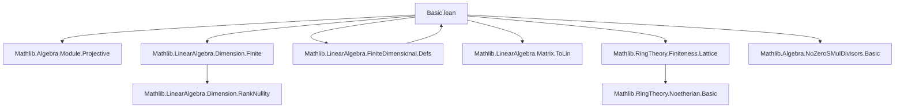
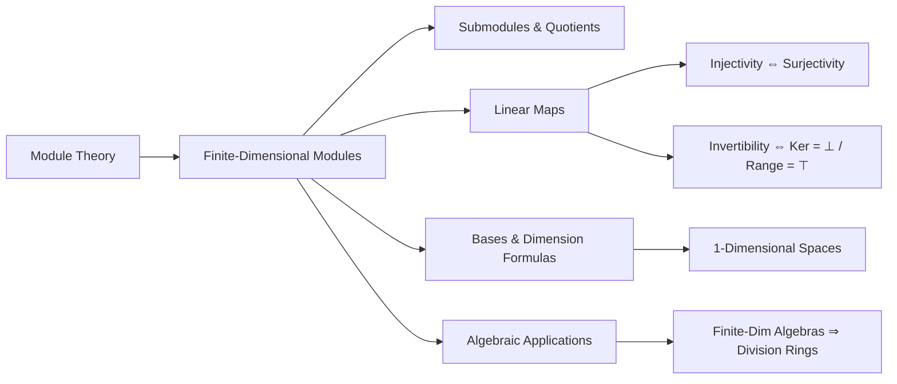

### Technical Brief: `Basic.lean` — Finite-Dimensional Vector Spaces in Lean 4

---

#### **1. Key Definitions & Theorems**

| Name | Type / Signature | Purpose |
|------|------------------|---------|
| `FiniteDimensional K V` | `Prop` | States that the $K$-module $V$ is finite-dimensional (i.e., has a finite basis). |
| `finrank K V` | `ℕ` | Dimension of $V$ over $K$, defined as the cardinality of any basis. |
| `basisSingleton ι h v hv` | `Basis ι K V` | Unique basis for a 1-dimensional space indexed by a `Unique` type $\iota$, using a nonzero vector $v$. |
| `LinearMap.injective_iff_surjective` | `Injective f ↔ Surjective f` | On finite-dimensional spaces, injectivity ⇔ surjectivity for endomorphisms. |
| `LinearMap.ker_eq_bot_iff_range_eq_top` | `Ker f = ⊥ ↔ Range f = ⊤` | Equivalence of injectivity and surjectivity via kernel/range. |
| `LinearMap.isUnit_iff_ker_eq_bot` / `isUnit_iff_range_eq_top` | `IsUnit f ↔ Ker f = ⊥` / `↔ Range f = ⊤` | Characterizes invertible endomorphisms in finite dimensions. |
| `LinearMap.comp_eq_id_comm` | `f ∘ g = id ↔ g ∘ f = id` | Left- and right-inverses coincide for endomorphisms in finite dimensions. |
| `Submodule.eq_top_of_finrank_eq` | `S = ⊤` if `finrank S = finrank V` | Maximal-dimensional submodule equals whole space. |
| `Submodule.eq_of_le_of_finrank_le` | $S_1 \le S_2 \land \dim S_2 \le \dim S_1 \Rightarrow S_1 = S_2$ | Submodule containment + dimension inequality ⇒ equality. |
| `FiniteDimensional.of_rank_eq_nat` | `Module.rank K V = n ⇒ FiniteDimensional K V` | Connects rank and finite-dimensionality. |
| `FiniteDimensional.exists_mul_eq_one` | $x \ne 0 \Rightarrow \exists y, x y = 1$ | In a finite-dimensional algebra over a field, nonzero elements are invertible. |
| `divisionRingOfFiniteDimensional`, `fieldOfFiniteDimensional` | Constructs division ring / field structure | Shows that a domain finite as an algebra over a field is a division ring / field. |
| `LinearEquiv.ofInjectiveOfFinrankEq` | `V →ₗ V'` injective + equal finite rank ⇒ linear equivalence | Refines an injective linear map to an equivalence when dimensions match. |
| `LinearIndependent.lt_aleph0_of_finiteDimensional` | `#ι < ℵ₀` | Any linearly independent family in a finite-dimensional space is countable. |
| `exists_relation_sum_zero_pos_coefficient_of_finrank_succ_lt_card` | Positive-coefficient dependency | Strengthened version of dependency lemma for ordered fields. |

---

#### **2. Naming Conventions**

- **Prefixes**:
  - `finiteDimensional_`: Instance lemmas (e.g., `finiteDimensional_inf_left`, `finiteDimensional_range`)
  - `eq_of_le_of_finrank_`: Submodule equality criteria under containment + dimension constraints
  - `of_`: Constructors or implications *from* a condition (e.g., `ofInjectiveEndo`, `of_finrank_eq_succ`)
  - `isUnit_iff_`, `injective_iff_`, `ker_eq_bot_iff_`: Biconditional characterizations
- **Suffixes**:
  - `_left`, `_right`: For symmetric properties (e.g., `inf_left`, `inf_right`)
  - `_mono`: Monotonicity (e.g., `finrank_mono`)
  - `_singleton`: 1-dimensional constructions (`basisSingleton`, `finrank_span_singleton`)
- **`_comm` suffix**: Commutativity of operations (e.g., `comp_eq_id_comm`, `mul_eq_one_comm`)

---

#### **3. Tactic Stack**

Frequently used tactics in proofs:
- `rw`, `simp`, `simp_rw`: Rewriting and simplification (especially with `finrank`, `span`, `basis`)
- `apply`, `exact`, `intro`, `cases`: Basic natural deduction
- `apply_fun`, `congr_arg`: Functional extensionality and congruence
- `aesop`: Automated reasoning for algebraic goals (e.g., `comm`, `disjoint`, `mul_eq_one`)
- `induction` (on `Finset`, `ℕ`): Structural induction for finite constructions
- `ext`: Extensionality for functions, submodules, bases
- `have`, `obtain`, `replace`: Intermediate lemma introduction
- `convert`, `refine`: Partial proof construction with typeclass inference

---

#### **4. Proof Logic**

- **Induction on finite structures**: Proofs about finite sets, finsets, or natural numbers often use `Finset.induction_on` or `nat.induction`.
- **Dimension comparison**: Many proofs rely on comparing `finrank` via:
  - `finrank_le_of_le` (monotonicity)
  - `eq_top_of_finrank_eq`, `eq_of_le_of_finrank_le` (equality criteria)
  - `finrank_range_of_inj`, `rank_range_of_injective` (rank of image)
- **Basis constructions**: Use of `Basis.ofVectorSpace`, `Basis.extend`, `Basis.ofRepr`, and `basisSingleton` to build explicit bases.
- **Equivalence via injectivity/surjectivity**: Key lemmas like `injective_iff_surjective` and `comp_eq_id_comm` reduce invertibility questions to dimension counts.
- **Algebraic closure**: For algebras over fields, finite-dimensionality + domain ⇒ division ring ⇒ field (via `divisionRingOfFiniteDimensional`, `fieldOfFiniteDimensional`).

---

#### **5. Imports & Dependencies**

**Core Imports**:
```lean
Mathlib.Algebra.Module.Projective
Mathlib.LinearAlgebra.Dimension.Finite
Mathlib.LinearAlgebra.FiniteDimensional.Defs
Mathlib.LinearAlgebra.Matrix.ToLin
Mathlib.RingTheory.Finiteness.Lattice
Mathlib.Algebra.NoZeroSMulDivisors.Basic
```

**Key Theories Leveraged**:
- `Module.Finite`, `Module.rank`, `Module.finrank`
- `Submodule`, `Subalgebra`, `LinearMap`, `LinearEquiv`
- `Basis`, `Finsupp`, `Finset`
- `IsStablyFiniteRing`, `IsDomain`, `Field`, `DivisionRing`

---

#### **6. Mermaid Diagrams**

##### **Dependency Graph (Top-Level Modules)**



##### **Overview of Theory Flow**



---

#### **7. Summary**

This file establishes foundational properties of finite-dimensional vector spaces over division rings (and fields), with emphasis on:
- Dimension behavior under submodules, quotients, images, and sums
- Equivalence of injectivity/surjectivity and left/right inverses for endomorphisms
- Explicit basis constructions in low-dimensional cases (especially 1D)
- Applications to algebras: finite-dimensional domains over fields are division rings/fields

It serves as a core module for the broader `LinearAlgebra.FiniteDimensional` hierarchy, feeding into rank-nullity, duality, and representation theory developments.

--- 

*Prepared for domain-specific AI agent training using Lean 4 formalization patterns.*
