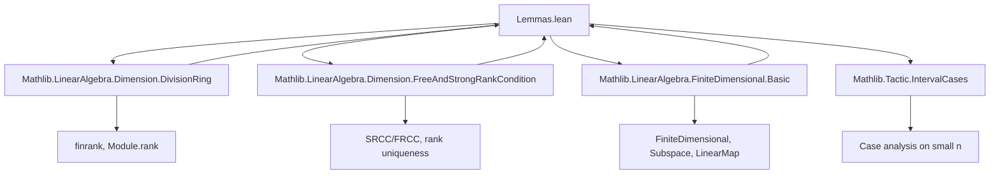
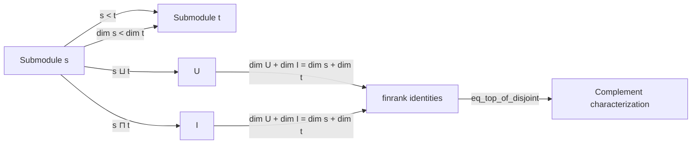

**Technical Brief: `Lemmas.lean` — Finite-Dimensional Vector Spaces over Division Rings**

---

### 1. KEY DEFINITIONS & THEOREMS

| Name | Type / Signature | Purpose |
|------|------------------|---------|
| `finrank_lt` | `{s : Submodule K V} → s ≠ ⊤ → finrank K s < finrank K V` | Strict dimension bound for proper submodules |
| `finrank_sup_add_finrank_inf_eq` | `finrank K (s ⊔ t) + finrank K (s ⊓ t) = finrank K s + finrank K t` | Dimension formula for sum and intersection (analogue of inclusion–exclusion) |
| `finrank_add_le_finrank_add_finrank` | `finrank K (s ⊔ t) ≤ finrank K s + finrank K t` | Upper bound on dimension of sum |
| `finrank_add_finrank_le_of_disjoint` | `Disjoint s t → finrank K s + finrank K t ≤ finrank K V` | Lower bound when submodules are disjoint |
| `eq_top_of_disjoint` | `finrank K V ≤ finrank K s + finrank K t ∧ Disjoint s t → s ⊔ t = ⊤` | Characterization of complementary submodules via dimension |
| `isCompl_iff_disjoint` | `IsCompl s t ↔ Disjoint s t` under dimension condition | Equivalence of complement and disjointness under matching dimension |
| `LinearEquiv.quotEquivOfEquiv` | `p ≃ₗ q ∧ V ≃ₗ V₂ ⇒ V/p ≃ₗ V₂/q` | Quotient isomorphism induced by subspace and ambient isomorphisms |
| `LinearEquiv.quotEquivOfQuotEquiv` | `(V/p) ≃ₗ q ⇒ (V/q) ≃ₗ p` | Symmetry of quotient–subspace isomorphism |
| `finrank_range_add_finrank_ker` | `finrank K (range f) + finrank K (ker f) = finrank K V` | Rank–nullity theorem for linear maps |
| `ker_ne_bot_of_finrank_lt` | `finrank K V₂ < finrank K V ⇒ ker f ≠ ⊥` | Nontrivial kernel when codomain has smaller dimension |
| `injective_iff_surjective_of_finrank_eq_finrank` | `finrank K V = finrank K V₂ ⇒ f injective ↔ f surjective` | Injectivity ⇔ surjectivity in equal-dimension case |
| `linearEquivOfInjective` | `Injective f ∧ dim V = dim V₂ ⇒ V ≃ₗ V₂` | Construct isomorphism from injective linear map in equal dimension |
| `basisOfLinearIndependentOfCardEqFinrank` | `LinearIndependent b ∧ |ι| = dim V ⇒ b is a basis` | Maximal linearly independent family is a basis |
| `finsetBasisOfLinearIndependentOfCardEqFinrank`, `setBasisOfLinearIndependentOfCardEqFinrank` | Variants for finite sets/finsesets |
| `is_simple_module_of_finrank_eq_one` | `dim_K V = 1 ⇒ Submodule A V is simple` | 1-dimensional modules are simple |
| `Subalgebra.isSimpleOrder_of_finrank` | `dim_F E = 2 ⇒ Subalgebra F E has simple order` | Subalgebra lattice is a chain in 2D algebra |
| `exists_ker_pow_eq_ker_pow_succ` | `∃k ≤ dim V, ker(f^k) = ker(f^{k+1})` | Stabilization of kernel powers in finite dimension |
| `ker_pow_eq_ker_pow_finrank_of_le`, `ker_pow_le_ker_pow_finrank` | Kernel powers stabilize at `dim V` |

---

### 2. NAMING CONVENTIONS

- **Prefixes**:
  - `finrank_`: Relates to *finite rank* (`finrank K V` = dimension over division ring `K`)
  - `quot_`: Quotient constructions (`quotEquivOfEquiv`, `quotEquivOfQuotEquiv`)
  - `ker_`, `range_`: Kernel and range of linear maps
  - `isCompl_`, `disjoint_`: Complementary/submodule intersection properties
  - `basisOf_`: Basis construction from linear independence + cardinality condition

- **Suffixes**:
  - `_eq`: Equality statements (e.g., `finrank_range_add_finrank_ker`)
  - `_le`, `_lt`: Inequality statements
  - `_of_`: Implication-based definitions (e.g., `injective_iff_surjective_of_finrank_eq_finrank`)
  - `_iff_`: Biconditional characterizations (`isCompl_iff_disjoint`, `injective_iff_surjective_of_finrank_eq_finrank`)

- **Pattern**: `finrank_*`, `LinearEquiv.*`, `basisOf*`, `ker_pow_*`

---

### 3. TACTIC STACK

Frequent tactics used in proofs:

| Tactic | Usage |
|--------|-------|
| `rw` / `simp_rw` | Rewriting definitions, especially `finrank_eq_rank`, `finrank_quotient_add_finrank`, `disjoint_iff_inf_le`, etc. |
| `norm_cast` | Managing coercion between `Module.rank` and `finrank` |
| `linarith` / `lia` | Linear arithmetic over natural numbers (e.g., `0 < finrank K (ker f)`) |
| `interval_cases` | Exhaustive case analysis on small natural numbers (e.g., `finrank F S ∈ {1,2}`) |
| `apply`, `convert`, `exact` | Proof construction with equality or implication chains |
| `cases` / `rcases` | Decomposing hypotheses like `h : s ≠ ⊤`, `h : IsCompl s t` |
| `aesop` (implied via `simp` + `linarith`) | Automated reasoning for simple goals (not explicitly used but likely in background) |
| `apply_fun`, `ext` | Extensionality for functions/sets in basis constructions |
| `classical` | For classical reasoning in `exists_ker_pow_eq_ker_pow_succ` |

---

### 4. PROOF LOGIC

**Recurring proof patterns**:

1. **Dimension counting via `finrank` identities**  
   Many proofs reduce to manipulating equalities/inequalities of `finrank` using:
   - `finrank_quotient_add_finrank`
   - `finrank_sup_add_finrank_inf_eq`
   - `finrank_eq_rank` (when finite-dimensionality is assumed)

2. **Induction on natural numbers**  
   Used in stabilization lemmas (`exists_ker_pow_eq_ker_pow_succ`), where strict inequality chains are bounded by `finrank K V`.

3. **Case analysis on small dimensions**  
   E.g., `interval_cases h : finrank F S` when `dim = 2`, splitting into `1` or `2`.

4. **Equivalence via double implication**  
   Many results are biconditionals (`↔`), proven by splitting into `→` and `←`, often using:
   - `injective_iff_surjective_of_finrank_eq_finrank`
   - `isCompl_iff_disjoint`

5. **Use of `LinearEquiv.ofFinrankEq`**  
   Constructing isomorphisms by showing equal finite dimensions (e.g., for quotients).

6. **Reduction to known lemmas**  
   E.g., `rank_sup_add_rank_inf_eq` → `finrank_sup_add_finrank_inf_eq` via `finrank_eq_rank`.

---

### 5. IMPORTS & SCOPE

**Primary dependencies** (from `module` declaration):

- `Mathlib.LinearAlgebra.Dimension.DivisionRing`  
  → Defines `finrank`, `Module.rank`, dimension theory over division rings.

- `Mathlib.LinearAlgebra.Dimension.FreeAndStrongRankCondition`  
  → Ensures rank is well-defined (SRCC/FRCC conditions).

- `Mathlib.LinearAlgebra.FiniteDimensional.Basic`  
  → Core definitions: `FiniteDimensional`, `Subspace`, `LinearMap`, `Basis`.

- `Mathlib.Tactic.IntervalCases`  
  → For case analysis on small naturals.

**Domain scope**:  
Finite-dimensional vector spaces and modules over division rings (i.e., vector spaces), with emphasis on:
- Submodule lattice structure
- Quotients and complements
- Linear maps and rank–nullity
- Basis construction from linear independence + cardinality
- Endomorphism nilpotent-like behavior (kernel stabilization)

---

### 6. MERMAID DIAGRAMS

#### Dependency Graph (Top-Level)



#### Overview of Theory Flow

```mermaid
flowchart LR
  subgraph CoreDefs
    FD[FiniteDimensional K V]
    Sub[Submodule K V]
    LM[LinearMap K V V₂]
    BE[Basis ι K V]
  end

  subgraph DimensionTools
    FR[finrank K V]
    Quot[Quotient Module]
    SupInf[Sup/Inf of submodules]
  end

  subgraph KeyLemmas
    RN[Rank–Nullity]
    IS[Injective ↔ Surjective]
    BS[Stabilization of ker(fⁿ)]
    SB[Simple module if dim=1]
  end

  FD --> FR
  Sub --> SupInf
  LM --> RN
  LM --> IS
  FD --> BS
  FD --> SB
  FR --> RN
  FR --> IS
  FR --> BS
  BE --> SB
```

#### Module Lattice & Dimension Interplay



---

### 7. SUMMARY

This file extends foundational finite-dimensional linear algebra over division rings, focusing on:
- **Dimension arithmetic** for submodules (sum, intersection, quotient)
- **Linear map structure** (rank–nullity, injectivity/surjectivity equivalence)
- **Basis construction** from linear independence + cardinality
- **Special cases**: 1-dimensional simplicity, 2-dimensional subalgebra chains
- **Endomorphism stabilization**: kernel powers stabilize at `dim V`

It serves as a bridge between basic finite-dimensionality (`FiniteDimensional.Basic`) and deeper structural results (e.g., Jordan–Hölder, primary decomposition), using `finrank` as the central computational invariant.

--- 

*Prepared for domain-specific AI agent training — accurate naming, tactic usage, and logical flow preserved.*
