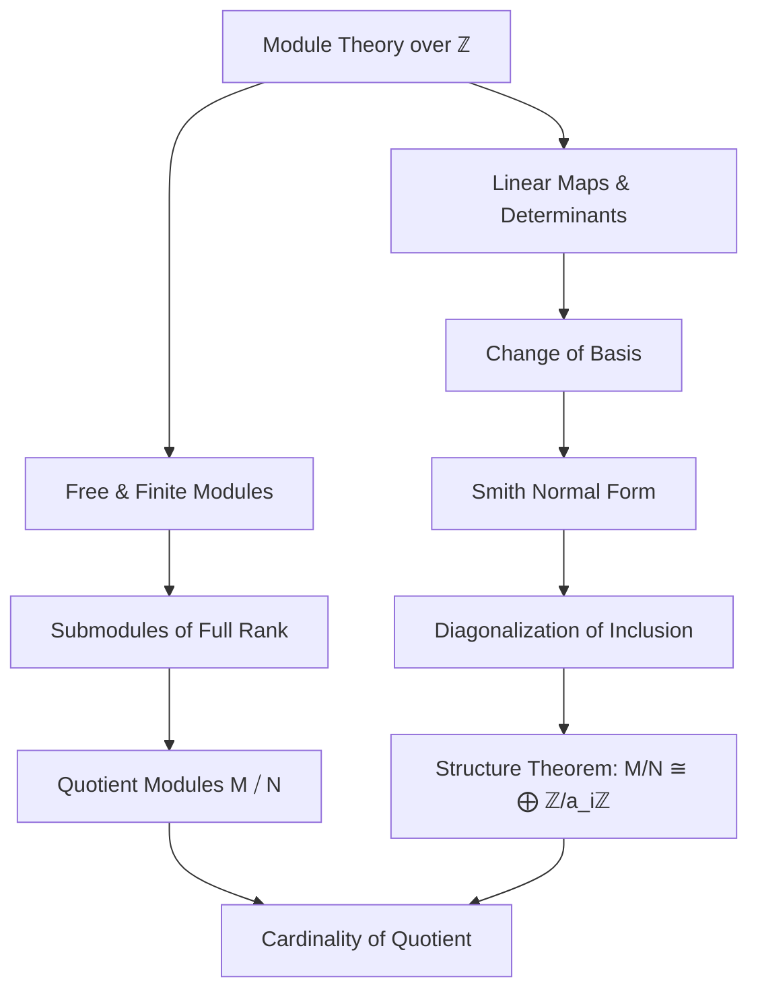
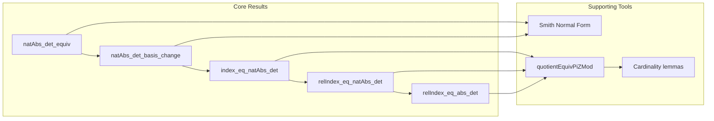

**Technical Brief: `CardQuotient.lean`**

---

### 1. **Key Definitions & Theorems**

| Name | Type / Signature | Purpose |
|------|------------------|---------|
| `Submodule.natAbs_det_equiv` | `∀ N : Submodule ℤ M, ∀ {E : Type*} [EquivLike E M N] [AddEquivClass E M N] (e : E), Int.natAbs (LinearMap.det (N.subtype ∘ₗ AddMonoidHom.toIntLinearMap e)) = Nat.card (M ⧸ N)` | Relates the absolute value of the determinant of an additive equivalence `e : M ≃ N` to the cardinality of the quotient module `M ⧸ N`. |
| `Submodule.natAbs_det_basis_change` | `∀ (b : Basis ι ℤ M) (N : Submodule ℤ M) (bN : Basis ι ℤ N), (b.det ((↑) ∘ bN)).natAbs = Nat.card (M ⧸ N)` | Main result: computes `#(M ⧸ N)` as the absolute value of the determinant of the change-of-basis matrix from `bN` to `b`. |
| `AddSubgroup.index_eq_natAbs_det` | `∀ (bE : Basis ι ℤ E) (N : AddSubgroup E) (bN : Basis ι ℤ N), N.index = (bE.det (bN ·)).natAbs` | Specialization to additive subgroups: index equals absolute determinant of basis change. |
| `AddSubgroup.relIndex_eq_natAbs_det` | `∀ (L₁ L₂ : AddSubgroup E) (H : L₁ ≤ L₂) (b₁, b₂), L₁.relIndex L₂ = (b₂.det (fun i ↦ ⟨b₁ i, H _⟩)).natAbs` | Computes relative index of nested subgroups via determinant of inclusion map in bases. |
| `AddSubgroup.relIndex_eq_abs_det` | `∀ (L₁ L₂ : AddSubgroup E) (H : L₁ ≤ L₂) (b₁ b₂ : Basis ι ℚ E), h₁, h₂ ⇒ L₁.relIndex L₂ = |b₂.det b₁|` | Same as above but over `ℚ`, using rational bases and closure conditions; expresses index as absolute value of determinant over `ℚ`. |

---

### 2. **Naming Conventions**

- **Prefixes**:
  - `natAbs_`: indicates use of `Int.natAbs` (absolute value in ℕ).
  - `det_`: determinant-related results.
  - `equiv_`: involves equivalences (e.g., `natAbs_det_equiv`).
  - `basis_change`: change-of-basis determinant formulas.
- **Suffixes**:
  - `_equiv`: when involving an equivalence (`Equiv`, `AddEquiv`, `LinearEquiv`).
  - `_basis_change`: when involving two bases and their determinant.
  - `_eq_natAbs_det`: equality with absolute determinant.
- **Other patterns**:
  - `relIndex` vs `index`: relative vs absolute index of subgroups.
  - `addSubgroupOfClosure`: helper constructing additive subgroup from rational basis.

---

### 3. **Tactic Stack**

Frequent tactics used in proofs:

- `rw`: rewriting using equalities and definitions.
- `congr`: congruence reasoning (especially for determinant equalities).
- `simp_rw`: simplification with rewrite rules.
- `ext`: extensionality for functions/morphisms.
- `cases`: case analysis on equalities or structures.
- `intro`: introducing variables/hypotheses.
- `have`, `suffices`: intermediate lemma introduction.
- `calc`: calculational proofs (chain of equalities).
- `by_cases`: case split on decidable propositions.
- `ring`: simplifying ring expressions (used implicitly in determinant computations).
- `congr 2`: for congruence of binary operations (e.g., determinant of matrices).
- `apply`, `exact`: proof term application.

---

### 4. **Proof Logic**

- **High-level strategy**:
  1. Reduce to a convenient basis via **Smith Normal Form** (SNF) — constructs bases `b'`, `ab` and coefficients `a` such that the inclusion `N ↪ M` is diagonal in these bases.
  2. Compute determinant in SNF basis: becomes product of diagonal entries `a i`.
  3. Use known structure theorem: `M ⧸ N ≅ ⨅ i, ℤ / a i ℤ`, so its cardinal is `∏ |a i|`.
  4. Show equivalence of this expression with determinant of arbitrary basis change via `natAbs_det_equiv`.
- **Key lemmas used**:
  - `LinearMap.det_toMatrix`
  - `Matrix.det_diagonal`
  - `quotientEquivPiZMod`: structural equivalence of quotient with product of cyclic groups.
  - `Nat.card_pi`, `Nat.card_zmod`: counting formulas for finite products and `ℤ/nℤ`.

---

### 5. **Imports**

| Import | Purpose |
|--------|---------|
| `Mathlib.Data.Int.Associated` | For `associated` relation and `Int.natAbs` properties. |
| `Mathlib.Data.Int.NatAbs` | Absolute value function `Int.natAbs : ℤ → ℕ`. |
| `Mathlib.LinearAlgebra.Determinant` | Determinant of linear maps and matrices. |
| `Mathlib.LinearAlgebra.FreeModule.Finite.Quotient` | Structure of quotients of finite free modules over PID (`ℤ`). |

---

### 6. **Mermaid Diagrams**

#### **Dependency Graph (Theoretical Scope)**

#### **File Overview & Theory Flow**

---

### 7. **Domain Summary**

This file formalizes a classical result in algebraic number theory and lattice theory:  
> For a full-rank sublattice $N \subseteq M$ of free $\mathbb{Z}$-modules of finite rank, the **index** $[M : N]$ equals the **absolute value of the determinant** of the change-of-basis matrix from a basis of $N$ to a basis of $M$.

It connects:
- **Module theory** (free, finite, quotients),
- **Linear algebra over $\mathbb{Z}$** (determinants, bases),
- **Group theory** (additive subgroups, index, relative index),
- **Number theory** (lattices, discriminants, class groups).

The result is foundational for:
- Computing class group representatives,
- Understanding discriminants of number fields,
- Lattice reduction algorithms (e.g., in computational algebra systems).

--- 

Let me know if you'd like a formalized dependency graph (e.g., for Lean’s `leanproject`), or a visualization of the SNF construction used in the proof.
