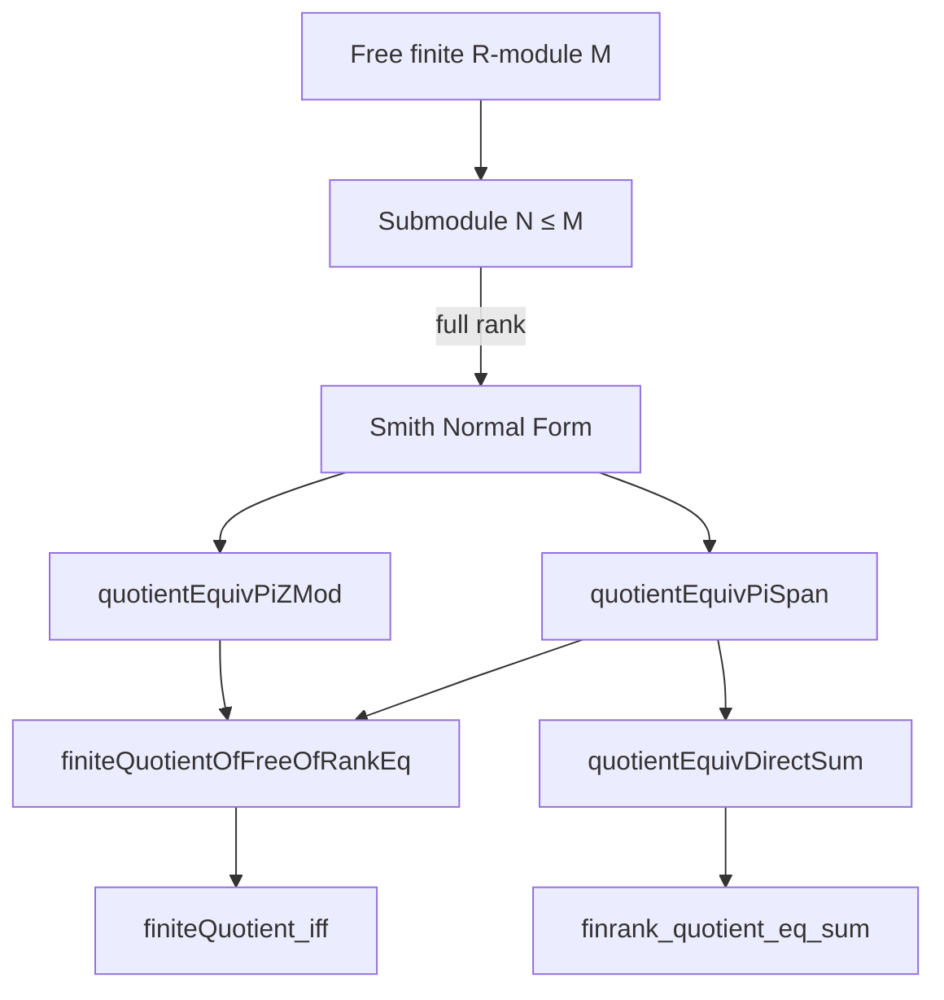

### Technical Brief: `Quotient.lean` — Quotients of Submodules of Full Rank over PIDs

---

#### **1. Key Definitions & Theorems**

| Name | Type | Purpose |
|------|------|---------|
| `quotientEquivPiSpan` | `(M ⧸ N) ≃ₗ[R] Π i, R ⧸ Ideal.span ({a i})` | Main structural theorem: quotient of a free finite module $M$ over a PID $R$ by a full-rank submodule $N$ decomposes as a product of cyclic quotients $R/(a_i)$, where $a_i$ are Smith normal form coefficients. |
| `quotientEquivPiZMod` | `M ⧸ N ≃+ Π i, ZMod (|a_i|)` | Specialization to $R = \mathbb{Z}$: quotient is additively isomorphic to a product of finite cyclic groups $ \mathbb{Z}/|a_i|\mathbb{Z} $. |
| `finiteQuotientOfFreeOfRankEq` | `Finite (M ⧸ N)` | Consequence: if $N \le M$ has equal rank, then $M/N$ is finite (for free finite $\mathbb{Z}$-modules). |
| `finiteQuotient_iff` | `Finite (M ⧸ N) ↔ Module.finrank N = Module.finrank M` | Characterization of finiteness of the quotient in terms of rank equality for free finite $\mathbb{Z}$-modules. |
| `quotientEquivDirectSum` | `(M ⧸ N) ≃ₗ[F] ⨁ i, R ⧸ Ideal.span ({a i})` | Refinement of `quotientEquivPiSpan` as a *direct sum* of cyclic modules (over an algebra $F$), using `DirectSum.linearEquivFunOnFintype`. |
| `finrank_quotient_eq_sum` | `Module.finrank (M ⧸ N) = ∑ i Module.finrank (R/(a_i))` | Computes the rank of the quotient module as the sum of ranks of the cyclic summands. |

- **`a := smithNormalFormCoeffs b h`**: the diagonal entries (Smith coefficients) of the inclusion $N \hookrightarrow M$ w.r.t. bases $b'$ and $ab$.
- **`smithNormalFormTopBasis`, `smithNormalFormBotBasis`**: change-of-basis data yielding a diagonalized inclusion map.

---

#### **2. Naming Conventions**

- **Prefixes**:
  - `quotientEquiv...`: indicates a linear/additive equivalence involving a quotient.
  - `finiteQuotient...`: properties of finiteness of quotients.
- **Suffixes**:
  - `PiSpan`: product of quotients by principal ideals.
  - `PiZMod`: product of `ZMod` (integers mod $n$).
  - `DirectSum`: direct sum decomposition (equivalent to product for finite index sets).
- **Variables**:
  - `a`, `b'`, `ab`: intermediate objects in Smith normal form construction.
  - `N'`: image of $N$ under a basis isomorphism.

---

#### **3. Tactic Stack**

| Tactic | Usage |
|--------|-------|
| `simp_rw` | Rewriting with definitional equalities (e.g., `mem_I_iff`). |
| `simp only [...]` | Simplifying membership in submodules, images, and products. |
| `constructor` | Proving biconditionals or universal properties. |
| `intro`, `rintro`, `refine`, `exact` | Standard proof structure. |
| `choose` | Axiom of choice for dependent families (e.g., picking witnesses for divisibility). |
| `rw [b'.ext_elem ...]` | Extensivity of basis representation. |
| `exact ...` | Closing goals via known equivalences (e.g., `Submodule.quotientPi`). |
| `classical` | Used before classical reasoning (e.g., existence of basis). |
| `finrank_eq`, `finrank_le`, `LinearEquiv.finrank_eq` | Rank computations. |

---

#### **4. Proof Logic**

The core proof strategy for `quotientEquivPiSpan` is:

1. **Smith Normal Form Setup**:
   - Use `smithNormalFormCoeffs`, `smithNormalFormTopBasis`, `smithNormalFormBotBasis` to diagonalize the inclusion $N \hookrightarrow M$.
   - Obtain basis $b'$ of $M$ and $ab$ of $N$ such that the inclusion sends $b'_i \mapsto a_i \cdot ab_i$.

2. **Characterize $N$ in Coordinates**:
   - Show $x \in N \iff \forall i,\ a_i \mid b'.repr(x, i)$.

3. **Transport Submodule via Basis Equivalence**:
   - Identify $M \cong \Pi i, R$ via $b'.equivFun$, and show $N$ maps to $N' = \Pi i, (a_i)$.

4. **Apply Quotient Equivalence**:
   - Use `Submodule.Quotient.equiv` to get $(M/N) \cong (\Pi i, R)/(N')$.
   - Apply `Submodule.quotientPi` to decompose the quotient as $\Pi i, R/(a_i)$.

5. **Specialization to $\mathbb{Z}$**:
   - Use `Int.quotientSpanEquivZMod` to identify $R/(a_i) = \mathbb{Z}/(a_i) \cong \mathbb{Z}/|a_i|\mathbb{Z} = \texttt{ZMod}(|a_i|)$.

6. **Finiteness & Rank**:
   - Use finite product of finite sets (`ZMod n` for $n > 0$) to deduce `Finite (M/N)`.
   - Prove equivalence `Finite (M/N) ↔ rank equality` using `finrank_le` and `lsmul` arguments.

---

#### **5. Imports & Dependencies**

| Import | Role |
|--------|------|
| `Mathlib.Data.ZMod.QuotientRing` | `ZMod` and its relation to quotients of $\mathbb{Z}$. |
| `Mathlib.LinearAlgebra.Dimension.Constructions` | `finrank`, dimension arguments. |
| `Mathlib.LinearAlgebra.FreeModule.PID` | Smith normal form over PIDs (`smithNormalFormCoeffs`, etc.). |
| `Mathlib.LinearAlgebra.FreeModule.StrongRankCondition` | Ensures rank is well-defined (used implicitly via `finrank`). |
| `Mathlib.LinearAlgebra.Quotient.Pi` | `Submodule.quotientPi`, quotient of product modules. |

---

#### **6. Theory Overview & Dependency Diagram**

##### **High-Level Theory Flow**

```
Free finite module M over PID R
│
├── Submodule N ≤ M of full rank (finrank N = finrank M)
│   │
│   ├── Smith Normal Form → diagonal inclusion matrix diag(a₁,…,aₙ)
│   │
│   ├── Quotient M/N ≅ ∏ R/(aᵢ)  (quotientEquivPiSpan)
│   │
│   └── For R = ℤ: M/N ≅ ∏ ZMod(|aᵢ|)  (quotientEquivPiZMod)
│       │
│       ├── ⇒ M/N finite (finiteQuotientOfFreeOfRankEq)
│       │
│       └── ⇐ M/N finite ⇒ rank equality (finiteQuotient_iff)
│
└── Direct sum decomposition (quotientEquivDirectSum)
    │
    └── Rank additivity (finrank_quotient_eq_sum)
```

##### **Mermaid Diagrams**

**Dependency Graph (Module-Level)**



**Proof Structure (quotientEquivPiSpan)**

```mermaid
flowchart LR
  SNF[Smith Normal Form] -->|basis b', ab| Diag[Inclusion diag(aᵢ)]
  Diag -->|repr characterization| Char[mem_I_iff]
  Char -->|transport via b'.equivFun| Map[N ↦ N' = ∏ (aᵢ)]
  Map -->|Submodule.Quotient.equiv| Quot1[(M/N) ≅ (Π R)/N']
  Quot1 -->|Submodule.quotientPi| Quot2[(M/N) ≅ ∏ R/(aᵢ)]
```

---

#### **7. Summary**

This module formalizes the structure theorem for quotients of full-rank submodules in free finite modules over PIDs, especially $\mathbb{Z}$. It leverages Smith normal form to reduce the problem to principal ideal quotients, and connects algebraic structure (decomposition into cyclic modules) with arithmetic properties (finiteness, rank). The results are foundational for classifying finite abelian groups and modules over PIDs.

--- 

Let me know if you'd like a formalized dependency graph in `leanpkg` format or a visualization of the `quotientEquivDirectSum` ↔ `quotientEquivPiSpan` relationship.
