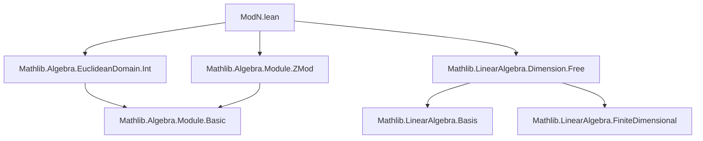
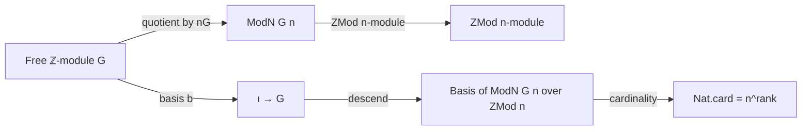

**Technical Brief: `ModN.lean`**

---

### 1. **Key Definitions & Theorems**

| Name | Type / Signature | Purpose |
|------|------------------|---------|
| `ModN G n` | `abbrev ModN : Type _ := G ⧸ LinearMap.range (LinearMap.lsmul ℤ G n)` | Quotient of additive group `G` by the subgroup `nG = {n • g | g : G}` |
| `ModN.liftEquiv` | `[AddMonoid M] : (ModN G n →+ M) ≃ {φ : G →+ M // ∀ g, n • φ g = 0}` | Universal property: additive monoid maps out of `ModN G n` correspond to `n`-torsion maps from `G` |
| `ModN.liftEquiv'` | `[AddCommGroup H] [Module (ZMod n) H] : (ModN G n →ₗ[ZMod n] H) ≃ {φ : G →+ H // ∀ g, n • φ g = 0}` | Universal property for `ZMod n`-linear maps |
| `ModN.mkQ` | `def mkQ : G →+ ModN G n` | Canonical quotient map `g ↦ g + nG` |
| `ModN.basis` | `def basis {ι : Type*} (b : Basis ι ℤ G) : Basis ι (ZMod n) (ModN G n)` | Given a ℤ-basis of `G`, constructs a `(ZMod n)`-basis of `ModN G n` |
| `ModN.basis_apply_eq_mkQ` | `lemma basis_apply_eq_mkQ` | Explicit description: `basis b i = mkQ (b i)` |
| `ModN.natCard_eq` | `lemma natCard_eq : Nat.card (ModN G n) = n ^ Module.finrank ℤ G` | Cardinality of `ModN G n` is `n^d` where `d = rank(G)` |

---

### 2. **Naming Conventions**

- **Prefixes**:
  - `liftEquiv` / `liftEquiv'`: universal properties via equivalence of hom-sets.
  - `mkQ`: “map to quotient” (`mk` + `Q` for quotient).
  - `basis`: constructs a basis in the quotient from one in the original module.
- **Suffixes**:
  - `'` (prime): variant of previous definition (e.g., `liftEquiv'` refines `liftEquiv` for modules).
- **Variables**:
  - `G`, `H`, `M`: generic additive groups/modules.
  - `n`: natural number (scalar for torsion/quotient).
  - `ι`: index type for bases.

---

### 3. **Tactic Stack**

Frequently used tactics in proofs:
- `simp` / `simp only`: simplification with definitional equalities and lemmas.
- `aesop`: automated reasoning for simple goals (used in `right_inv`).
- `rw`: rewriting using equalities/equivalences.
- `intro` / `rintro`: introduction of hypotheses/variables.
- `induction ... using ...`: structural induction on quotient elements.
- `ext`: extensionality for functions/morphisms.
- `change`: targeted rewriting for readability (e.g., to expose a goal in terms of kernel).
- `refine`: constructing terms with holes to be filled later.
- `choose`: using dependent choice to extract witnesses from existential hypotheses.

---

### 4. **Proof Logic**

- **Structure of proofs**:
  - **Universal properties (`liftEquiv`, `liftEquiv'`)**:
    - Construct forward/backward maps using `QuotientAddGroup.lift` / `comp`.
    - Prove well-definedness via kernel containment.
    - Show inverses using induction on quotient representatives and extensionality.
  - **Basis construction (`basis`)**:
    - Reduce to linear algebra over `ℤ` and `ZMod n`.
    - Use `mapRange.linearMap` to descend scalars.
    - Prove bijectivity of induced map by:
      - Injectivity: show kernel trivial using divisibility (`n ∣ f x b` ⇒ `x ∈ nG`).
      - Surjectivity: lift surjectivity from `ℤ`-basis to `ZMod n` via `mapRange_surjective`.
  - **Cardinality (`natCard_eq`)**:
    - Use equivalence between `ModN G n` and `ZMod n^d` via basis isomorphism.
    - Apply `Nat.card_congr` and known facts about finite modules.

- **Induction pattern**:
  - Quotient induction (`QuotientAddGroup.induction_on`) is standard for element-wise arguments.

---

### 5. **Imports**

| Import | Role |
|--------|------|
| `Mathlib.Algebra.EuclideanDomain.Int` | Provides `ℤ`-module structure, `lsmul`, Euclidean domain facts |
| `Mathlib.Algebra.Module.ZMod` | `ZMod n`-module theory, scalar multiplication, torsion |
| `Mathlib.LinearAlgebra.Dimension.Free` | Free modules, bases, finite rank, cardinality lemmas |

---

### 6. **Mermaid Diagrams**

#### **Dependency Graph (Module-Level)**

#### **Overview of Theory Flow**

---

### 7. **Summary**

This file formalizes the structure of the quotient `G / nG` for a free ℤ-module `G`, showing it inherits a natural `(ℤ/nℤ)`-module structure, admits a basis induced from any ℤ-basis of `G`, and has cardinality `n^d` where `d = rank(G)`. The proofs rely on:
- Quotient universal properties,
- Linear algebra over principal ideal domains (`ℤ`),
- Explicit basis constructions via `mapRange` and `liftQ`.

The development is clean, modular, and leverages Lean’s `AddMonoidHom`, `LinearMap`, and `QuotientAddGroup` infrastructure.
