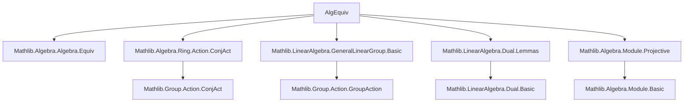

### Technical Brief: `AlgEquiv.lean`

---

#### **1. Key Definitions & Theorems**

| Name | Type / Signature | Purpose |
|------|------------------|---------|
| `AlgEquiv.eq_linearEquivConjAlgEquiv` | `f : End K V ≃ₐ[K] End K W → ∃ T : V ≃ₗ[K] W, f = T.conjAlgEquiv K` | Main theorem: any algebra isomorphism between endomorphism rings of projective modules is inner, i.e., induced by a linear equivalence. |
| `LinearEquiv.conjAlgEquiv_surjective` | `Function.Surjective (conjAlgEquiv K)` | Reformulation: every algebra equivalence arises as conjugation by some linear equivalence. |
| `Module.End.mulSemiringActionToAlgEquiv_conjAct_surjective` | `Function.Surjective (MulSemiringAction.toAlgEquiv …)` | Special case for $V = W$: the natural action of $\mathrm{GL}(V)$ on $\mathrm{End}(V)$ via algebra automorphisms is surjective onto all algebra automorphisms. |
| `conjAlgEquiv` | `V ≃ₗ[K] W → End K V ≃ₐ[K] End K W` | The canonical map sending a linear equivalence $T$ to the algebra equivalence $x \mapsto T \circ x \circ T^{-1}$. |
| `smulRight`, `smulRightₗ`, `applyₗ` | `V → K → End K V`, `K → V ≃ₗ[K] V`, `W → (V →ₗ[K] W) ≃ₗ[K] V →ₗ[K] W` | Standard constructions used to build test maps (e.g., rank-1 operators). |

---

#### **2. Naming Conventions**

- **Prefixes**:
  - `conjAlgEquiv`: conjugation by linear equivalence → algebra equivalence.
  - `smulRight[_ₗ]`: right multiplication by scalar (as linear endomorphism).
  - `applyₗ`: evaluation at a fixed point, promoted to linear map.
- **Suffixes**:
  - `_surjective`: asserts surjectivity of a map.
  - `_toAlgEquiv`: conversion from multiplicative/group action to algebra equivalence.
- **Variables**:
  - `K`: base semifield.
  - `V, W`: projective $K$-modules.
  - `f`: algebra equivalence.
  - `T`: linear equivalence (constructed in proof).
  - `u, v, z, d`: elements used in rank-1 operator constructions.

---

#### **3. Tactic Stack**

| Tactic | Usage |
|--------|-------|
| `by_cases!` | Split on subsingleton case (`hV : Subsingleton V`). |
| `simp_rw` | Rewrite using extensionality lemmas (`AlgEquiv.ext_iff`, `conjAlgEquiv_apply`, etc.). |
| `obtain ⟨…⟩` | Extract witnesses from existential statements (e.g., dual pair, non-zero image). |
| `congr` + `ext` | Prove equality of linear maps/endomorphisms by extensionality. |
| `simp` | Simplify compositions, applications, and module actions. |
| `nontriviality` | Ensure nontriviality of module when needed (after subsingleton case). |
| `ofBijective` | Construct linear equivalence from bijective linear map. |

---

#### **4. Proof Logic**

The proof proceeds as follows:

1. **Subsingleton case**: If $V$ is subsingleton, then $V \cong 0$, and $W$ must also be subsingleton (hence zero), so both endomorphism rings are trivial — the result holds vacuously.

2. **Non-subsingleton case**:
   - Pick $u \in V$, $v \in V$ such that $v(u) \ne 0$ (using projectivity to get a dual pair).
   - Pick $z \in W$ such that $f(\mathrm{smulRight}\ v\ u)(z) \ne 0$ (using nontriviality and projectivity again).
   - Define $T := \mathrm{apply}_\ell\ z \circ f \circ \mathrm{smulRight}_\ell\ v$, i.e., $T(x) = f(\mathrm{smulRight}\ v\ x)(z)$.
   - Show $T$ intertwines $f$: $T(Ax) = f(A)(T(x))$.
   - Prove $T$ is surjective using projectivity (existence of dual vector $d$ with $d(z)=1$).
   - Prove $T$ is injective using injectivity of $f$ and invertibility of scalar action.
   - Conclude $T$ is a linear equivalence, and $f = T.\mathrm{conjAlgEquiv}$.

3. **Corollaries**:
   - Surjectivity of `conjAlgEquiv` follows directly.
   - For $V = W$, the group action $\mathrm{GL}(V) \curvearrowright \mathrm{End}(V)$ via conjugation surjects onto $\mathrm{AlgEquiv}(\mathrm{End}(V))$.

---

#### **5. Imports & Dependencies**

| Import | Role |
|--------|------|
| `Mathlib.Algebra.Algebra.Equiv` | Core definitions of algebra equivalences. |
| `Mathlib.Algebra.Ring.Action.ConjAct` | Conjugation action of $\mathrm{GL}(V)$ on $\mathrm{End}(V)$. |
| `Mathlib.LinearAlgebra.GeneralLinearGroup.Basic` | Definition of $\mathrm{GL}(V)$ and its action. |
| `Mathlib.LinearAlgebra.Dual.Lemmas` | Dual vectors, evaluation maps, rank-1 operators (`smulRight`, `applyₗ`). |
| `Mathlib.Algebra.Module.Projective` | Projectivity used to construct dual pairs and split epimorphisms. |

---

#### **6. Mermaid Diagrams**

##### **Dependency Graph**



##### **Theoretical Overview**

```mermaid
flowchart LR
  A[Projective K-modules V, W] --> B[End K V, End K W]
  B --> C[AlgEquiv End K V ≃ₐ[K] End K W]
  C --> D[LinearEquiv V ≃ₗ[K] W]
  D -->|conjAlgEquiv| C
  D -.->|surjective| C
  C -->|special case V=W| E[MulSemiringAction.toAlgEquiv]
  E -->|surjective| C
```

---

#### **7. Summary**

This file establishes a structural rigidity result: *all* algebra isomorphisms between endomorphism rings of projective modules are inner — i.e., induced by change-of-base via a linear equivalence. It generalizes the classical fact that $\mathrm{Aut}_{K\text{-alg}}(\mathrm{End}_K(V)) \cong \mathrm{PGL}(V)$ for finite-dimensional $V$, but here holds for arbitrary projective modules over a semifield. The proof is constructive and leverages projectivity to extract dual pairs and rank-1 operators.

--- 

Let me know if you'd like a formalized summary in Lean docstring format or a visualization of the proof structure as a tactic tree.
