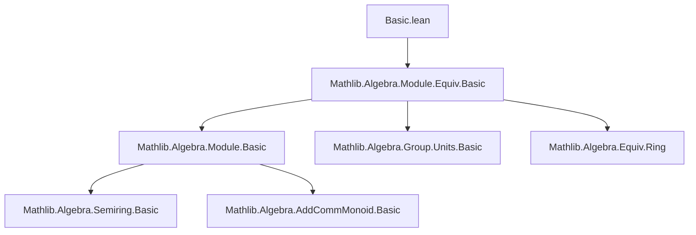

### Technical Brief: `Basic.lean` — General Linear Group of Linear Maps

---

#### **1. Key Definitions & Theorems**

| Name | Type / Signature | Purpose |
|------|------------------|---------|
| `GeneralLinearGroup` | `abbrev GeneralLinearGroup := (M →ₗ[R] M)ˣ` | Defines the group of invertible $R$-linear endomorphisms of $M$ as the unit group of the monoid of linear maps. |
| `toLinearEquiv` | `def toLinearEquiv (f : GeneralLinearGroup R M) : M ≃ₗ[R] M` | Converts an invertible linear map to a linear equivalence (i.e., an isomorphism in the category of $R$-modules). |
| `ofLinearEquiv` | `def ofLinearEquiv (f : M ≃ₗ[R] M) : GeneralLinearGroup R M` | Converts a linear equivalence back to an invertible linear map (i.e., an element of the general linear group). |
| `generalLinearEquiv` | `def generalLinearEquiv : GeneralLinearGroup R M ≃* M ≃ₗ[R] M` | Multiplicative equivalence between the general linear group and the group of linear equivalences. |
| `congrLinearEquiv` | `def congrLinearEquiv (e₁₂ : M₁ ≃ₛₗ[σ₁₂] M₂) : GeneralLinearGroup R₁ M₁ ≃* GeneralLinearGroup R₂ M₂` | Induces a group isomorphism between general linear groups via a semilinear equivalence. |
| `coe_toLinearEquiv` | `f.toLinearEquiv = (f : M → M)` | Shows coercion of `toLinearEquiv` agrees with underlying function. |
| `toLinearEquiv_mul`, `toLinearEquiv_inv` | `f, g ↦ (f * g).toLinearEquiv = f.toLinearEquiv * g.toLinearEquiv`, etc. | Verifies that `toLinearEquiv` preserves multiplication and inversion. |
| `ofLinearEquiv_mul`, `ofLinearEquiv_inv` | Analogous to above for `ofLinearEquiv`. | Confirms `ofLinearEquiv` is a group homomorphism. |
| `congrLinearEquiv_apply` | `congrLinearEquiv e₁₂ g = ofLinearEquiv (e₁₂.symm.trans (g.toLinearEquiv.trans e₁₂))` | Explicit description of how `congrLinearEquiv` acts. |
| `congrLinearEquiv_trans`, `congrLinearEquiv_trans'`, `congrLinearEquiv_refl` | Functorsiality lemmas for `congrLinearEquiv`. | Ensures compatibility with composition and identity of equivalences. |

---

#### **2. Naming Conventions**

- **Prefixes**:
  - `to_`: Conversion *from* a structured object to a simpler one (e.g., `toLinearEquiv`, `toFun`).
  - `of_`: Conversion *from* a simpler object to a structured one (e.g., `ofLinearEquiv`).
  - `congr_`: Congruence/isomorphism induced by an equivalence (e.g., `congrLinearEquiv`).
- **Suffixes**:
  - `_equiv`: Indicates an equivalence (often `≃` or `≃*`).
  - `_map`: For maps between structured objects (e.g., `mapEquiv` in `Units.mapEquiv`).
- **Function names**:
  - `coe_`: Coercion lemmas (e.g., `coe_toLinearEquiv`, `coe_ofLinearEquiv`, `coeFn_generalLinearEquiv`).
  - `_mul`, `_inv`: Lemmas about preservation of group operations.

---

#### **3. Tactic Stack**

- **`rfl`**: Dominant tactic — used in almost all proofs to show definitional equality.
- **`ext`**: Used to extend extensionality (e.g., `ext; rfl` for function extensionality).
- **`simp`**: Used in `left_inv`/`right_inv` proofs inside `toLinearEquiv`.
- **`aesop`** not used here — this file is highly definitional.
- **No induction or case analysis** — all proofs are by definitional equality or extensionality.

---

#### **4. Proof Logic**

- **Definitional reasoning**: Most proofs are immediate from definitions (e.g., `rfl`, `ext; rfl`).
- **Extensionality**: For proving equality of linear maps or equivalences, `ext` is used to reduce to pointwise equality.
- **Functoriality via naturality**: `congrLinearEquiv` lemmas follow from naturality of conjugation by semilinear equivalences.
- **No heavy algebraic manipulation**: The structure is mostly categorical — the group structure is inherited from `Units`, and equivalences are handled via transport.

---

#### **5. Imports**

- `Mathlib.Algebra.Module.Equiv.Basic`: Core module equivalences (`≃ₗ`, `≃ₛₗ`), their composition, inverses, etc.
- Implicitly relies on:
  - `Mathlib.Algebra.Group.Units.Basic` (for `ˣ`, unit group construction)
  - `Mathlib.Algebra.Module.Basic` (for `→ₗ`, `Module`, `AddCommMonoid`, `Semiring`)
  - `Mathlib.Algebra.Equiv.Ring` (for `RingHomInvPair`, `RingHomCompTriple` in functoriality section)

---

#### **6. Theory Overview & Dependency Diagram**

##### **Conceptual Flow**
```
Linear Maps (M →ₗ M)
       ↓
Units (invertible elements) → GeneralLinearGroup R M
       ↓
Linear Equivalences (M ≃ₗ M)
       ↑
Semilinear Equivs (M₁ ≃ₛₗ M₂) → induce group isos (congrLinearEquiv)
```

##### **Mermaid Diagrams**

**Dependency Graph (Module-Level)**



**Conceptual Structure (Theory Graph)**

```mermaid
graph LR
  A[Linear Maps M →ₗ M] -->|Units| B[GeneralLinearGroup R M]
  B -->|toLinearEquiv| C[Linear Equivs M ≃ₗ M]
  C -->|ofLinearEquiv| B
  B <-->|generalLinearEquiv| C
  D[Semilinear Equivs M₁ ≃ₛₗ M₂] -->|congrLinearEquiv| B₁[GL(R₁, M₁)]
  D -->|congrLinearEquiv| B₂[GL(R₂, M₂)]
  B₁ <-->|congrLinearEquiv e| B₂
```

**Functoriality Layer**

```mermaid
graph LR
  M₁ ≃ₛₗ[σ₁₂] M₂ -->|congrLinearEquiv| GL(R₁, M₁) ≃* GL(R₂, M₂)
  M₂ ≃ₛₗ[σ₂₃] M₃ -->|congrLinearEquiv| GL(R₂, M₂) ≃* GL(R₃, M₃)
  M₁ ≃ₛₗ[σ₁₃] M₃ -->|congrLinearEquiv| GL(R₁, M₁) ≃* GL(R₃, M₃)
  %% naturality
  (M₁ ≃ₛₗ M₂) .-> (M₂ ≃ₛₗ M₃) .-> (M₁ ≃ₛₗ M₃)
  GL(R₁,M₁) ≃* GL(R₂,M₂) .-> GL(R₂,M₂) ≃* GL(R₃,M₃) .-> GL(R₁,M₁) ≃* GL(R₃,M₃)
```

---

#### **7. Summary**

This file formalizes the **equivalence between the general linear group** (defined as units of the linear endomorphism monoid) **and the group of linear equivalences** on a module $M$ over a semiring $R$. It further establishes **functoriality**: semilinear equivalences induce group isomorphisms between general linear groups, with coherence laws (identity, composition) verified definitionaly.

The formalization is **highly structural and definitional**, leveraging Lean’s typeclass inference and `Units` machinery to avoid redundant constructions. It serves as a foundational module for more advanced linear algebra (e.g., matrix representations, determinant theory, Lie groups).
