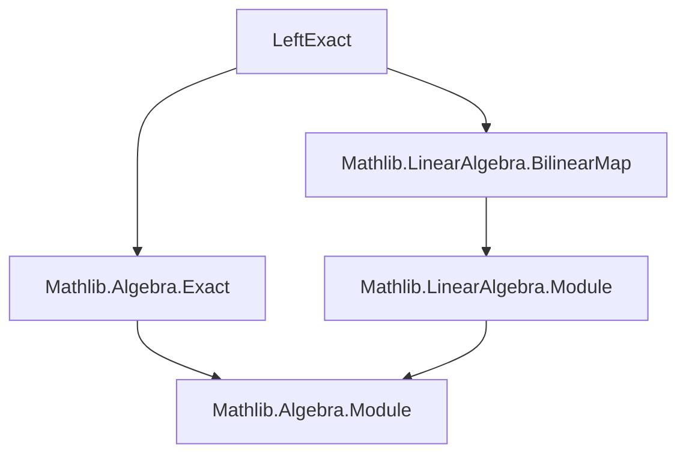

**Technical Brief: `LeftExact.lean`**

---

### 1. **Key Definitions & Theorems**

| Name | Type | Purpose |
|------|------|---------|
| `exact_lcomp_of_exact_of_surjective` | `{f : M1 →ₗ[R] M2} {g : M2 →ₗ[R] M3} → Function.Exact f g → Function.Surjective g → Function.Exact (lcomp R N g) (lcomp R N f)` | Proves left exactness of the contravariant Hom functor `(- →ₗ[R] N)` at the middle term, assuming surjectivity of `g`. |
| `LinearMap.lcomp` | `(M₂ →ₗ[R] M₃) → (M₁ →ₗ[R] M₂) → (M₁ →ₗ[R] M₃)` | Left composition (precomposition) of linear maps; used to define the induced map on Hom. |
| `LinearMap.lcomp_apply'` | `lcomp R N g h = h ∘ g` | Beta-reduction lemma for `lcomp`. |
| `Function.Exact` | `(f : A → B) → (g : B → C) → Prop` | `Function.Exact f g` means `range f = ker g`. |
| `LinearMap.range_le_ker_iff` | `range f ≤ ker g ↔ f.comp g = 0` | Equivalence between inclusion of range in kernel and composition being zero. |
| `linearEquivOfSurjective` (from `Mathlib.Algebra.Exact`) | `Function.Surjective g → range g ≃ₗ[R] M3` | Given surjective `g : M2 → M3`, provides a linear equivalence `range g ≃ₗ[R] M3`. |
| `liftQ` (on submodules) | `range f ≤ ker h ⇒ ∃! h' : range f → N, h' ∘ subtype = h` | Universal property of quotient / lift through range. |

---

### 2. **Naming Conventions**

- **Prefixes**:
  - `lcomp_`: for left-composition (precomposition) operations on linear maps.
  - `exact_`: for lemmas about exactness of sequences under Hom.
- **Suffixes**:
  - `_of_exact_of_surjective`: indicates the lemma’s hypotheses: exactness of original sequence + surjectivity.
- **Module/Map variables**:
  - `f`, `g`: maps in the original sequence `M1 → M2 → M3`.
  - `N`: target module for Hom.
  - `R`: base commutative ring.

---

### 3. **Tactic Stack**

- `intro h`: standard intro for proving `Function.Exact`.
- `simp only [LinearMap.lcomp_apply', Set.mem_range]`: simplification using definitional lemmas.
- `refine ⟨fun hh ↦ ?_, fun ⟨y, hy⟩ ↦ ?_⟩`: split exactness proof into two inclusions (`range ⊆ ker` and `ker ⊆ range`).
- `use ...`: construct witness for existence.
- `ext x`: extensionality for linear maps (pointwise equality).
- `rw [← hy, LinearMap.comp_assoc, exac.linearMap_comp_eq_zero, LinearMap.comp_zero y]`: rewrite using hypotheses and known identities.

No heavy automation (e.g., `aesop`, `ring`, `simp_rw`) is used — the proof is mostly *constructive* and *algebraic*.

---

### 4. **Proof Logic**

The proof proceeds as follows:

1. **Goal**: Show `Function.Exact (lcomp g) (lcomp f)`, i.e., `range (lcomp g) = ker (lcomp f)`.
2. **Inclusion `⊆`** (`range (lcomp g) ⊆ ker (lcomp f)`):
   - Given `h ∈ range (lcomp g)`, i.e., `h = h' ∘ g` for some `h' : M3 → N`.
   - Show `h ∘ f = 0`: use `exac.linearMap_comp_eq_zero` (since `f.comp g = 0` by exactness).
3. **Inclusion `⊇`** (`ker (lcomp f) ⊆ range (lcomp g)`):
   - Given `h : M2 → N` with `h ∘ f = 0`, i.e., `range f ≤ ker h`.
   - Since `g` is surjective, `range g = M3`, and `exac` gives `range f = ker g`.
   - So `h` factors through `M2 / ker g ≅ M3` via the linear equivalence `linearEquivOfSurjective`.
   - Construct `h' : M3 → N` as `h' = h ∘ (equiv.symm : M3 → M2 / ker g)` composed with the lift of `h` through `range f`.
   - Verify `h = h' ∘ g` using `comp_assoc` and `comp_zero`.

The key idea: surjectivity of `g` lets us identify `M3` with `M2 / ker g`, and exactness identifies `ker g = range f`, so any map killing `range f` descends to `M3`.

---

### 5. **Imports**

- `Mathlib.Algebra.Exact`: provides `Function.Exact`, `linearEquivOfSurjective`, `linearMap_comp_eq_zero`.
- `Mathlib.LinearAlgebra.BilinearMap`: contains `LinearMap.lcomp`, `lcomp_injective_of_surjective`, and related lemmas.

> **Note**: The file is part of a larger effort to formalize homological algebra in Lean, specifically the contravariant Hom functor’s left exactness.

---

### 8. **Dependency & Theory Overview**

#### Mermaid Diagram: File Dependencies



#### Mermaid Diagram: Theoretical Flow (This File)

```mermaid
graph LR
  A[Exact Sequence M1 →f M2 →g M3 → 0] --> B[Surjective g]
  A --> C[Exactness: range f = ker g]
  B --> D[LinearEquiv range g ≃ₗ M3]
  C --> E[Lift h through range f]
  D & E --> F[Construct h' : M3 → N]
  F --> G[Show h = h' ∘ g]
  G --> H[Exactness at Hom(M2,N)]
```

#### Summary

This file formalizes the **left exactness of the contravariant Hom functor** in the category of modules over a commutative ring. It complements the known result `lcomp_injective_of_surjective` (injectivity at the left term) by proving exactness at the middle term. The proof is constructive and leverages standard module-theoretic universal properties (quotients, lifts, linear equivalences). It sits at the foundation for further homological algebra developments (e.g., derived functors, Ext, spectral sequences).

--- 

Let me know if you'd like the corresponding diagram for the full `Hom` complex or derived functors.
