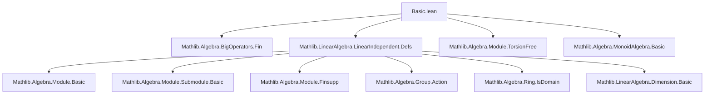
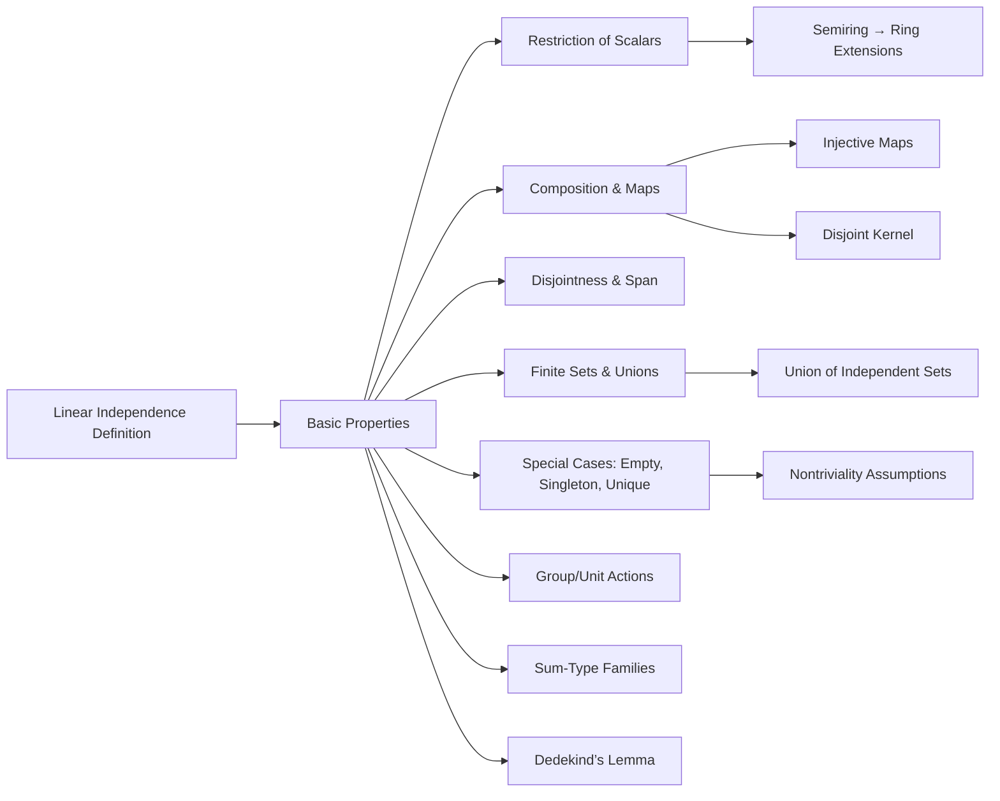

**Technical Brief: `Basic.lean` — Linear Independence in Lean 4 / Mathlib**

---

### 1. KEY DEFINITIONS & THEOREMS

| Name | Type / Signature | Purpose |
|------|------------------|---------|
| `LinearIndependent R v` | `Prop` | Family `v : ι → M` is linearly independent over semiring `R`. Defined via `Finsupp.linearCombination` being injective. |
| `LinearIndepOn R v s` | `Prop` | Restriction of linear independence to indices in `s : Set ι`. |
| `LinearIndependent.restrict_scalars` | `[Semiring K] [SMulWithZero R K] [Module K M] [IsScalarTower R K M] → LinearIndependent K v → LinearIndependent R v` | If scalars are restricted along an injective map `R → K`, linear independence is preserved. |
| `LinearIndependent.restrict_scalars'` | `[FaithfulSMul R K] → LinearIndependent K v → LinearIndependent R v` | More practical version using `FaithfulSMul`. |
| `Submodule.range_ker_disjoint` | `LinearIndependent R (f ∘ v) → Disjoint (span (range v)) (ker f)` | If `f ∘ v` is linearly independent, then `span(range v)` intersects `ker f` trivially. |
| `LinearIndependent.map` | `LinearIndependent R v → Disjoint (span (range v)) (ker f) → LinearIndependent R (f ∘ v)` | Pushforward of linear independence along a linear map with disjoint kernel. |
| `LinearIndependent.map'` | `LinearIndependent R v → ker f = ⊥ → LinearIndependent R (f ∘ v)` | Special case: injective linear maps preserve linear independence. |
| `linearIndependent_sum` | `LinearIndependent R (v ∘ Sum.inl) ∧ LinearIndependent R (v ∘ Sum.inr) ∧ Disjoint(...) ↔ LinearIndependent R v` | Characterizes linear independence of a sum-type family as independence of each part + disjointness of spans. |
| `linearIndependent_monoidHom` | `LinearIndependent L (fun f : G →* L ↦ f : G → L)` | **Dedekind’s Lemma**: distinct monoid homomorphisms `G → L` (with `L` a commutative domain) are linearly independent over `L`. |
| `linearIndependent_unique_iff` | `[Unique ι] → LinearIndependent R v ↔ v default ≠ 0` | For singleton index type, linear independence reduces to non-vanishing. |
| `linearIndepOn_singleton_iff` | `LinearIndepOn R v {i} ↔ v i ≠ 0` | Same for singleton sets. |
| `LinearIndependent.group_smul` / `LinearIndependent.units_smul` | `LinearIndependent R v → LinearIndependent R (w • v)` | Action by group/unit elements preserves linear independence. |
| `LinearIndepOn.union` | `LinearIndepOn R v s ∧ LinearIndepOn R v t ∧ Disjoint(...) → LinearIndepOn R v (s ∪ t)` | Union of disjointly-spanned independent sets is independent. |
| `linearIndepOn_union_iff` | Equivalence for union under disjointness of index sets. | Enables bidirectional reasoning about unions. |

---

### 2. NAMING CONVENTIONS

- **Prefixes**:
  - `linearIndependent_`: properties about families (`ι → M`)
  - `linearIndepOn_`: properties about sets (`Set ι`)
  - `map_`, `restrict_scalars_`, `group_smul_`, `units_smul_`: action-based modifiers
  - `disjoint_`, `span_`, `image_`, `subtype_`: structural modifiers

- **Suffixes**:
  - `_iff`: characterizations (biconditionals)
  - `_iff'`, `_iff''`: variants for different formulations (e.g., via `Finsupp.linearCombination`)
  - `_of_`: implication direction (e.g., `map_of_injective_injective`)
  - `_image`, `_subtype`, `_comp`: index-set transformations

- **Dot-style operations**:
  - `hv.union hdj`, `hv.map hf_inj`, `hv.insert ha`, etc. — enable tactic-style chaining.

---

### 3. TACTIC STACK

Frequent tactics used in proofs:

| Tactic | Usage |
|--------|-------|
| `rw` / `simp_rw` | Rewriting definitions (`linearIndependent_iff'`, `Finsupp.linearCombination`, etc.) |
| `simp` | Simplifying `Finsupp`, `span`, `image`, `sum`, `disjoint`, `ker`, `range` |
| `ext` / `funext` | Extensionality for functions |
| `aesop` | Automated reasoning for set/module membership, disjointness, subset goals |
| `rcases` / `obtain` | Destructuring existential/universal hypotheses |
| `convert` / `congr` | Matching goals up to definitional equality |
| `induction` (on `Finset`) | Structural induction over finite sets (e.g., in `linearIndependent_monoidHom`) |
| `rwa`, `rfl`, `subst` | Rewriting + assumption matching, reflexivity, substitution |
| `exact`, `assumption` | Direct proof steps |
| `nontriviality R` | Ensures `R` is nontrivial (needed for many lemmas) |

---

### 4. PROOF LOGIC

**General proof strategy**:

1. **Unfold definitions**: Use `linearIndependent_iff'` or `linearIndepOn_iff` to reduce to `Finsupp.linearCombination` injectivity.
2. **Decompose index sets**: Use `Finset.sum_preimage`, `Finset.sum_union`, `Sum.elim`, or `image` lemmas to split sums over unions or embeddings.
3. **Apply disjointness**: Use `disjoint_def`, `disjoint_def'`, or `disjoint_span_image` to separate components.
4. **Leverage injectivity/surjectivity**: Use `map_of_injective_injective`, `map_of_surjective_injective`, or `linearIndependent_iff_of_disjoint`.
5. **Induction on finite sets**: Especially in `linearIndependent_monoidHom`, use `Finset.induction_on`.
6. **Use module/torsion-free assumptions**: For extension from semirings to rings, or for cancellation (e.g., `IsTorsionFree` in `linearIndependent_unique_iff`).

**Typical flow**:
- Assume `∑ i ∈ s, c i • v i = 0`
- Show `c i = 0` for all `i ∈ s`
- Use disjointness or injectivity to isolate components
- Apply induction or uniqueness of representation (via `repr`)

---

### 5. IMPORTS & DEPENDENCIES

**Core imports**:
```lean
Mathlib.Algebra.BigOperators.Fin
Mathlib.LinearAlgebra.LinearIndependent.Defs
```

**Implicit dependencies** (via `Semiring`, `Module`, `Submodule`, `Finsupp`, etc.):
- `Mathlib.Algebra.Module.Basic`
- `Mathlib.Algebra.Module.Submodule.Basic`
- `Mathlib.Algebra.Module.Finsupp`
- `Mathlib.Algebra.BigOperators.Sum`
- `Mathlib.Algebra.Group.Action`
- `Mathlib.Algebra.Ring.IsDomain`
- `Mathlib.LinearAlgebra.Dimension.Basic` (for torsion-freeness, etc.)

---

### 6. MERMAID DIAGRAMS

#### Dependency Graph (High-Level)



#### Overview of Theory Flow



---

### 7. REMARKS & TODO

- **TODO**: Rework proofs to hold over *semirings* without relying on `ker (Finsupp.linearCombination R v) = ⊥`.
- Many lemmas assume `Nontrivial R` or `IsDomain R` — critical for cancellation and uniqueness of coefficients.
- The `LinearIndependent.group_smul` lemma cannot be used directly for `Rˣ` due to non-commutativity of `R`’s action on itself — hence the separate `units_smul` lemma.
- The `linearIndependent_monoidHom` proof is a formalization of Dedekind’s classical result on linear independence of characters — a cornerstone in Galois theory.

--- 

Let me know if you'd like a **proof sketch** of a specific theorem (e.g., `linearIndependent_monoidHom`) or a **dependency analysis** for a particular lemma.
