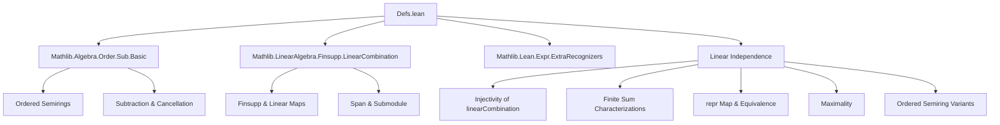

Here is the structured technical metadata extracted from the provided `Defs.lean` file:

---

### **1. KEY DEFINITIONS & THEOREMS**

#### **Definitions**
| Name | Type | Purpose |
|------|------|---------|
| `LinearIndependent R v` | `Prop` | States that the family `v : ι → M` is linearly independent over semiring `R`, defined as `Injective (Finsupp.linearCombination R v)`. |
| `LinearIndepOn R v s` | `Prop` | States that the subfamily indexed by `s : Set ι` is linearly independent: `LinearIndependent R (fun x : s ↦ v x)`. |
| `LinearIndependent.repr hv x` | `span R (range v) →ₗ[R] ι →₀ R` | Returns the unique linear combination (as a finitely supported function) representing `x` in the span of `v`, given `hv : LinearIndependent R v`. |
| `LinearIndependent.Maximal hv` | `Prop` | States that `hv` cannot be strictly extended to a larger linearly independent family. |

#### **Theorems (selected key equivalences & characterizations)**
| Name | Statement (informal) |
|------|----------------------|
| `linearIndependent_iffₛ` | `LinearIndependent R v ↔ ∀ l₁ l₂, Finsupp.linearCombination R v l₁ = l₂ → l₁ = l₂` |
| `linearIndependent_iff'ₛ` | `LinearIndependent R v ↔ ∀ s : Finset ι, ∀ f g, ∑ i ∈ s, f i • v i = ∑ i ∈ s, g i • v i → ∀ i ∈ s, f i = g i` |
| `linearIndependent_iff''ₛ` | Same as above but with condition `∀ i ∉ s, f i = g i` instead of `i ∈ s`. |
| `Fintype.linearIndependent_iffₛ` | For finite `ι`, `LinearIndependent R v ↔ ∀ f g, ∑ i, f i • v i = ∑ i, g i • v i → ∀ i, f i = g i` |
| `linearIndependent_iffₒₛ` | For linearly ordered, canonically ordered semiring `R`, `LinearIndependent R v ↔` disjoint finite sums equality implies zero coefficients. |
| `linearIndependent_iff_finset_linearIndependent` | `v` is linearly independent iff all its finite subfamilies are. |
| `linearIndepOn_iff_linearCombinationOnₛ` | `LinearIndepOn R v s ↔ Injective (Finsupp.linearCombinationOn ι M R v s)` |
| `LinearIndependent.linearCombinationEquiv hv` | `(ι →₀ R) ≃ₗ[R] span R (range v)` — canonical linear equivalence when `v` is linearly independent. |
| `Fintype.linearIndependent_iffₒₛ` | For finite `ι`, linear independence iff equality of full sums over `t` and `tᶜ` implies zero coefficients. |

---

### **2. NAMING CONVENTIONS**

- **Prefixes**:
  - `linearIndependent_...`: for `LinearIndependent R v`.
  - `linearIndepOn_...`: for `LinearIndepOn R v s`.
  - `..._iff...`: equivalence theorems.
  - `..._iff...ₛ`: versions for **semirings**.
  - `..._iff...ₒₛ`: versions for **canonically ordered semirings**.
  - `not_...`: negated versions (e.g., `not_linearIndependent_iffₛ`).
  - `..._repr`: related to the `repr` map (coefficient extraction).
  - `..._maximal`: maximal linear independence.

- **Suffixes**:
  - `_s`: semiring-specific.
  - `_o_s`: ordered semiring-specific.
  - `_iff`: indicates equivalence.
  - `_finset`: finite-indexed versions.

- **Other patterns**:
  - `of_...`: e.g., `LinearIndependent.of_comp`, `LinearIndependent.of_linearIndepOn_id_range`.
  - `equiv`, `Equiv`, `linearCombinationEquiv`: for isomorphisms.

---

### **3. TACTIC STACK**

Frequently used tactics in proofs:
- `simp`, `simp_rw`, `rwa`, `convert`, `ext`, `congr!`
- `aesop`, `intro`, `cases`, `contrapose!`, `by_contra`
- `rw [← ...]`, `symm`, `apply`, `exact`
- `Finset.sum_...`, `Finsupp.*`, `Set.*` simplifications
- `linearIndependent_iffₛ.1`, `linearIndependent_iff'ₛ.2`, etc., for direction-specific rewriting.

---

### **4. PROOF LOGIC**

- **Core strategy**: Prove equivalence between injectivity of `Finsupp.linearCombination` and various explicit sum-based conditions.
- **Typical flow**:
  1. Unfold `LinearIndependent` as `Injective (Finsupp.linearCombination R v)`.
  2. Use `Finsupp.ext` or `Finset.sum_eq_single` to reduce to coefficient-wise equality.
  3. For semiring/ordered cases, use `tsub`, `le_of_not_lt`, `antisymm`, etc.
  4. For finite types, replace `Finsupp` sums with `∑ i : ι`.
  5. Use `linearIndependent_iff_finset_linearIndependent` to reduce to finite subfamilies.
  6. For `repr`, use `LinearEquiv.ofBijective` and properties of `Finsupp.linearCombination`.

- **Induction**: Not used directly; instead, finite-case reductions via `Finset` and `Fintype` are preferred.

---

### **5. IMPORTS**

| Module | Purpose |
|--------|---------|
| `Mathlib.Algebra.Order.Sub.Basic` | Ordered additive monoids, subtraction, `Sub`, `OrderedSub`. |
| `Mathlib.LinearAlgebra.Finsupp.LinearCombination` | `Finsupp.linearCombination`, `Finsupp.linearCombinationOn`, `Finsupp.supported`, etc. |
| `Mathlib.Lean.Expr.ExtraRecognizers` | Lean metaprogramming utilities (e.g., delaborators). |

---

### **6. DEPENDENCY & THEORY OVERVIEW**

#### **Mermaid Diagram: Theory Dependencies**



#### **Mermaid Diagram: File Overview**

```mermaid
flowchart LR
  A[Defs.lean] --> B[Definitions]
  A --> C[Equivalences (semiring)]
  A --> D[Equivalences (ordered semiring)]
  A --> E[repr & linearCombinationEquiv]
  A --> F[Maximality]
  A --> G[Set-theoretic variants]

  B --> B1[LinearIndependent]
  B --> B2[LinearIndepOn]
  B --> B3[repr]
  B --> B4[Maximal]

  C --> C1[linearIndependent_iffₛ]
  C --> C2[linearIndependent_iff'ₛ]
  C --> C3[Fintype.linearIndependent_iffₛ]

  D --> D1[linearIndependent_iffₒₛ]
  D --> D2[Fintype.linearIndependent_iffₒₛ]

  E --> E1[linearCombinationEquiv]
  E --> E2[repr_ker/range]
  E --> E3[eq_zero_of_smul_mem_span]

  F --> F1[maximal_iff]
```

---

### **7. TAGS & KEYWORDS**

- `linearly dependent`
- `linear dependence`
- `linearly independent`
- `linear independence`
- `Finsupp.linearCombination`
- `span`
- `repr`
- `semiring`
- `ordered semiring`
- `finite type`
- `injective`
- `disjoint sums`

---

Let me know if you'd like a formalized dependency graph (e.g., for Lean’s `leanproject`), or a summary of how this file fits into the broader `Mathlib` linear algebra hierarchy.
