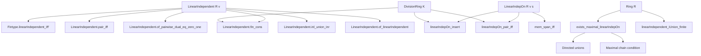
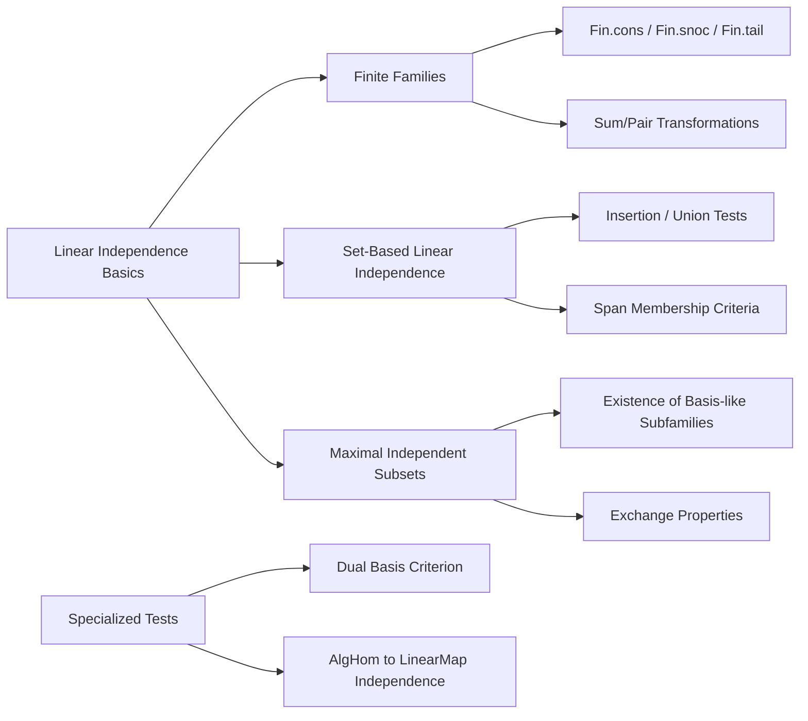

Here is the **technical metadata** extracted from the provided `Lemmas.lean` file, structured as requested:

---

### 1. **Key Definitions & Theorems**

| Name | Type / Signature | Purpose |
|------|------------------|---------|
| `LinearIndependent R v` | `Π {ι : Type u'} {M : Type u} [Semiring R] [AddCommMonoid M] [Module R M], (ι → M) → Prop` | A family `v : ι → M` is linearly independent if the only linear combination yielding `0` is the trivial one. |
| `LinearIndepOn R v s` | `s : Set ι → Prop` | Restriction of linear independence to a subset `s` of the index type. |
| `Fintype.linearIndependent_iff'` | `[Fintype ι] [DecidableEq ι]` | Equivalence between linear independence and injectivity (or trivial kernel) of the linear combination map. |
| `LinearIndependent.pair_iff` | `LinearIndependent R ![x, y] ↔ ∀ s t, s • x + t • y = 0 → s = 0 ∧ t = 0` | Characterization of linear independence for pairs of vectors. |
| `LinearIndependent.pair_add_smul_add_smul_iff` | Over a domain `S`, characterizes linear independence of linear combinations `a•x + b•y`, `c•x + d•y`. | Used for change-of-basis criteria. |
| `linearIndepOn_insert` | `[DivisionRing K]` | `LinearIndepOn K f (insert a s) ↔ LinearIndepOn K f s ∧ f a ∉ span (f '' s)` | Insertion test for linear independence over division rings. |
| `linearIndependent_fin_cons` | `LinearIndependent K (Fin.cons x v) ↔ LinearIndependent K v ∧ x ∉ span (range v)` | Characterization for extending finite families by prepending a vector. |
| `linearIndependent_fin_succ` | `LinearIndependent K v ↔ LinearIndependent K (Fin.tail v) ∧ v 0 ∉ span (range (Fin.tail v))` | Tail-based characterization for finite families. |
| `exists_maximal_linearIndepOn` | `[Ring R]` | Existence of a maximal linearly independent subset (w.r.t. inclusion) such that any extension introduces a scalar multiple into the span. |
| `LinearIndependent.of_pairwise_dual_eq_zero_one` | `LinearIndependent R v` if there exists a dual family `f` with `f i (v j) = δ_{ij}` | Generalizes the standard dual basis criterion. |
| `LinearMap.injective_of_linearIndependent` | If `v` spans `M`, and `f ∘ v` is linearly independent, then `f` is injective. | A key tool for proving injectivity via linear independence. |
| `LinearIndependent.inl_union_inr` | Union of independent sets under left/right injections into product is independent. | Enables constructing independent families in product modules. |

---

### 2. **Naming Conventions**

- **Prefixes**:
  - `linearIndependent_`: for families (`ι → M`)
  - `linearIndepOn_`: for sets (`Set ι`)
  - `pair_`, `fin_cons`, `fin_snoc`, `fin_succ`: for specific finite constructions
  - `insert`, `union`, `id_insert`, `singleton'`: for set operations
  - `mem_span_iff`, `notMem_span_iff`: for membership/non-membership in spans

- **Suffixes**:
  - `_iff`: equivalence statements
  - `_iff'`: variants (often over more general structures)
  - `_symm`: symmetry variants (e.g., `pair_symm_iff`)
  - `_left`, `_right`: directional variants (e.g., `pair_add_smul_left_iff`)
  - `_neg_left`, `_neg_right`: sign variants

- **Dot-style operations**:
  - `LinearIndependent.union`, `LinearIndepOn.id_insert`, etc., allow method-style usage like `hv.insert hx`.

---

### 3. **Tactic Stack**

Frequently used tactics in proofs:

| Tactic | Usage |
|--------|-------|
| `simp` / `simp only` | Simplification of definitions, especially `LinearIndependent`, `span`, `range`, `Finset.sum`, etc. |
| `rw` / `rwa` | Rewriting using equivalences, especially `iff` lemmas and `set`/`submodule` equalities |
| `exact`, `refine`, `convert` | Proof construction, especially with `LinearIndependent` definitions |
| `aesop` | Automated reasoning for simple goals (e.g., `Finset` membership, set equalities) |
| `module` | Custom tactic for module arithmetic (e.g., simplifying `smul`, `add`, `zero`) |
| `abel` | Abelian group/ring simplifications (e.g., `s - t + t = s`) |
| `push_neg` | Negating universal quantifiers and implications |
| `match_scalars` | Used in division ring proofs to isolate scalars (e.g., in `mem_span_insert_exchange`) |
| `fin_cases` | Case analysis on `Fin n` indices |
| `congr_arg` | Applying function to both sides of equality |
| `by_cases`, `by_contra` | Case splits and contradiction arguments |

---

### 4. **Proof Logic**

- **Inductive structure**:
  - Many proofs proceed by **induction on finite types** (`Fin n`, `Finset`), especially for `fin_cons`, `fin_snoc`, `fin_succ`.
  - For infinite families, proofs often use **directed unions** (`linearIndepOn_iUnion_of_directed`) or **maximality arguments** (`exists_maximal_linearIndepOn`).
- **Case analysis**:
  - On `i ∈ s` or `i ∉ s` (e.g., `linearIndepOn_insert_iff`)
  - On `a * d = b * c` or not (e.g., `pair_add_smul_add_smul_iff`)
- **Equivalence-based reasoning**:
  - Many lemmas are proven via `↔`-elimination using `linearIndependent_equiv`, `linearIndepOn_iff'`, etc.
- **Dual basis arguments**:
  - `LinearIndependent.of_pairwise_dual_eq_zero_one` uses evaluation against dual functionals to isolate coefficients.

---

### 5. **Imports & Dependencies**

**Core imports** (define scope and theory):

```lean
Mathlib.Data.Fin.Tuple.Reflection
Mathlib.LinearAlgebra.Dual.Defs
Mathlib.LinearAlgebra.Finsupp.SumProd
Mathlib.LinearAlgebra.LinearIndependent.Basic
Mathlib.LinearAlgebra.Pi
Mathlib.Logic.Equiv.Fin.Rotate
Mathlib.Tactic.FinCases
Mathlib.Tactic.Module
Mathlib.Tactic.Abel
Mathlib.Tactic.NormNum.Ineq
Mathlib.Algebra.Module.Torsion.Field
```

**Key dependencies**:
- `Finsupp`: for linear combinations and support reasoning.
- `LinearIndependent.Basic`: foundational definitions.
- `Pi`, `Finsupp.SumProd`: for product/sum module reasoning.
- `Fin.Rotate`, `Equiv.Fin`: for finite index manipulations.
- `Tactic.Module`, `Tactic.Abel`: for module arithmetic automation.
- `Torsion.Field`: for torsion-free and division ring properties.

---

### 6. **Mermaid Diagrams**

#### **Dependency Graph (Module Scope)**



#### **Overview of File Structure**



---

Let me know if you'd like a **proof outline** for a specific lemma or a **dependency tree** for a particular section (e.g., `Pair`, `Maximal`, `Module`).
