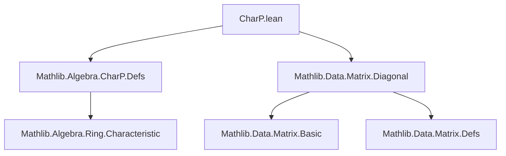
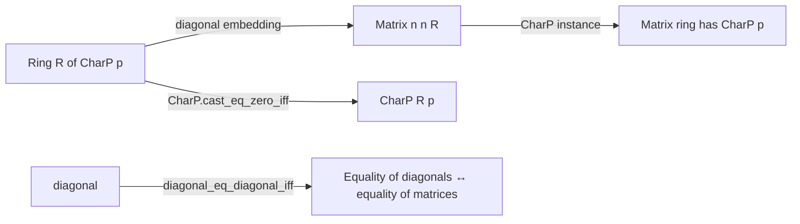

**Technical Brief: `CharP.lean` (Matrix Characteristic in Prime Characteristic)**

---

### 1. **Key Definitions & Theorems**

| Name | Type / Signature | Purpose |
|------|------------------|---------|
| `Matrix.charP` | `instance {n : Type*} {R : Type*} [AddMonoidWithOne R] [DecidableEq n] [Nonempty n] (p : ℕ) [CharP R p] : CharP (Matrix n n R) p` | Proves that the ring of $n \times n$ matrices over a ring $R$ of characteristic $p$ also has characteristic $p$, assuming $n$ is nonempty and decidable equality holds. |
| `CharP.cast_eq_zero_iff` | `CharP.cast_eq_zero_iff R p k : (k : R) = 0 ↔ p ∣ k` | Used internally to reduce matrix characteristic to base ring characteristic. |
| `diagonal_natCast`, `diagonal_zero`, `diagonal_eq_diagonal_iff` | Lemmas about diagonal matrices | Used to relate scalar multiplication in `Matrix n n R` to scalar multiplication in `R`, via diagonal embedding. |

---

### 2. **Naming Conventions**

- **Prefixes / Suffixes**:
  - `diagonal_`: Relates to diagonal matrices (e.g., `diagonal_natCast`, `diagonal_zero`, `diagonal_eq_diagonal_iff`).
  - `cast_eq_zero_iff`: Standard pattern in `CharP`-related lemmas for characterizing when a natural number maps to zero.
  - `charP`: Used in instance names and module title (`CharP.lean`).

- **No explicit `is_`, `mul_`, or `dist_` prefixes** — this file focuses on structural properties (characteristic) rather than operations.

---

### 3. **Tactic Stack**

- `simp_rw`: Used to rewrite using definitional equalities and lemmas (e.g., `← diagonal_natCast`, `CharP.cast_eq_zero_iff R p k`).
- `simp`: Implicitly used via `simp_rw`.
- `ring`: Not present — arithmetic is handled via `simp_rw` and `CharP.cast_eq_zero_iff`.
- `aesop`: Not used.
- `forall_const`: A simplifier lemma used to simplify `∀ x, P` where $x$ does not appear in $P$.

**Primary tactic**: `simp_rw [...]` — leverages diagonal embedding to reduce matrix-level statements to scalar-level ones.

---

### 4. **Proof Logic**

The proof proceeds as follows:

1. **Goal**: Show `CharP (Matrix n n R) p`, i.e., for all $k : \mathbb{N}$, $(k : \text{Matrix } n\ n\ R) = 0 \iff p \mid k$.
2. **Rewrite** using `diagonal_natCast`: $(k : \text{Matrix } n\ n\ R) = \text{diagonal}(k : R)$.
3. **Rewrite zero** using `diagonal_zero`: $0 = \text{diagonal}(0 : R)$.
4. **Apply** `diagonal_eq_diagonal_iff`: Diagonal matrices are equal iff their diagonals are equal.
5. **Reduce** to: $(k : R) = 0 \iff p \mid k$, which is exactly `CharP.cast_eq_zero_iff R p k`.
6. **Simplify** using `forall_const` to discharge vacuous quantifiers.

**Structure**:  
`by simp_rw [← diagonal_natCast, ← diagonal_zero, diagonal_eq_diagonal_iff, CharP.cast_eq_zero_iff R p k, forall_const]`

→ A one-line proof leveraging definitional properties and existing `CharP` theory.

---

### 5. **Imports**

| Import | Purpose |
|--------|---------|
| `Mathlib.Algebra.CharP.Defs` | Core definitions and basic lemmas about characteristic of rings. |
| `Mathlib.Data.Matrix.Diagonal` | Diagonal matrix constructions and properties (e.g., `diagonal_natCast`, `diagonal_eq_diagonal_iff`). |

**No additional algebraic structure imports** (e.g., no `Ring`, `Field`) — only `AddMonoidWithOne R` is assumed, minimal for scalar embedding.

---

### 6. **Dependency & Theory Overview (Mermaid Diagrams)**

#### **File Dependency Graph**

#### **Theoretical Flow**

#### **Key Relationships**
- The diagonal embedding $\mathbb{N} \xrightarrow{k \mapsto k \cdot I} \text{Matrix}_n(R)$ is central.
- Nonempty index type ensures the diagonal embedding reflects zero (no degenerate $0 \times 0$ case).
- Decidable equality is needed for `Matrix` infrastructure (e.g., `diagonal` definition).

---

### 7. **Summary**

This file formalizes a foundational fact: **matrix rings inherit the characteristic of their base ring**, provided the index type is nonempty. The proof is elegant and short, relying on the diagonal embedding and existing `CharP` machinery. It exemplifies Lean’s strength in algebraic formalization: minimal assumptions, high-level tactics (`simp_rw`), and modular imports.

--- 

Let me know if you'd like a formalized statement of the theorem in natural language or a proof sketch in LaTeX.
