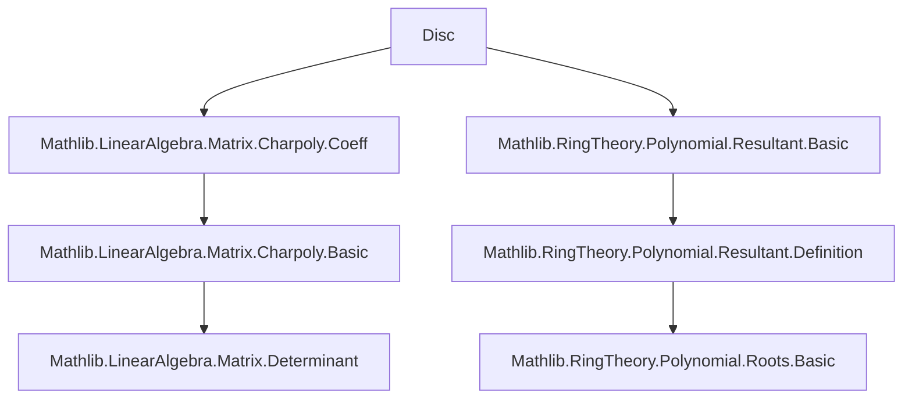

**Technical Brief: `Disc.lean` — Discriminant of a Matrix**

---

### 1. **Key Definitions & Theorems**

| Name | Type / Signature | Purpose |
|------|------------------|---------|
| `discr` | `Matrix n n R → R` | Defines the discriminant of a square matrix as the discriminant of its characteristic polynomial. |
| `discr_of_card_eq_two` | `∀ A, Fintype.card n = 2 → A.discr = A.trace^2 - 4 * A.det` | Explicit formula for discriminant when the matrix size is 2. |
| `discr_fin_two` | `∀ A : Matrix (Fin 2) (Fin 2) R, A.discr = A.trace^2 - 4 * A.det` | Specialization of the above to `Fin 2`-indexed matrices. |
| `disc` (deprecated) | alias of `discr` | Legacy name; retained for backward compatibility. |
| `disc_of_card_eq_two` (deprecated) | alias of `discr_of_card_eq_two` | Deprecated alias. |
| `disc_fin_two` (deprecated) | alias of `discr_fin_two` | Deprecated alias. |

> **Note**: The discriminant of a monic polynomial $ f(x) = x^2 - t x + d $ is $ t^2 - 4d $, matching the classical discriminant of a quadratic.

---

### 2. **Naming Conventions**

- **Prefix**: `discr_` — indicates discriminant-related definitions/lemmas.
- **Suffixes**:
  - `_of_card_eq_two`: for proofs/definitions assuming the index type has cardinality 2.
  - `_fin_two`: for the concrete case `Fin 2`.
- **Aliases** use `disc` (deprecated), consistent with older literature where `disc` is standard.

---

### 3. **Tactic Stack**

- `simp` / `norm_cast`: used to simplify and cast numeric literals.
- `rw`: rewriting using definitions (`discr`, `charpoly_of_card_eq_two`) and lemmas.
- `simp` + `norm_cast`: combined in proof of `discr_of_card_eq_two`.
- No heavy automation (e.g., `aesop`, `ring`, `linarith`) is used — proofs are direct and rely on known polynomial discriminant formulas.

---

### 4. **Proof Logic**

- **Strategy**: Direct computation using known formulas.
  - For `discr_of_card_eq_two`:
    1. Unfold `discr` as `A.charpoly.discr`.
    2. Apply `Polynomial.discr_of_degree_eq_two`, justified by showing `charpoly` has degree 2 (via `by simp; norm_cast`).
    3. Rewrite `A.charpoly_of_card_eq_two hn` to express the characteristic polynomial explicitly.
    4. Simplify to obtain the quadratic discriminant formula.

- No induction or case analysis beyond cardinality assumptions.

---

### 5. **Imports**

| Module | Role |
|--------|------|
| `Mathlib.LinearAlgebra.Matrix.Charpoly.Coeff` | Provides `charpoly`, `trace`, `det`, and properties like `charpoly_of_card_eq_two`. |
| `Mathlib.RingTheory.Polynomial.Resultant.Basic` | Supplies `Polynomial.discr`, the discriminant of a polynomial (via resultant). |

> These imports define the core objects: characteristic polynomial, its coefficients, and discriminant of polynomials.

---

### 6. **Mermaid Diagrams**

#### **Dependency Graph (Module-Level)**



#### **Overview of File Content**

```mermaid
flowchart LR
  A[Matrix A : n×n over R] --> B[charpoly A]
  B --> C[discr A := discr(charpoly A)]
  C --> D{card n = 2?}
  D -- Yes --> E[discr A = trace A^2 - 4 det A]
  D -- No --> F[No closed form in this file]
```

---

### 7. **Theoretical Context**

- The discriminant of a matrix serves as an invariant under similarity: if $ A = PBP^{-1} $, then $ \operatorname{discr}(A) = \operatorname{discr}(B) $, since characteristic polynomials are similarity invariants and discriminant depends only on the polynomial.
- For $ n = 2 $, the discriminant detects whether the matrix has repeated eigenvalues: $ \operatorname{discr}(A) = 0 $ iff $ A $ is not diagonalizable over an algebraically closed field (or more precisely, iff its minimal polynomial has a repeated root).
- This file is a minimal, foundational module — likely a stepping stone for larger theory on matrix invariants, Jordan form, or Galois theory applications.

--- 

Let me know if you'd like formalization suggestions (e.g., proving similarity-invariance or extending to $ n = 3 $).
