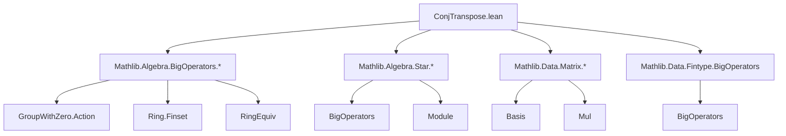
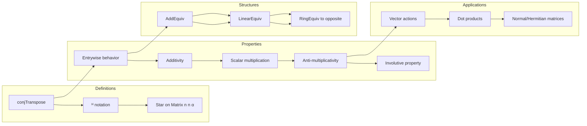

### Technical Brief: `ConjTranspose.lean`

---

#### **1. Key Definitions & Theorems**

| Name | Type / Signature | Purpose |
|------|------------------|---------|
| `conjTranspose` | `[Star α] → Matrix m n α → Matrix n m α` | Defines conjugate transpose via `transpose ∘ map star`. |
| `ᴴ` (postfix notation) | `Matrix m n α → Matrix n m α` | Shorthand for `conjTranspose`. |
| `conjTranspose_single` | `(single i j a)ᴴ = single j i (star a)` | Action of `conjTranspose` on matrix units. |
| `diagonal_conjTranspose` | `(diagonal v)ᴴ = diagonal (star v)` | `conjTranspose` preserves diagonal structure with `star` applied entrywise. |
| `diag_conjTranspose` | `diag Aᴴ = star (diag A)` | Diagonal entries transform via `star`. |
| `star_dotProduct_*` (3 lemmas) | `star v ⬝ᵥ star w = star (w ⬝ᵥ v)` etc. | Interaction of `star` with dot product. |
| `star_mulVec`, `star_vecMul` | `star (M *ᵥ v) = star v ᵥ* Mᴴ`, `star (v ᵥ* M) = Mᴴ *ᵥ star v` | Compatibility of `*ᵥ`, `ᵥ*` with `conjTranspose`. |
| `mulVec_conjTranspose`, `vecMul_conjTranspose` | `Aᴴ *ᵥ x = star (star x ᵥ* A)`, `x ᵥ* Aᴴ = star (A *ᵥ star x)` | Expressions for action of `Aᴴ` on vectors. |
| `conjTranspose_vecMulVec` | `(vecMulVec w v)ᴴ = vecMulVec (star v) (star w)` | Transpose of outer product. |
| `conjTranspose_apply` | `Mᴴ j i = star (M i j)` | Entrywise definition of `conjTranspose`. |
| `conjTranspose_conjTranspose` | `Mᴴᴴ = M` (if `InvolutiveStar α`) | Involution property. |
| `conjTranspose_transpose`, `transpose_conjTranspose` | `Mᴴᵀ = M.map star`, `Mᵀᴴ = M.map star` | Relations between transpose and `conjTranspose`. |
| `conjTranspose_injective`, `conjTranspose_inj` | Injectivity and equivalence `Aᴴ = Bᴴ ↔ A = B` | `conjTranspose` is injective under involutive `star`. |
| `conjTranspose_eq_diagonal` | `Mᴴ = diagonal v ↔ M = diagonal (star v)` | Characterization of diagonal matrices under `conjTranspose`. |
| `conjTranspose_zero`, `conjTranspose_eq_zero` | `(0)ᴴ = 0`, `Mᴴ = 0 ↔ M = 0` | Behavior on zero matrix. |
| `conjTranspose_one`, `conjTranspose_eq_one` | `(1)ᴴ = 1`, `Mᴴ = 1 ↔ M = 1` | Behavior on identity matrix. |
| `conjTranspose_natCast`, `conjTranspose_intCast`, etc. | `(d : Matrix)ᴴ = d` for scalars fixed by `star`. | Scalars fixed by `star` are invariant under `conjTranspose`. |
| `conjTranspose_add`, `conjTranspose_sub`, `conjTranspose_neg` | Additive group homomorphism properties. | `conjTranspose` is additive. |
| `conjTranspose_smul`, `conjTranspose_smul_non_comm`, `conjTranspose_smul_self` | `(c • M)ᴴ = star c • Mᴴ` (under `StarModule`), or twisted version. | Compatibility with scalar multiplication. |
| `conjTranspose_nsmul`, `conjTranspose_zsmul`, `conjTranspose_rat_smul`, etc. | Scalar multiplication by `ℕ`, `ℤ`, `ℚ` etc. is preserved. | Special cases of `smul` compatibility. |
| `conjTranspose_mul` | `(M * N)ᴴ = Nᴴ * Mᴴ` | Reverses multiplication order (anti-homomorphism). |
| `conjTranspose_map` | `Aᴴ.map f = (A.map f)ᴴ` if `f` semiconjugates `star`. | Functoriality of `conjTranspose`. |
| `conjTranspose_eq_transpose_of_trivial` | If `star` is trivial, `Aᴴ = Aᵀ`. | Reduces to transpose when `star = id`. |
| `conjTransposeAddEquiv` | `Matrix m n α ≃+ Matrix n m α` | `conjTranspose` as an additive equivalence. |
| `conjTransposeLinearEquiv` | `Matrix m n α ≃ₗ⋆[R] Matrix n m α` | `conjTranspose` as a `*`-linear equivalence (under `StarModule`). |
| `conjTransposeRingEquiv` | `Matrix m m α ≃+* (Matrix m m α)ᵐᵒᵖ` | `conjTranspose` as a ring isomorphism to opposite ring. |
| `conjTranspose_pow`, `conjTranspose_list_prod` | `(M^k)ᴴ = Mᴴ^k`, `l.prodᴴ = (l.map conjTranspose).reverse.prod` | Compatibility with powers and products. |
| `star_eq_conjTranspose` | `star M = Mᴴ` | Defines `Star (Matrix n n α)` instance. |
| `star_mul` | `star (M * N) = star N * star M` | `star` on square matrices is anti-multiplicative. |

---

#### **2. Naming Conventions**

- **Prefixes**:
  - `conjTranspose_`: for lemmas about `conjTranspose`.
  - `star_`: for lemmas about the `star` operation on matrices (e.g., `star_mul`, `star_dotProduct`).
  - `diagonal_`, `diag_`, `vecMulVec_`: for structured matrices.

- **Suffixes**:
  - `_apply`: entrywise behavior (`conjTranspose_apply`).
  - `_eq_*`: characterizations of equality (`conjTranspose_eq_zero`, `conjTranspose_eq_one`).
  - `_smul`, `_nsmul`, `_zsmul`, `_natCast`, `_intCast`, `_ratCast`: scalar action variants.
  - `_AddEquiv`, `_LinearEquiv`, `_RingEquiv`: structural equivalences.

- **Notation**:
  - `ᴴ` for `conjTranspose`.
  - `star` for the unary operation on coefficients.

---

#### **3. Tactic Stack**

Frequently used tactics in proofs:

| Tactic | Usage |
|--------|-------|
| `simp` | Simplifying using `@[simp]` lemmas (e.g., `conjTranspose_apply`, `star_dotProduct_*`). |
| `ext` | Proving matrix equality by extensionality (entrywise). |
| `rfl` | Reflexivity for definitional equalities (e.g., `diag_conjTranspose`). |
| `rw [*, *]` | Rewriting using lemmas like `conjTranspose_mul`, `diagonal_conjTranspose`. |
| `funext` | Extending equality of functions (e.g., in `star_mulVec`). |
| `congr_arg` | Applying congruence to both sides of equality. |
| `map_*` lemmas (e.g., `map_sum`, `map_list_prod`) | Leveraging structure-preserving maps. |
| `mulOpposite.*` | Working in opposite ring via `MulOpposite`. |
| `aesop` (not explicitly used here, but implied by `simp`-heavy style) | For routine automation. |

---

#### **4. Proof Logic**

- **Structure**: Most proofs follow a pattern:
  1. **Extensionality**: Use `ext` to reduce to entrywise equality.
  2. **Simplification**: Apply `simp` with `@[simp]` lemmas (e.g., `conjTranspose_apply`, `star_dotProduct_*`).
  3. **Rewriting**: Use known algebraic properties (`star_mul`, `star_add`, `star_smul`) and definitions (`dotProduct`, `mul_apply`, `vecMulVec`).
  4. **Functoriality**: For structural equivalences (`AddEquiv`, `LinearEquiv`, `RingEquiv`), verify homomorphism properties and inverses.

- **Induction**: Not heavily used; most results are direct from definitions and `simp`-friendly lemmas.

- **Case analysis**: Used in `diagonal_conjTranspose` (via `diagonal_transpose`, `diagonal_map`).

- **Equivalence reasoning**: For `conjTranspose_inj`, `conjTranspose_eq_*`, use `Function.Involutive.eq_iff`.

---

#### **5. Imports**

Core dependencies defining the module’s scope:

| Import | Purpose |
|--------|---------|
| `Mathlib.Algebra.BigOperators.GroupWithZero.Action` | For `star`-actions and dot products. |
| `Mathlib.Algebra.BigOperators.Ring.Finset` | Summation over finite sets. |
| `Mathlib.Algebra.BigOperators.RingEquiv` | Ring isomorphisms and sums/products. |
| `Mathlib.Algebra.Module.Pi` | Module structure on function spaces (`m → α`). |
| `Mathlib.Algebra.Star.BigOperators` | `star` interacts with sums/products. |
| `Mathlib.Algebra.Star.Module` | `StarModule` and `StarRing` structures. |
| `Mathlib.Data.Fintype.BigOperators` | Sums/products over finite types. |
| `Mathlib.Data.Matrix.Basis` | Matrix basis and `single`, `diagonal`, `vecMulVec`. |
| `Mathlib.Data.Matrix.Mul` | Matrix multiplication and vector actions (`*ᵥ`, `ᵥ*`). |

---

#### **6. Mermaid Diagrams**

##### **Dependency Graph (High-Level)**

##### **Overview of Theory Flow**

---

#### **7. Theory Context**

- **Purpose**: Formalizes the conjugate transpose (`ᴴ`) for matrices over `*`-rings, enabling:
  - Definition of Hermitian/skew-Hermitian matrices.
  - Development of `*`-algebra structure on matrix rings.
  - Compatibility with vector actions, dot products, and module theory.

- **Key Structures**:
  - `Star α`, `StarRing α`, `StarModule R α`, `InvolutiveStar α`.
  - Matrix operations: `transpose`, `map`, `diagonal`, `vecMulVec`, `*ᵥ`, `ᵥ*`.

- **Target Use Cases**:
  - Quantum mechanics (Hermitian operators).
  - Numerical linear algebra over `ℂ`.
  - Representation theory with `*`-algebras.

---

Let me know if you'd like a formalization roadmap or a `leanpkg` dependency analysis.
