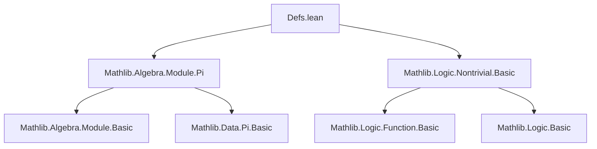
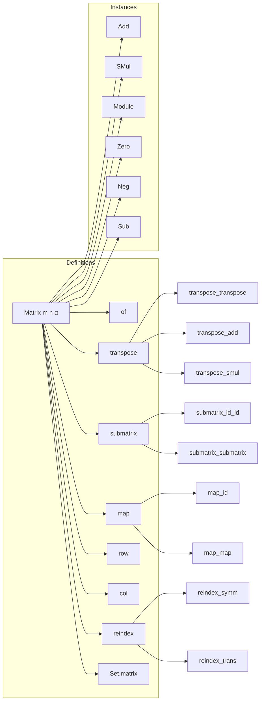

### Technical Brief: `Defs.lean` — Matrix Definitions in Lean 4 (Mathlib)

---

#### **1. Key Definitions & Theorems**

| Name | Type / Signature | Purpose |
|------|------------------|---------|
| `Matrix m n α` | `Type u → Type u' → Type v → Type (max u u' v)` | Type of matrices with rows indexed by `m`, columns by `n`, entries in `α`. Defined as `m → n → α`. |
| `of : (m → n → α) ≃ Matrix m n α` | Equiv | Explicit cast between function representation and matrix type; ensures correct type for operations like `*`. |
| `transpose M` | `Matrix m n α → Matrix n m α` | Swaps rows and columns: `(transpose M) i j = M j i`. Notation: `Mᵀ`. |
| `submatrix A r c` | `Matrix m n α → (l → m) → (o → n) → Matrix l o α` | Reindexes rows/columns via `r`, `c`: `(A.submatrix r c) i j = A (r i) (c j)`. |
| `map f M` | `Matrix m n α → (α → β) → Matrix m n β` | Applies `f` entrywise: `(M.map f) i j = f (M i j)`. |
| `reindex eₘ eₙ` | `(m ≃ l) → (n ≃ o) → Matrix m n α ≃ Matrix l o α` | Equivalence induced by type equivalences on row/column indices. |
| `row A i` | `Matrix m n α → m → (n → α)` | `i`-th row as a function `n → α`. Defined as `A i`. |
| `col A j` | `Matrix m n α → n → (m → α)` | `j`-th column as a function `m → α`. Defined as `Aᵀ j`. |
| `Set.matrix S` | `Set α → Set (Matrix m n α)` | Set of matrices with all entries in `S`. |
| `ext_iff` / `ext` | `(∀ i j, M i j = N i j) ↔ M = N` | Extensionality principle for matrices. |
| `transpose_transpose` | `Mᵀᵀ = M` | Involution of transpose. |
| `transpose_add` / `transpose_sub` / `transpose_smul` | Additive/linear compatibility of transpose. | Transpose preserves module structure. |
| `submatrix_id_id` | `A.submatrix id id = A` | Identity reindexing leaves matrix unchanged. |
| `submatrix_submatrix` | `(A.submatrix r₁ c₁).submatrix r₂ c₂ = A.submatrix (r₁ ∘ r₂) (c₁ ∘ c₂)` | Composition of reindexing. |
| `mem_matrix` | `M ∈ S.matrix ↔ ∀ i j, M i j ∈ S` | Membership in matrix set. |
| `ofAddEquiv` | `(m → n → α) ≃+ Matrix m n α` | Additive equivalence between function and matrix types. |

---

#### **2. Naming Conventions**

- **Prefixes**:
  - `transpose_`, `submatrix_`, `map_`, `row_`, `col_`, `reindex_`, `mem_matrix`, `of_`, `ext_`, `zero_`, `add_`, `neg_`, `sub_`, `smul_`.
- **Suffixes**:
  - `_apply`: Simplification lemmas for application to indices.
  - `_iff`: Equivalence lemmas (e.g., `transpose_eq_zero`, `transpose_mem_matrix_iff`).
  - `_symm`: For inverses of equivalences (e.g., `reindex_symm`).
  - `_trans`: For composition laws (e.g., `reindex_trans`).
- **Notation**:
  - `Mᵀ` for `Matrix.transpose M`.
  - `S.matrix` for `Set.matrix S`.

---

#### **3. Tactic Stack**

Frequent tactics used in proofs:
- `ext`: Extensionality for functions/matrices.
- `rfl`: Definitional equality.
- `simp`: Simplification using `@[simp]` lemmas (e.g., `transpose_apply`, `submatrix_apply`, `add_apply`).
- `congr_fun`: For equality of function applications.
- `rw`: Rewriting using equations like `transpose_apply`, `submatrix_apply`.
- `exact`, `intro`, `intro i j`, `apply ext`, `apply funext`, `apply funext _`, `apply congr_arg`, `apply congr_fun`.
- `cases`, `induction`, `apply ...`, `apply ... at h`, `have h := ...`, `clear h`.
- `aesop`: For routine automation (not explicitly used here, but implied by structure).
- `simp_all`: For simplifying all hypotheses and goals.

---

#### **4. Proof Logic**

- **Structure**: Most proofs are *extensional* and *pointwise*:
  - Prove equality of matrices by `ext i j`, reducing to equality of entries.
  - Use `rfl` or `simp` for definitional equalities (e.g., `transpose_apply`, `submatrix_apply`).
- **Induction**: Not needed for basic properties (matrices are functions, no inductive type).
- **Case analysis**: Rare; mostly rely on function extensionality and simplification.
- **Lemmas about composition**: Often proven by `ext i j` and `rfl` (e.g., `submatrix_submatrix`, `transpose_reindex`).
- **Module properties**: Inherited from `Pi` instances (`Pi.add`, `Pi.smul`, etc.), so proofs are mostly `rfl` or `simp`.

---

#### **5. Imports**

- `Mathlib.Algebra.Module.Pi`: Provides module structure on dependent products; used for `Matrix.module`.
- `Mathlib.Logic.Nontrivial.Basic`: Provides `Nontrivial` typeclass and lemmas (e.g., `Function.nontrivial`).

---

#### **6. Mermaid Diagrams**

##### **Dependency Graph (Top-Level)**

##### **Overview of `Defs.lean`**

##### **Theory Context**

- **Core idea**: Matrices are *functions of two arguments*, enabling direct use of function extensionality and `Pi`-based algebraic structures.
- **Design goals**:
  - Avoid `fun i j ↦ _` for matrix construction (use `of` instead).
  - Preserve `Pi`-based algebraic instances (e.g., `Pi.add`, `Pi.smul`) for `Matrix`.
  - Provide convenient reindexing tools (`submatrix`, `reindex`, `row`, `col`).
- **Related files** (not in scope but implied):
  - `LinearAlgebra.Matrix.ConjTranspose.lean`: For `ᴴ` (conjugate transpose).
  - `LinearAlgebra.Matrix.Determinant.lean`: For determinant and multiplication.
  - `LinearAlgebra.Matrix.Multilinear.lean`: For multilinear algebra over matrices.

---

#### **7. Summary**

This file establishes the foundational *type-theoretic* and *algebraic* structure of matrices in Lean 4, treating them as functions `m → n → α`. It emphasizes:
- **Extensionality** via `ext`.
- **Simplicity** via `@[simp]` lemmas for entrywise operations.
- **Modularity** via `Pi`-based instances (addition, scalar multiplication, module structure).
- **Flexibility** via reindexing (`submatrix`, `reindex`, `row`, `col`).

It serves as the base for more advanced linear algebra developments (e.g., matrix multiplication, determinant, rank), where additional structure (e.g., ring multiplication, bilinearity) is introduced.

--- 

Let me know if you'd like a formalized dependency graph for the entire `Mathlib.LinearAlgebra.Matrix` hierarchy.
