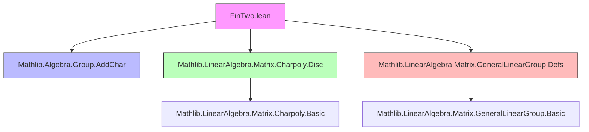

### Technical Brief: `FinTwo.lean`

---

#### **1. Key Definitions & Theorems**

| Name | Type / Signature | Purpose |
|------|------------------|---------|
| `IsParabolic` | `m : Matrix (Fin 2) (Fin 2) R → Prop` | Defines a matrix as *parabolic* iff it is non-scalar and has discriminant zero. |
| `IsHyperbolic` | `m : Matrix (Fin 2) (Fin 2) R → Prop` (under `Preorder R`) | Matrix is hyperbolic iff its discriminant is strictly positive. |
| `IsElliptic` | `m : Matrix (Fin 2) (Fin 2) R → Prop` (under `Preorder R`) | Matrix is elliptic iff its discriminant is strictly negative. |
| `parabolicEigenvalue` | `m.trace / 2` | The unique eigenvalue of a parabolic matrix (over a field where `2 ≠ 0`). |
| `fixpointPolynomial` | `g : GL(2, R) → R[X]` | Polynomial encoding fixed points of `g` as a Möbius transformation: $g_{10} X^2 + (g_{11} - g_{00}) X - g_{01}$. |
| `upperRightHom` | `AddChar R (GL(2, R))` | Embeds additive characters into $GL(2,R)$ via $x \mapsto \begin{pmatrix}1 & x \\ 0 & 1\end{pmatrix}$. |
| `sub_scalar_sq_eq_discr` | `(m - scalar(trace/2))^2 = scalar(discr/4)` | Key identity over fields with $2 \ne 0$, linking discriminant to nilpotent part. |
| `isParabolic_iff_exists` | `m.IsParabolic ↔ ∃ a n, m = scalar a + n ∧ n ≠ 0 ∧ n^2 = 0` | Structural characterization: parabolic = scalar + nonzero nilpotent. |
| `isParabolic_conj_iff` | `(g * h * g⁻¹).IsParabolic ↔ h.IsParabolic` | Parabolicity is invariant under conjugation. |
| `parabolicEigenvalue_ne_zero` | `IsParabolic g ⇒ parabolicEigenvalue ≠ 0` | Parabolic elements in $GL(2,K)$ have nonzero trace (since det ≠ 0). |
| `IsParabolic.pow` | `IsParabolic g ⇒ IsParabolic (g^n)` for $n ≠ 0$ | Powers of parabolic elements remain parabolic (requires char 0). |

---

#### **2. Naming Conventions**

- **Predicates**: `is_*`, `_*_iff`, `_*_conjugation`, `_*_iff_of_*`
  - e.g., `isParabolic`, `isHyperbolic`, `isElliptic`, `isParabolic_conj_iff`, `isParabolic_iff_of_upperTriangular`
- **Auxiliary lemmas**: `aux`, `hP`, `hb`, `hc`, `hd`, `hg`, `hm`, `hn0`, `hnsq`, `h_det`, `hg10`
- **Constants**: `parabolicEigenvalue`, `fixpointPolynomial`, `upperRightHom`
- **Abbreviations**: `IsParabolic`, `IsElliptic`, `IsHyperbolic` for group elements via `g.val.Is*`
- **Suffixes**:
  - `_conj` / `_conj'`: conjugation by `g` or `g⁻¹`
  - `_iff`: equivalence with condition on original element
  - `_iff_of_*`: characterization under structural assumptions (e.g., upper triangular)

---

#### **3. Tactic Stack**

| Tactic | Frequency | Role |
|--------|-----------|------|
| `simp` / `simp_rw` | Very High | Simplification using lemmas like `discr_conj`, `trace_units_conj`, `det_units_conj`, `scalar_apply`, etc. |
| `rw` | High | Rewriting using definitions (`IsParabolic`, `fixpointPolynomial`, `discr_fin_two`, etc.) |
| `ext` / `funext` | Medium | Extensionality for matrices and functions |
| `fin_cases` | Medium | Case analysis on `Fin 2` indices |
| `grind` | Low | Custom tactic for simplifying expressions involving `trace`, `det`, `discr` |
| `field` | Low | Field arithmetic simplification (e.g., in `sub_scalar_sq_eq_discr`) |
| `tauto` | Medium | Logical reasoning in conjunctions/disjunctions |
| `induction` | Low | Structural induction (e.g., in `IsParabolic.pow`) |
| `ring` / `ring_nf` | Medium | Polynomial/ring simplifications |

---

#### **4. Proof Logic**

- **Inductive structure**: Proofs often proceed by:
  1. Unfolding definitions (`IsParabolic`, `fixpointPolynomial`, etc.)
  2. Reducing to matrix entries via `fin_cases` and `ext`
  3. Using algebraic identities (e.g., discriminant formula, trace/determinant of conjugates)
  4. Leveraging field/ring properties (`NeZero`, `CharZero`, `IsReduced`)
- **Common pattern**:
  - For conjugation invariance: use `discr_conj`, then simplify with `Set.mem_range`, `Units.eq_mul_inv_iff_mul_eq`
  - For structural characterizations (e.g., `isParabolic_iff_exists`):
    - ⇒: decompose $m = a + n$ using eigenvalue shift and nilpotency
    - ⇐: show non-scalar via contradiction and nilpotency ⇒ zero discriminant
- **Specialized cases**:
  - Upper triangular matrices: reduce to entry-wise conditions (`m 0 0 = m 1 1`, `m 0 1 ≠ 0`)
  - Determinant ±1 case: relate to `upperRightHom` and sign cases (`±`)

---

#### **5. Imports & Dependencies**

| Module | Purpose |
|--------|---------|
| `Mathlib.Algebra.Group.AddChar` | For `AddChar` and `upperRightHom` |
| `Mathlib.LinearAlgebra.Matrix.Charpoly.Disc` | For `discr`, `discr_fin_two`, discriminant theory |
| `Mathlib.LinearAlgebra.Matrix.GeneralLinearGroup.Defs` | For `GL`, `val`, `inv`, scalar matrices, `scalar _` |

---

#### **6. Mermaid Diagrams**

##### **Dependency Graph (Module-Level)**



##### **Overview of Theory Flow**

```mermaid
flowchart LR
  GL2R[GL(2,R)] --> IsParabolic[IsParabolic: discr=0 ∧ non-scalar]
  GL2R --> IsHyperbolic[IsHyperbolic: discr > 0]
  GL2R --> IsElliptic[IsElliptic: discr < 0]
  
  IsParabolic --> Conjugacy[Conjugacy-invariance]
  IsParabolic --> Structure[Scalar + nilpotent]
  IsParabolic --> Eigenvalue[parabolicEigenvalue = trace/2]
  
  GL2R --> FixpointPoly[Fixpoint polynomial]
  FixpointPoly --> Scalar[=0 ⇔ scalar]
  
  GL2R --> UpperRight[upperRightHom: AddChar ↪ GL(2,R)]
  
  subgraph Field[K]
    IsParabolic --> NilpotentDecomp[Parabolic ⇔ a + n, n²=0]
    NilpotentDecomp --> Power[IsParabolic(g) ⇒ IsParabolic(gⁿ)]
  end
  
  subgraph OrderedRing[R]
    IsHyperbolic & IsElliptic --> Conjugacy
  end
```

---

#### **7. Summary**

This module formalizes the classification of elements in $GL(2,R)$ (especially over fields and ordered rings) via discriminant-based types: *elliptic*, *parabolic*, *hyperbolic*. It establishes:

- Invariance under conjugation
- Structural decomposition of parabolic elements (scalar + nilpotent)
- Explicit formulas for eigenvalues and fixed-point polynomials
- Embedding of additive characters into upper-triangular unipotent subgroup

The theory is foundational for geometric group theory (e.g., actions on hyperbolic plane, modular group analysis), and is designed for use in discrete subgroup contexts (e.g., $GL(2,\mathbb{R})$, $GL(2,\mathbb{Z})$).
