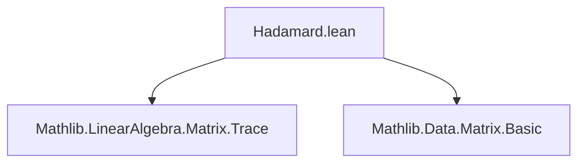
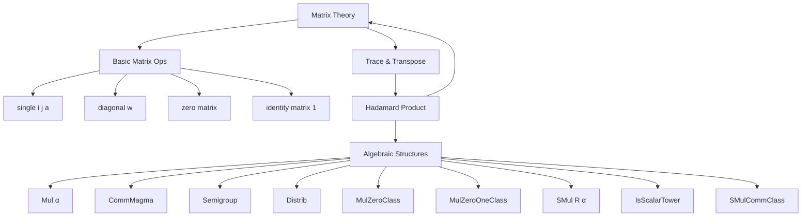

### Technical Brief: `Hadamard.lean`

---

#### **1. Key Definitions & Theorems**

| Name | Type / Signature | Purpose |
|------|------------------|---------|
| `hadamard` | `[Mul α] → Matrix m n α → Matrix m n α → Matrix m n α` | Defines the pointwise (Hadamard) product of two matrices of same dimensions. |
| `hadamard_apply` | `[Mul α] → A ⊙ B i j = A i j * B i j` | Characterizes the action of `hadamard` on entries (equational lemma). |
| `⊙` | `infixl:100` | Notation for `Matrix.hadamard`. |
| `hadamard_comm` | `[CommMagma α] → A ⊙ B = B ⊙ A` | Commutativity of Hadamard product. |
| `hadamard_assoc` | `[Semigroup α] → (A ⊙ B) ⊙ C = A ⊙ (B ⊙ C)` | Associativity of Hadamard product. |
| `hadamard_add` / `add_hadamard` | `[Distrib α] → A ⊙ (B + C) = A ⊙ B + A ⊙ C`, etc. | Left/right distributivity over matrix addition. |
| `smul_hadamard` / `hadamard_smul` | `[SMul R α]` + conditions → `(k • A) ⊙ B = k • (A ⊙ B)`, etc. | Compatibility of scalar multiplication with Hadamard product. |
| `hadamard_zero` / `zero_hadamard` | `[MulZeroClass α] → A ⊙ 0 = 0`, etc. | Zero is absorbing for Hadamard product. |
| `hadamard_diagonal` / `diagonal_hadamard` | `[DecidableEq n] [MulZeroClass α]` | Interaction of Hadamard product with diagonal matrices. |
| `diagonal_hadamard_diagonal` | `[DecidableEq n] [MulZeroClass α]` | Hadamard product of two diagonal matrices is diagonal of pointwise product. |
| `hadamard_one` / `one_hadamard` | `[MulZeroOneClass α]` | Hadamard product with identity matrix yields diagonal of diagonal entries. |
| `hadamard_self_eq_self_iff` | `[Mul α]` | Idempotency condition: $A ⊙ A = A \iff \forall i,j,\ A_{ij}$ is idempotent. |
| `single_hadamard_single_eq` / `single_hadamard_single_of_ne` | `[DecidableEq m] [DecidableEq n] [MulZeroClass α]` | Hadamard product of matrix units (`single`) behaves like scalar multiplication or zero. |
| `sum_hadamard_eq` | `[Fintype m] [Fintype n] [Semiring α]` | Sum of all entries of $A ⊙ B$ equals $\operatorname{trace}(A B^\top)$. |
| `dotProduct_vecMul_hadamard` | `[DecidableEq m] [DecidableEq n]` | Expresses bilinear form with Hadamard product via trace. |

---

#### **2. Naming Conventions**

- **Prefixes**:
  - `hadamard_`: for core properties of the Hadamard product.
  - `diagonal_`: for lemmas involving diagonal matrices.
  - `single_`: for lemmas involving `single` (matrix with one nonzero entry).
  - `smul_`, `zero_`, `one_`: for interactions with scalar mult., zero, and identity.

- **Suffixes**:
  - `_comm`, `_assoc`, `_add`: algebraic properties.
  - `_eq_diagonal_iff`, `_eq_zero_iff`, `_eq_one_iff`: characterizations of when result is diagonal/zero/identity.
  - `_diagonal`, `_diagonal_diagonal`: specific cases involving diagonals.

- **Infix notation**: `⊙` scoped at `infixl:100`.

---

#### **3. Tactic Stack**

Frequently used tactics in proofs:

| Tactic | Usage |
|--------|-------|
| `ext` | Prove matrix equality by extensionality (entrywise). |
| `simp` / `simp only` | Simplify using definitional equalities and lemmas (e.g., `hadamard_apply`, `diagonal`, `single`). |
| `aesop` | Automated reasoning for simple goals, especially with `diagonal` and `single`. |
| `rw` | Rewrite using equations (e.g., `← sum_hadamard_eq`). |
| `cases` | Case analysis on `DecidableEq` or `not_and_or`. |
| `congr_arg` | Apply congruence to equalities under function application. |
| `mul_one`, `zero_mul`, `mul_zero`, `left_distrib`, etc. | Algebraic rewrites from `MulZeroClass`, `Distrib`, etc. |

---

#### **4. Proof Logic**

- **Structure**: Most proofs follow a standard pattern:
  1. **Extensionality**: Use `ext` to reduce to entrywise equality.
  2. **Simplify**: Apply `hadamard_apply` to rewrite `A ⊙ B i j`.
  3. **Algebraic Rewriting**: Use magma/semiring axioms (`mul_comm`, `mul_assoc`, `left_distrib`, etc.).
  4. **Special Cases**: For diagonal/single matrices, use `diagonal`, `single`, and `DecidableEq` to case-split on indices.

- **Diagonal/Identity Cases**:
  - Use `diagonal_hadamard`, `hadamard_diagonal`, and `diagonal_eq_diagonal_iff` to reduce to vector-level equalities.
  - Often combine with `simp` and `congr_arg` to manipulate diagonal vectors.

- **Trace-related proofs**:
  - Use `sum_hadamard_eq` to convert sums over entries to trace expressions.
  - Apply `Finset.sum_comm`, `mul_assoc`, and `vecMul`/`dotProduct` definitions.

---

#### **5. Imports**

| Module | Purpose |
|--------|---------|
| `Mathlib.LinearAlgebra.Matrix.Trace` | Provides trace, transpose, and related lemmas. |
| `Mathlib.Data.Matrix.Basic` | Defines `Matrix`, `of`, `diagonal`, `single`, `transpose`, etc. |

---

#### **6. Theory Overview & Dependencies**

##### **Mermaid Diagram: Module Dependencies**

##### **Mermaid Diagram: Theory Dependencies**

##### **Overview of `Hadamard.lean`**

This file formalizes the **Hadamard product** (`⊙`) on matrices, a binary operation defined pointwise. It establishes foundational algebraic properties (commutativity, associativity, distributivity), interacts with standard matrix constructions (zero, identity, diagonal, single), and connects to trace and vector operations. The development is structured around typeclass constraints (`Mul`, `CommMagma`, `Semigroup`, `Distrib`, `MulZeroClass`, etc.), ensuring generality across semirings, rings, and modules.

The file is a key building block for further matrix analysis, especially in contexts involving entrywise operations (e.g., Hadamard inverses, Schur product theorem, or entrywise functions on matrices).

--- 

Let me know if you'd like a formalized dependency graph for the entire `Mathlib.LinearAlgebra.Matrix.*` hierarchy.
