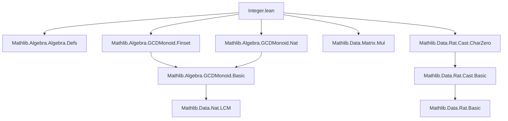
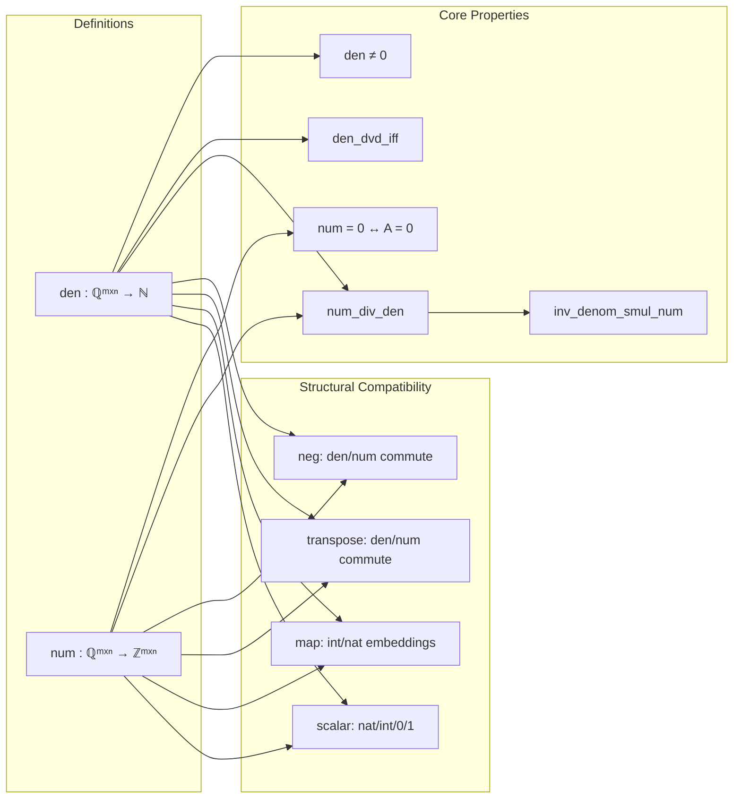

**Technical Brief: `Integer.lean` — Matrix over ℚ and ℤ**

---

### 1. KEY DEFINITIONS & THEOREMS

| Name | Type / Signature | Purpose |
|------|------------------|---------|
| `Matrix.den` | `Matrix m n ℚ → ℕ` | Computes the **least common multiple (LCM)** of denominators of all entries of a rational matrix. |
| `Matrix.num` | `Matrix m n ℚ → Matrix m n ℤ` | Constructs the **integer numerator matrix** such that $ A = \frac{A.\text{num}}{A.\text{den}} $ entrywise. |
| `den_ne_zero` | `A.den ≠ 0` | Ensures denominator is nonzero (needed for division). |
| `num_eq_zero_iff` | `A.num = 0 ↔ A = 0` | Characterizes zero matrices via numerator. |
| `den_dvd_iff` | `A.den ∣ r ↔ ∀ i j, (A i j).den ∣ r` | Relates global denominator divisibility to entrywise divisibility. |
| `num_div_den` | `A.num i j / A.den = A i j` | Entrywise correctness of `num`/`den` decomposition. |
| `inv_denom_smul_num` | `(A.den⁻¹ : ℚ) • A.num.map (↑) = A` | Global matrix equality: $ A = \frac{1}{\text{den}} \cdot \text{num}(A) $. |
| `den_neg`, `num_neg` | `(-A).den = A.den`, `(-A).num = -A.num` | Behavior under negation. |
| `den_transpose`, `num_transpose` | `(Aᵀ).den = A.den`, `(Aᵀ).num = (A.num)ᵀ` | Behavior under transpose. |
| `den_map_intCast`, `num_map_intCast` | `(A.map ↑).den = 1`, `(A.map ↑).num = A` | Integer matrices embed as rational matrices with denominator 1. |
| `den_natCast`, `num_natCast` | `(a : Matrix m m ℚ).den = 1`, `(a : Matrix m m ℚ).num = a` | Scalar natural/integer embeddings have denominator 1. |
| `den_zero`, `num_zero`, `den_one`, `num_one` | Denominators/numerators of zero/identity matrices. | Special cases for standard matrices. |

**Lemmas on casts (auxiliary):**

| Name | Type | Purpose |
|------|------|---------|
| `map_mul_natCast` | `map (A * B) ((↑) : ℕ → α) = map A (↑) * map B (↑)` | Ensures multiplication commutes with natural embedding (via `Nat.castRingHom`). |
| `map_mul_intCast` | Same for `ℤ → α` (ring) | Same for integers. |
| `map_mul_ratCast` | Same for `ℚ → α` (division ring, char 0) | Same for rationals. |

---

### 2. NAMING CONVENTIONS

- **Prefixes**:
  - `den_`, `num_`: for properties of denominator/numerator.
  - `map_`: for lemmas about `Matrix.map`.
  - `natCast`, `intCast`, `ratCast`: for canonical embeddings.
- **Suffixes**:
  - `_iff`: for biconditional characterizations (`den_dvd_iff`).
  - `_ne_zero`: for nonzero proofs.
  - `_zero`, `_one`: for zero/identity matrices.
  - `_neg`, `_transpose`: for structural compatibility.
- **`[DecidableEq m]`**: used when scalar matrices are defined via `diagonal` or `ofNat`, requiring equality decidable on index type.

---

### 3. TACTIC STACK

- `simp`: heavily used, especially with `←`, `ext`, `den_dvd_iff`, `num_div_den`, `map_apply`, `smul_eq_mul`.
- `obtain ⟨k, hk⟩`: existential unpacking (e.g., from divisibility).
- `rw [...]`: rewriting using lemmas like `mul_comm`, `div_eq_iff`, `Rat.mul_den_eq_num`.
- `eq_of_forall_dvd`: proves equality of naturals by mutual divisibility.
- `ext`: extensionality for matrices (entrywise equality).
- `simpa [...] using ...`: simplifies using a lemma and applies a given proof.

No heavy automation (e.g., `ring`, `linarith`, `aesop`) — proofs are mostly direct algebraic manipulations.

---

### 4. PROOF LOGIC

- **Structure**: Most proofs follow a pattern:
  1. Reduce to entrywise statements using `ext` or `den_dvd_iff`.
  2. Use definitions (`Matrix.den`, `Matrix.num`) and properties of `lcm`, `den`, `num` for rationals.
  3. Apply known rational/integer arithmetic lemmas (e.g., `Rat.mul_den_eq_num`, `Rat.num_intCast`).
  4. Use `smul_eq_mul`, `map_apply`, and cast compatibility lemmas.
- **Induction**: Not used — all proofs are direct algebraic reasoning.
- **Case analysis**: Minimal; mostly handled via `simp` and `rw`.
- **Key insight**: The `num`/`den` decomposition is *entrywise*, so global matrix properties reduce to scalar rational arithmetic.

---

### 5. IMPORTS (PRIMARY DEPENDENCIES)

| Module | Role |
|--------|------|
| `Mathlib.Algebra.Algebra.Defs` | General algebraic structures (rings, semirings, modules). |
| `Mathlib.Algebra.GCDMonoid.Finset`, `Mathlib.Algebra.GCDMonoid.Nat` | Provides `lcm`, `gcd`, divisibility over `ℕ` and finite sets — used in `den`. |
| `Mathlib.Data.Matrix.Mul` | Matrix multiplication, `map`, transpose, etc. |
| `Mathlib.Data.Rat.Cast.CharZero` | Rational embedding into char 0 rings; ensures `Rat.castHom` is well-defined. |

---

### 6. MERMAID DIAGRAMS

#### Dependency Graph (Top-Level)

#### Overview of `Integer.lean` Theory

---

### 7. THEORY SCOPE & INTENT

- **Goal**: Provide a *computable* rational matrix decomposition into integer numerator and natural denominator.
- **Use case**: Enables working with rational matrices via integer arithmetic (e.g., for algorithmic applications, modular reasoning, or lifting to other rings via `map`).
- **Future work (per TODO)**: Generalize to matrices over localizations $ S^{-1}R $, not just $ \mathbb{Q} = S^{-1}\mathbb{Z} $.

--- 

Let me know if you'd like a formalization roadmap for the TODO or generalization to localizations.
