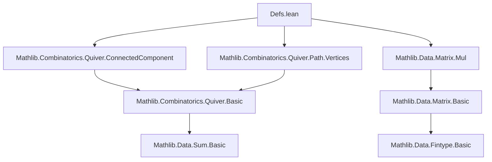

**Technical Brief: `Defs.lean` — Irreducibility and Primitivity of Nonnegative Matrices**

---

### 1. **Key Definitions & Theorems**

| Name | Type / Signature | Purpose |
|------|------------------|---------|
| `toQuiver A` | `Matrix n n R → Quiver n` | Constructs a directed graph (quiver) from matrix `A`, with edge `i ⟶ j` iff `0 < A i j`. |
| `IsIrreducible A` | `Prop` | `A` is entrywise nonnegative and its quiver `toQuiver A` is strongly connected. |
| `IsPrimitive A` | `Prop` | `A` is entrywise nonnegative and ∃ `k > 0` s.t. `(A ^ k) i j > 0` for all `i, j`. |
| `pow_apply_pos_iff_nonempty_path` | `0 < (A ^ k) i j ↔ Nonempty (Path i j of length k)` | Bridge between matrix powers and graph paths. |
| `isIrreducible_iff_exists_pow_pos` | `IsIrreducible A ↔ ∀ i j, ∃ k > 0, 0 < (A ^ k) i j` | Equivalence of graph-theoretic and algebraic irreducibility (Seneta, Def 1.6). |
| `IsPrimitive.isIrreducible` | `IsPrimitive A → IsIrreducible A` | Primitive ⇒ irreducible (Seneta, p.14). |
| `IsIrreducible.transpose` | `IsIrreducible A → IsIrreducible Aᵀ` | Irreducibility preserved under transpose. |
| `isIrreducible_transpose_iff` | `Aᵀ.IsIrreducible ↔ A.IsIrreducible` | Full equivalence of irreducibility under transpose. |
| `IsIrreducible.exists_pos` | `∀ i, ∃ j, 0 < A i j` (under `Nontrivial n`) | Every row of an irreducible matrix has a positive entry. |

---

### 2. **Naming Conventions**

- **Prefixes**:
  - `toQuiver`: converts algebraic object to graph-theoretic.
  - `isIrreducible`, `isPrimitive`: predicate constructors (via `mk_iff`).
  - `transposePath`, `transposePath`: path-level operations mirroring transpose.
- **Suffixes**:
  - `_iff`: equivalence statements.
  - `_pos`: positivity conditions.
  - `_nonneg`: nonnegativity assumptions.
- **Structure fields**:
  - `nonneg`, `connected`, `exists_pos_pow`: explicit components of definitions.

---

### 3. **Tactic Stack**

Frequently used tactics in proofs:
- `induction ... with | zero | succ ...`: structural induction on natural numbers.
- `simp` / `simp_all`: simplification using definitional equalities and `mk_iff` lemmas.
- `rcases` / `obtain`: destruct existential/universal hypotheses.
- `aesop`: automated reasoning for arithmetic and order goals.
- `by_contra`: contradiction-based arguments (e.g., in `exists_pos`).
- `rw [pow_succ, mul_apply]`: rewriting matrix power and multiplication definitions.
- `Finset.sum_pos_iff_of_nonneg`: positivity of finite sums.

---

### 4. **Proof Logic**

- **Inductive structure** on `k : ℕ` for path-power correspondence.
- **Case analysis** on path length (`nil` vs `cons`) to handle base and inductive steps.
- **Equivalence proofs** (`↔`) via two-directional implication:
  - Forward: extract path from positivity of matrix entry.
  - Backward: construct entry positivity from existence of path.
- **Graph-theoretic reasoning**:
  - Strong connectivity ⇒ existence of paths ⇒ algebraic positivity.
  - Path reversal via `transposePath` to prove transpose invariance.
- **Contrapositive reasoning** in `exists_pos` lemma: assume no positive entry in a row ⇒ no outgoing edges ⇒ contradiction with strong connectivity.

---

### 5. **Imports & Dependencies**

| Import | Role |
|--------|------|
| `Mathlib.Combinatorics.Quiver.ConnectedComponent` | Strong connectivity and component reasoning. |
| `Mathlib.Combinatorics.Quiver.Path.Vertices` | Path definitions, length, composition, reversal. |
| `Mathlib.Data.Matrix.Mul` | Matrix multiplication, powers, and application. |

**Underlying type assumptions**:
- `Ring R`, `LinearOrder R`: ordered ring for positivity comparisons.
- `[IsOrderedRing R]`, `[PosMulStrictMono R]`, `[Nontrivial R]`, `[Fintype n]`, `[DecidableEq n]`: required for path-power equivalence and positivity arguments.

---

### 6. **Mermaid Diagrams**

#### **Dependency Graph (Module-Level)**



#### **Conceptual Overview of Theory Flow**

```mermaid
flowchart LR
  A[Matrix A : n × n R] --> B[toQuiver A]
  B --> C[Quiver n]
  C --> D[Strongly Connected?]
  D -->|Yes| E[IsIrreducible A]
  C --> F[Existence of k s.t. A^k > 0?]
  F -->|Yes| G[IsPrimitive A]
  G --> E
  E --> H[∀ i,j ∃ k>0, (A^k)ij > 0]
  H --> I[Algebraic irreducibility]
  B --> J[Path of length k ⇔ (A^k)ij > 0]
  J --> H
  E --> K[A^T is irreducible]
```

---

### 7. **Tags & Context**

- **Tags**: `matrix`, `nonnegative`, `positive`, `power`, `quiver`, `graph`, `irreducible`, `primitive`, `perron-frobenius`
- **Mathlib module scope**: Combinatorics / Linear Algebra / Dynamical Systems (via Markov chains).
- **Target application**: Perron–Frobenius theory, convergence of powers of nonnegative matrices.

--- 

Let me know if you'd like a formalization roadmap for extending this to digraphs (as per the TODO).
