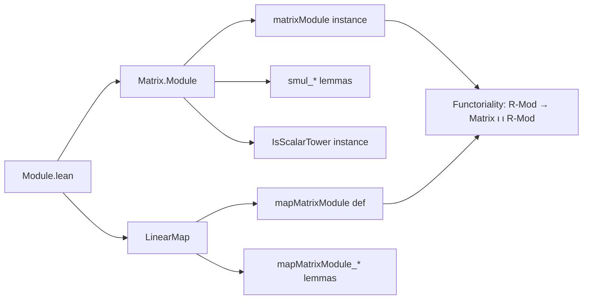

### Technical Brief: `Module.lean` — Matrix Module Structure on Function Spaces

---

#### **1. Key Definitions & Theorems**

| Name | Type / Signature | Purpose |
|------|------------------|---------|
| `matrixModule` | `instance : Module (Matrix ι ι R) (ι → M)` | Equips the function space `ι → M` (i.e., column vectors indexed by `ι`) with a left module structure over the ring of square matrices `Matrix ι ι R`, via matrix–vector multiplication generalized to arbitrary modules. |
| `smul_def` | `N • v = fun i ↦ ∑ j, N i j • v j` | Explicitly characterizes the scalar multiplication action. |
| `smul_def'` | `N • v = ∑ j, fun i ↦ N i j • v j` | Alternative sum-of-functions form of the action. |
| `smul_apply` | `(N • v) i = ∑ j, N i j • v j` | Pointwise evaluation of the action (used for simplification). |
| `single_smul` | `Matrix.single i j r • v = Pi.single i (r • v j)` | Describes action of a matrix with a single nonzero entry `r` at `(i, j)`. |
| `diagonal_const_smul` | `diagonal (fun _ ↦ r) • v = r • v` | Action of a scalar diagonal matrix reduces to scalar multiplication on the vector. |
| `scalar_smul` | `Matrix.scalar ι r • v = r • v` | Action of the scalar matrix `r·I` coincides with scalar multiplication. |
| `IsScalarTower` instance | `IsScalarTower R (Matrix ι ι S) (ι → M)` | Ensures compatibility when `M` is already an `S`-module and `R → S` is a ring homomorphism. |
| `mapMatrixModule` | `f ↦ (ι → M) →ₗ[Matrix ι ι R] (ι → N)` | Induces a `Matrix ι ι R`-linear map on function spaces from an `R`-linear map `f : M →ₗ N`. |
| `mapMatrixModule_id` | `id.mapMatrixModule ι = id` | Identity is preserved under the induced map. |
| `mapMatrixModule_comp` | `(g ∘ₗ f).mapMatrixModule ι = g.mapMatrixModule ι ∘ₗ f.mapMatrixModule ι` | Composition of linear maps is preserved — functoriality. |

---

#### **2. Naming Conventions**

- **Prefixes**:
  - `matrixModule`: Instance naming for canonical module structure.
  - `smul_*`: Properties of scalar multiplication.
  - `mapMatrixModule_*`: Properties of the induced linear map.
- **Suffixes**:
  - `_def`, `_def'`: Definitional equalities (often `rfl` or `ext; simp`).
  - `_apply`: Pointwise version of an equation (e.g., `smul_apply`).
  - `_comp`: Behavior under composition.
  - `_id`: Behavior under identity.

---

#### **3. Tactic Stack**

Frequently used tactics in proofs:
- `ext`: Extensionality for functions (to prove equality of vectors).
- `simp` / `simp_rw`: Simplification using lemmas like `smul_def`, `Finset.sum_smul`, etc.
- `rw`: Rewriting with `smul_def`, `Finset.sum_comm`, `mul_apply`, etc.
- `dsimp`: Delta-simplification for definitional reductions (e.g., in `single_smul`).
- `obtain rfl | hi := eq_or_ne i i'`: Case analysis on equality of indices.
- `Finset.sum_eq_single j fun j' hj => ?_`: To reduce sums to a single term.

---

#### **4. Proof Logic**

- **Module Axiom Proofs**:  
  Each module law (e.g., `one_smul`, `mul_smul`, `smul_add`) is proven by:
  1. Extending to pointwise equality (`funext i ↦ ...`).
  2. Expanding `•` via `smul_def`.
  3. Applying `simp` and rewriting with module axioms in `M`, e.g., `smul_add`, `add_smul`, `Finset.sum_add_distrib`, `Finset.smul_sum`, `SemigroupAction.mul_smul`.

- **Special Cases** (`single_smul`, `diagonal_const_smul`, `scalar_smul`):
  - Use `ext i'` to reduce to index-wise equality.
  - Apply `Finset.sum_eq_single` or `diagonal_apply` to collapse sums.
  - Simplify using `Pi.single` and module properties.

- **Functoriality of `mapMatrixModule`**:
  - Prove by `ext`, then `simp` using definitions of `mapMatrixModule`, `compLeft`, and `LinearMap.id`.
  - Composition uses `mapMatrixModule_comp` proven by extensionality and `simp`.

---

#### **5. Imports & Dependencies**

- **Core Dependencies**:
  ```lean
  Mathlib.Algebra.Module.BigOperators
  Mathlib.Data.Matrix.Basis
  ```
- **Implicit Dependencies** (via typeclass inference):
  - `Mathlib.Algebra.Module` (for `Module`, `AddCommGroup`, `SMul`, etc.)
  - `Mathlib.Data.Fintype.Finset` (for `Finset.sum`, `Fintype.sum_eq_single`)
  - `Mathlib.Algebra.Module.Defs` (for `LinearMap`, `compLeft`, etc.)
  - `Mathlib.Data.Matrix.Defs` (for `Matrix.single`, `diagonal`, `scalar`)

---

#### **6. Mermaid Diagrams**

##### **Dependency Graph (Module Structure)**

```mermaid
graph TD
  A[Ring R] --> B[AddCommGroup M]
  B --> C[Module R M]
  C --> D[ι → M]
  A --> E[Matrix ι ι R]
  E --> D
  D -->|matrixModule| F[Module (Matrix ι ι R) (ι → M)]
```

##### **Functorial Induction (Linear Maps)**

```mermaid
graph LR
  M -- f: M →ₗ N --> N
  |                         |
  v                         v
  ι → M -- mapMatrixModule f --> ι → N

  subgraph Category
    M -- LinearMap R --> N
    ι → M -- LinearMap (Matrix ι ι R) --> ι → N
  end

  mapMatrixModule -->|functor| Category
```

##### **Overview of File Structure**



---

#### **7. Theory Context**

This file formalizes the standard fact that:
> The category of $R$-modules embeds functorially into the category of $M_n(R)$-modules via $M \mapsto M^n$, where $M^n$ is viewed as column vectors and $M_n(R)$ acts by matrix multiplication.

The construction is foundational for:
- Representing linear maps as matrices,
- Studying module extensions and base change,
- Formalizing coordinate-free linear algebra in dependent type theory.

The `matrixModule` instance is *not* canonical in all cases (e.g., when $M = R$ or $M = M_n(R)$), leading to potential diamonds — hence the comment in the docstring.

--- 

Let me know if you'd like a formalization of the induced **functor** `R-Mod ⥤ Matrix ι ι R-Mod` or a proof that this is a *strict* monomorphism of categories.
