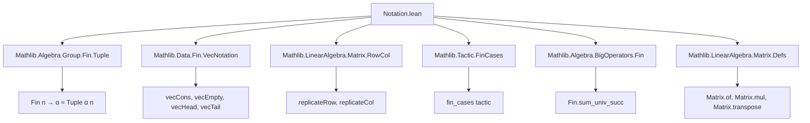
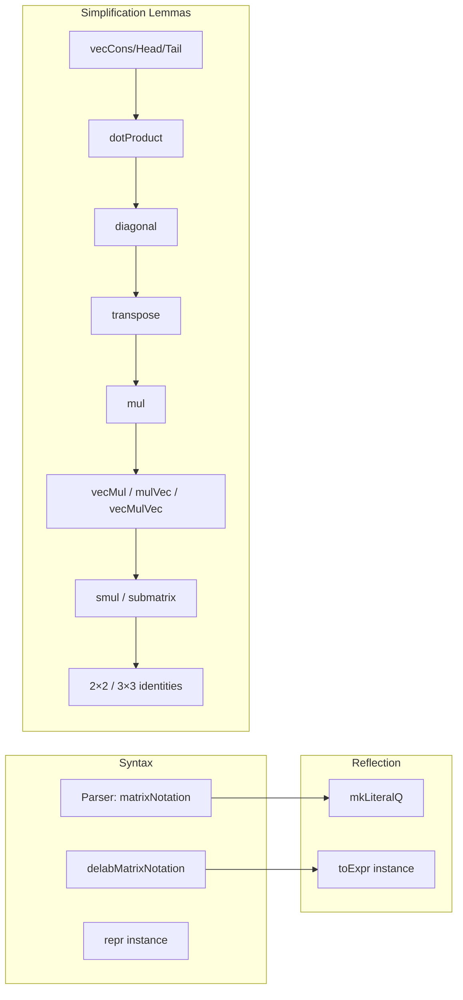

**Technical Brief: `Notation.lean` (Matrix and Vector Notation Module)**  
*Domain: Lean 4 / Mathlib — Formalization of Matrix/Vector Syntax and Simplification Lemmas*

---

### 1. **Key Definitions & Theorems**

| Name | Type / Signature | Purpose |
|------|------------------|---------|
| `matrixNotation` | Syntax rule `"!![" rows "]"` | Parses matrix literals like `!![a, b; c, d]` as `Matrix.of ![![a, b], ![c, d]]` |
| `mkLiteralQ` | `Matrix (Fin m) (Fin n) Q(α) → Q(Matrix (Fin m) (Fin n) α)` | Reflects matrix terms into Lean’s `Q` type for metaprogramming |
| `toExpr` instance | `ToExpr (Matrix m' n' α)` | Enables reflection of matrices when entries are reflectable |
| `delabMatrixNotation` | `Delab` | Delaborator to pretty-print matrices using `!![]` syntax when possible |
| `repr` instance | `Repr (Matrix (Fin m) (Fin n) α)` | Provides human-readable string representation using `!![]` |
| `cons_val'`, `head_val'`, `tail_val'` | `@[simp]` lemmas | Simplify indexing of `vecCons`/`vecHead`/`vecTail` applied pointwise |
| `dotProduct_of_isEmpty` | `v ⬝ᵥ w = 0` | Dot product over empty index is zero |
| `cons_dotProduct`, `dotProduct_cons`, `cons_dotProduct_cons` | `@[simp]` | Simplify dot product with `vecCons` |
| `diagonal_fin_n`, `diagonal_vec_n` | `diagonal d = !![...]` | Express diagonal matrices in `!![]` notation |
| `cons_transpose`, `transpose_empty_rows/cols` | `@[simp]` | Simplify transpose of `!![]`-style matrices |
| `cons_mul`, `empty_mul`, `mul_empty` | `@[simp]` | Simplify matrix multiplication with `!![]` |
| `cons_vecMul`, `vecMul_cons`, `cons_vecMul_cons` | `@[simp]` | Simplify row-vector × matrix multiplication |
| `cons_mulVec`, `mulVec_cons` | `@[simp]` | Simplify matrix × column-vector multiplication |
| `cons_vecMulVec`, `vecMulVec_cons` | `@[simp]` | Simplify outer product (`vecMulVec`) |
| `one_fin_two`, `one_fin_three` | `1 = !![1,0;0,1]`, etc. | Identity matrices in `!![]` notation |
| `natCast_fin_two`, `natCast_fin_three` | `(n : Matrix (Fin n) α) = !![↑n, 0; 0, ↑n]` | Natural number scalars as diagonal matrices |
| `eta_fin_two`, `eta_fin_three` | `A = !![A 0 0, ...]` | Extensionality for 2×2 and 3×3 matrices |
| `mul_fin_two`, `mul_fin_three` | `!![] * !![] = !![]` | Explicit multiplication formulas for 2×2 and 3×3 matrices |
| `vec2_eq`, `vec3_eq`, `vec2_add`, `vec3_add`, etc. | `@[simp]` or lemmas | Simplify equality and operations on 2- and 3-vectors |
| `vec2_dotProduct`, `vec3_dotProduct` | `v ⬝ᵥ w = ...` | Dot product formulas for 2D/3D vectors |
| `injective_pair_iff_ne` | `Function.Injective ![x, y] ↔ x ≠ y` | Characterizes injectivity of 2-element vectors |

---

### 2. **Naming Conventions**

- **Prefixes**:
  - `vec*`: operations on vectors (`vecCons`, `vecHead`, `vecTail`, `vecMul`, `vecMulVec`, etc.)
  - `dotProduct*`, `mulVec*`, `vecMul*`, `smul*`, `diagonal*`, `replicate*`, `submatrix*`
  - `cons_*`, `head_*`, `tail_*`: pointwise behavior of vector operations
  - `empty_*`: behavior when one dimension is zero
- **Suffixes**:
  - `_fin_n`: specialized lemmas for `Fin 2`, `Fin 3`, etc.
  - `_val'`: indexing lemmas for `vecCons`-based matrix construction
  - `_eq`: equality lemmas for vectors/matrices
- **Notation**:
  - `!![...]`: matrix notation (rows separated by `;`, columns by `,`)
  - `![...]`: vector notation (already defined in `VecNotation`)

---

### 3. **Tactic Stack**

Frequently used tactics in proofs:

| Tactic | Usage |
|--------|-------|
| `simp` | Core simplifier, especially with `@[simp]` lemmas for `vecCons`, `vecHead`, `vecTail`, `Matrix.of`, `transpose`, `mul`, etc. |
| `ext` | Extensionality for matrices/vectors (`Matrix.ext`, `funext`) |
| `fin_cases` | Case analysis on `Fin n` indices (e.g., `i : Fin 2`) |
| `rfl` | Reflexivity for definitional equalities |
| `aesop` | Automated reasoning for simple goals (e.g., `injective_pair_iff_ne`) |
| `refine` + `Fin.cases` | Manual case splits over `Fin` to prove pointwise equalities |
| `simp_rw` (implicit via `simp`) | Rewriting with `@[simp]` lemmas involving `vecCons`, `Matrix.of`, etc. |
| `ring` (not present here) | Not used — arithmetic is handled via `simp` + `add_assoc`, `mul_add`, etc. |

---

### 4. **Proof Logic**

- **Structure of proofs**:
  - Most proofs are *pointwise*: use `ext i j` to reduce to arbitrary indices.
  - Then apply `fin_cases i <;> fin_cases j` to handle finite cases (`Fin 0`, `Fin 1`, `Fin 2`, `Fin 3`).
  - Simplify using `simp [Matrix.*, vecCons, vecHead, vecTail, dotProduct, mul_apply]`.
- **Induction**: Not used — finite indexing (`Fin n`) avoids induction; proofs rely on case analysis.
- **Rewriting**: Heavy use of `@[simp]` lemmas to reduce expressions involving `vecCons`, `Matrix.of`, and operations like `mul`, `transpose`, `dotProduct`.
- **Meta-level reasoning**: Reflection (`mkLiteralQ`, `toExpr`, `delabMatrixNotation`) uses Lean metaprogramming (`Q`, `Term`, `Macro`, `Elab.Term`).

---

### 5. **Imports**

| Import | Purpose |
|--------|---------|
| `Mathlib.Algebra.Group.Fin.Tuple` | Finite tuple structures, `Fin n → α` as tuples |
| `Mathlib.Data.Fin.VecNotation` | Vector notation `![a, b]` and `vecCons`/`vecEmpty` |
| `Mathlib.LinearAlgebra.Matrix.RowCol` | Row/column operations (`replicateRow`, `replicateCol`) |
| `Mathlib.Tactic.FinCases` | `fin_cases` tactic |
| `Mathlib.Algebra.BigOperators.Fin` | Summation over `Fin n`, used in `dotProduct` |
| `Mathlib.LinearAlgebra.Matrix.Defs` | Core matrix definitions (`Matrix.of`, `Matrix.mul`, etc.) |

---

### 6. **Mermaid Diagrams**

#### **Dependency Graph (Module Scope)**

#### **Overview of File Structure**

---

### 7. **Key Insight**

This module **bridges syntax and semantics** for matrices and vectors in Lean:
- It defines a *user-friendly notation* (`!![a, b; c, d]`) for matrices built on top of `Matrix.of` and vector notation.
- It provides a *comprehensive set of `simp` lemmas* to automatically simplify expressions involving this notation.
- It ensures that `simp` only introduces `!![]` when it already appears in the input — preserving readability and avoiding explosion.

This is essential for interactive theorem proving with concrete matrices (e.g., linear algebra over finite fields, control theory, cryptography), where readability and automation are critical.

--- 

Let me know if you'd like a **dependency graph of the entire Mathlib matrix theory** or a **proof automation strategy** for matrix calculations using this module.
