### Technical Brief: `Rank.lean` — Rank of Matrices in Mathlib

---

#### **1. Key Definitions & Theorems**

| Name | Type / Signature | Purpose |
|------|------------------|---------|
| `cRank` | `Matrix m n R → Cardinal` | Cardinal-valued rank: dimension (as cardinal) of the column space (`span R (range Aᵀ)`). |
| `eRank` | `Matrix m n R → ℕ∞` | Extended natural number rank: `cRank A.toENat`. |
| `rank` | `Matrix m n R → ℕ` | Natural-number rank: `finrank R (LinearMap.range (A.mulVecLin))`. |
| `rank_eq_finrank_range_toLin` | `A.rank = finrank R (LinearMap.range (toLin v₂ v₁ A))` | Basis-independence of `rank`: equivalent to rank of associated linear map between free modules. |
| `rank_transpose` | `Aᵀ.rank = A.rank` | Rank is invariant under transpose. |
| `rank_conjTranspose` | `Aᴴ.rank = A.rank` | Rank is invariant under conjugate transpose (over star-ordered fields). |
| `rank_mul_le` | `(A * B).rank ≤ min A.rank B.rank` | Submultiplicativity of rank. |
| `rank_diagonal` | `(diagonal w).rank = Fintype.card {i // w i ≠ 0}` | Rank of diagonal matrix = number of nonzero diagonal entries. |
| `rank_vecMulVec_le` | `(vecMulVec w v).rank ≤ 1` | Rank of outer product ≤ 1. |
| `rank_unit` | `A ∈ Units (Matrix n n R) ⇒ A.rank = Fintype.card n` | Invertible matrices have full rank. |
| `rank_mul_eq_left_of_isUnit_det` | `IsUnit A.det ⇒ (B * A).rank = B.rank` | Right multiplication by invertible matrix preserves rank. |
| `rank_mul_eq_right_of_isUnit_det` | `IsUnit A.det ⇒ (A * B).rank = B.rank` | Left multiplication by invertible matrix preserves rank. |
| `rank_eq_finrank_span_cols` | `A.rank = finrank R (span R (range A.col))` | Rank equals column span dimension. |
| `rank_eq_finrank_span_row` | `A.rank = finrank R (span R (range A.row))` | Rank equals row span dimension (over fields). |
| `rank_add_rank_le_card_of_mul_eq_zero` | `A * B = 0 ⇒ A.rank + B.rank ≤ card m` | Rank inequality for zero products (over fields). |

---

#### **2. Naming Conventions**

- **Prefixes**:
  - `cRank`: *cardinal* rank.
  - `eRank`: *extended natural* (ℕ∞) rank.
  - `rank`: standard natural-number rank (default).
- **Suffixes**:
  - `_le_card_width` / `_le_card_height`: bounds by matrix dimensions.
  - `_submatrix`: behavior under submatrices.
  - `_reindex`: invariance under reindexing (bijections).
  - `_transpose` / `_conjTranspose`: transpose/conjugate transpose invariance.
  - `_mul_self`: e.g., `rank_transpose_mul_self`, `rank_conjTranspose_mul_self`.
  - `_of_isUnit_det`: rank invariance under multiplication by matrices with unit determinant.
- **Helper patterns**:
  - `toNat_eq_rank`, `toENat_eq_rank`: relate `cRank`/`eRank` to `rank`.
  - `lift_…`: universe-lifting lemmas for `cRank`.

---

#### **3. Tactic Stack**

Frequently used tactics in proofs:

| Tactic | Role |
|--------|------|
| `rw` / `simp_rw` | Rewriting definitions (e.g., `rank`, `cRank`, `mulVecLin`, `transpose`). |
| `simp` | Simplifying using lemmas like `rank_zero`, `rank_one`, `mulVecLin_mul`, etc. |
| `aesop` | Automated reasoning for set/module inclusions, e.g., `span_mono`, `range_eq_top`. |
| `exact` / `refine` | Constructing proofs with known lemmas (e.g., `rank_lt_aleph0`, `finrank_map_eq`). |
| `congr` / `congr_arg` | Equality of expressions under functors (e.g., `congr_arg _ (conjTranspose_conjTranspose _)`). |
| `apply le_antisymm` | Proving equality via double inequality (common in `rank_transpose`, `rank_conjTranspose`). |
| `ext` / `funext` | Extensionality for functions/morphisms (e.g., proving `LinearMap` equality). |
| `nontriviality` | Ensuring ring is nontrivial (needed for many rank lemmas). |
| `wlog` | Without loss of generality (e.g., finiteness assumptions in `eRank_le_card_width`). |
| `convert` | Matching up definitions via definitional equality (e.g., `toLin'_apply'`). |
| `cases` / `obtain` | Decomposing existential/universal hypotheses (e.g., `hAB : A * B = 0`). |

---

#### **4. Proof Logic**

- **Structure**:
  - **Induction/Case analysis** is rare; most proofs are *algebraic* and *module-theoretic*.
  - **Basis-free reasoning** dominates: proofs rely on properties of `LinearMap.range`, `Submodule.span`, `finrank`, and `rank`.
  - **Universe management** is handled via `lift` lemmas and universe polymorphism.
  - **Equivalence of definitions** is central: e.g., `rank`, `cRank`, `eRank` are shown equivalent via `toNat`/`toENat`.
  - **Invertibility arguments**: use `IsUnit`, `Units`, `mulVecLin` surjectivity/injectivity.
  - **Transpose/conjugate transpose**: rely on kernel-range decomposition (e.g., `LinearMap.finrank_range_add_finrank_ker`) and positivity (in ordered/star-ordered settings).
  - **Zero-product inequalities**: use rank-nullity and monotonicity of `finrank`.

- **Typical flow**:
  1. Unfold definitions (`rank`, `cRank`, `mulVecLin`, `transpose`).
  2. Apply module-theoretic lemmas (`rank_span`, `finrank_map_eq`, `rank_comp_le_left`).
  3. Use invariance under change of basis (`rank_eq_finrank_range_toLin`, `rank_reindex`).
  4. Conclude via inequalities or equality via `le_antisymm`.

---

#### **5. Imports & Dependencies**

| Import | Role |
|--------|------|
| `Mathlib.LinearAlgebra.Determinant` | Determinants, invertibility, `IsUnit det`. |
| `Mathlib.LinearAlgebra.Dimension.OrzechProperty` | Used for rank comparisons and dimension theory. |
| `Mathlib.LinearAlgebra.Dual.Lemmas` | Dual bases, `dualBasis`, `dualMap`. |
| `Mathlib.LinearAlgebra.FiniteDimensional.Lemmas` | `finrank`, `rank`, `Submodule.finrank_mono`. |
| `Mathlib.LinearAlgebra.Matrix.Diagonal` | Diagonal matrices, `diagonal`. |
| `Mathlib.LinearAlgebra.Matrix.DotProduct` | `dotProduct`, used in `rank_transpose_mul_self` proof. |
| `Mathlib.LinearAlgebra.Matrix.Dual` | `toLin`, `toLin'`, duality between matrices and linear maps. |

---

#### **6. Mermaid Diagrams**

##### **Dependency Graph (High-Level)**

```mermaid
graph TD
  A[Rank.lean] --> B[Mathlib.LinearAlgebra.Determinant]
  A --> C[Mathlib.LinearAlgebra.Dimension.OrzechProperty]
  A --> D[Mathlib.LinearAlgebra.Dual.Lemmas]
  A --> E[Mathlib.LinearAlgebra.FiniteDimensional.Lemmas]
  A --> F[Mathlib.LinearAlgebra.Matrix.Diagonal]
  A --> G[Mathlib.LinearAlgebra.Matrix.DotProduct]
  A --> H[Mathlib.LinearAlgebra.Matrix.Dual]

  subgraph Theory
    B --> I[IsUnit, det ≠ 0]
    C --> J[Orzech, dimension bounds]
    D --> K[Dual bases, dualMap]
    E --> L[finrank, finite dim]
    F --> M[Diagonal matrices]
    G --> N[dotProduct, positivity]
    H --> O[toLin, matrix ↔ linear map]
  end

  A --> P[Matrix.rank]
  A --> Q[Matrix.cRank]
  A --> R[Matrix.eRank]
  P --> S[rank_transpose]
  P --> T[rank_mul_le]
  P --> U[rank_diagonal]
  P --> V[rank_vecMulVec_le]
  Q --> W[cRank_submatrix]
  Q --> X[cRank_diagonal]
  R --> Y[eRank_submatrix]
  R --> Z[eRank_diagonal]
```



##### **Overview of `Rank.lean`**

```mermaid
flowchart LR
  subgraph Definitions
    D1[cRank: Cardinal]
    D2[eRank: ℕ∞]
    D3[rank: ℕ]
  end

  subgraph Equivalences
    E1[cRank.toNat = rank]
    E2[eRank.toNat = rank]
    E3[rank = finrank (range toLin)]
  end

  subgraph Properties
    P1[rank_transpose]
    P2[rank_conjTranspose]
    P3[rank_mul_le]
    P4[rank_diagonal]
    P5[rank_unit]
    P6[rank_vecMulVec_le]
    P7[rank_add_rank_le_card_of_mul_eq_zero]
  end

  subgraph Invariance
    I1[reindex invariance]
    I2[submatrix invariance (under iso)]
    I3[multiplication by invertible]
  end

  Definitions --> Equivalences
  Equivalences --> Properties
  Properties --> Invariance
  Invariance --> Properties
```

---

#### **7. Theory Scope**

- **Scope**: Matrix rank over semirings, commutative rings, and fields.
- **Key generalizations**:
  - Cardinal/ENat-valued ranks for infinite-dimensional settings.
  - Universe-polymorphic treatment of row/column types.
  - Invariance under change of basis (via `toLin`).
  - Behavior under transpose/conjugate transpose (over ordered/star-ordered fields).
- **Limitations**:
  - Transpose case for `ℂ` not yet proven (requires `LinearOrderedField` vs `StarOrderedField` split).
  - `rank_transpose` currently uses `toLin` + duality; goal is Gaussian elimination-based proof.

--- 

Let me know if you'd like a formalized dependency graph (e.g., `.lean`-level imports) or a proof sketch for a specific theorem.
