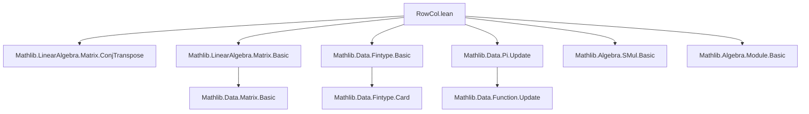
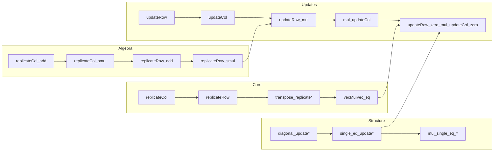

### Technical Brief: `RowCol.lean` — Row and Column Matrices in Lean 4

---

#### **1. Key Definitions & Theorems**

| Name | Type / Signature | Purpose |
|------|------------------|---------|
| `replicateCol` | `Π (ι : Type*) (w : m → α), Matrix m ι α` | Constructs a matrix with all columns equal to vector `w`. |
| `replicateRow` | `Π (ι : Type*) (v : n → α), Matrix ι n α` | Constructs a matrix with all rows equal to vector `v`. |
| `updateRow` | `[DecidableEq m] → Matrix m n α → m → (n → α) → Matrix m n α` | Replaces the `i`-th row of a matrix with a new row vector. |
| `updateCol` | `[DecidableEq n] → Matrix m n α → n → (m → α) → Matrix m n α` | Replaces the `j`-th column of a matrix with a new column vector. |
| `vecMulVec` | `(x : m → R) → (y : n → R) → Matrix m n R` | Outer product (matrix of rank 1) — `x * yᵀ`. |
| `transpose_replicateCol` | `(replicateCol ι v)ᵀ = replicateRow ι v` | Transpose of a column replicate is a row replicate. |
| `transpose_replicateRow` | `(replicateRow ι v)ᵀ = replicateCol ι v` | Transpose of a row replicate is a column replicate. |
| `conjTranspose_replicateCol` | `[Star α] ⇒ (replicateCol ι v)ᴴ = replicateRow ι (star v)` | *-conjugate transpose interacts with `star` on vectors. |
| `replicateRow_mul_replicateCol` | `[Fintype m] [Mul α] [AddCommMonoid α] ⇒ replicateRow ι v * replicateCol ι w = of fun _ _ => v ⬝ᵥ w` | Product of row and column replicates is a constant matrix with dot product. |
| `vecMulVec_eq` | `[Mul α] [AddCommMonoid α] [Unique ι] ⇒ vecMulVec w v = replicateCol ι w * replicateRow ι v` | Outer product equals product of column and row replicates. |
| `updateRow_mul` | `[Fintype m] [NonUnitalNonAssocSemiring α] ⇒ A.updateRow i r * B = (A * B).updateRow i (r ᵥ* B)` | Row update commutes with left multiplication. |
| `mul_updateCol` | `[Fintype m] [NonUnitalNonAssocSemiring α] ⇒ A * B.updateCol j c = (A * B).updateCol j (A *ᵥ c)` | Column update commutes with right multiplication. |
| `updateRow_zero_mul_updateCol_zero` | `[Fintype m] [NonUnitalNonAssocSemiring α] ⇒ (0.updateRow i r) * (0.updateCol j c) = single i j (r ⬝ᵥ c)` | Product of rank-1 updates of zero matrices yields a `single` matrix. |

---

#### **2. Naming Conventions**

- **Prefixes**:
  - `replicate*`: for matrices built by repeating a vector.
  - `update*`: for row/column replacement operations.
  - `single*`: for elementary matrices with one nonzero entry.
- **Suffixes**:
  - `*Col`, `*Row`: distinguish column vs row variants.
  - `*mul*`, `*vec*`: indicate interaction with matrix-vector or vector-matrix multiplication.
- **Suffixes for properties**:
  - `_inj`, `_eq_zero`, `_add`, `_smul`: algebraic behavior (injectivity, zero, addition, scalar mult).
  - `_apply`, `_transpose`, `_conjTranspose`: operational behavior under standard operations.

---

#### **3. Tactic Stack**

Frequent tactics used in proofs:
- `ext`: extensionality for matrices/vectors.
- `simp` / `simp_rw`: simplification using equation lemmas (e.g., `replicateCol_apply`, `updateRow_apply`).
- `rfl`: for definitional equalities.
- `by_cases`: case analysis on equality (e.g., `i' = i`).
- `congr_arg`: to transport equalities through functors (e.g., transpose).
- `simpa`: refined simplification with target rewriting.
- `obtain rfl | hi := eq_or_ne i' i`: standard case split on equality in matrix index reasoning.

---

#### **4. Proof Logic**

- **Structure**: Most proofs follow a *pointwise* strategy:
  1. Use `ext` to reduce to arbitrary indices `i, j`.
  2. Apply `updateRow_apply` / `updateCol_apply` to get conditional expressions (`if ... then ... else ...`).
  3. Split on equality of indices (`i' = i`, `j' = j`) using `by_cases` or `obtain rfl | hi`.
  4. Simplify each branch using `updateRow_self`, `updateRow_ne`, etc.
- **Algebraic properties** (e.g., additivity, scalar multiplication) are proven by `ext` + `rfl`, as definitions are pointwise.
- **Transpose/`*`-conjugate** properties use `transpose_apply`, `conjTranspose`, and `map_update*` lemmas.
- **Subsingleton / unique index** cases (e.g., `Unique ι`) simplify heavily via `Subsingleton.elim` or `Unique.elim`.

---

#### **5. Imports**

- `Mathlib.LinearAlgebra.Matrix.ConjTranspose`: provides `conjTranspose`, `Star α`, and related lemmas.

This file builds on core matrix theory (e.g., `Matrix.of`, `Matrix.mul`, `Matrix.mulVec`, `Matrix.vecMul`) from Mathlib’s `Matrix` namespace.

---

#### **6. Mermaid Diagrams**

##### **Dependency Graph (High-Level)**

##### **Overview of Theoretical Flow**

---

#### **7. Theory Scope**

This module formalizes:
- **Rank-1 matrices** via `replicateRow`, `replicateCol`, and `vecMulVec`.
- **Row/column replacement** (`updateRow`, `updateCol`) and their algebraic behavior.
- **Interaction with matrix multiplication**, vector multiplication, transpose, and `*`-conjugate.
- **Elementary matrices** (`single i j r`) and their factorization via updates of zero matrices.
- **Reindexing compatibility** with updates via `submatrix` and `reindex`.

It serves as a foundational toolkit for reasoning about low-rank updates, outer products, and sparse matrix constructions in linear algebra.

--- 

Let me know if you'd like a formalized dependency graph (e.g., `.lean`-level imports) or a proof automation summary.
