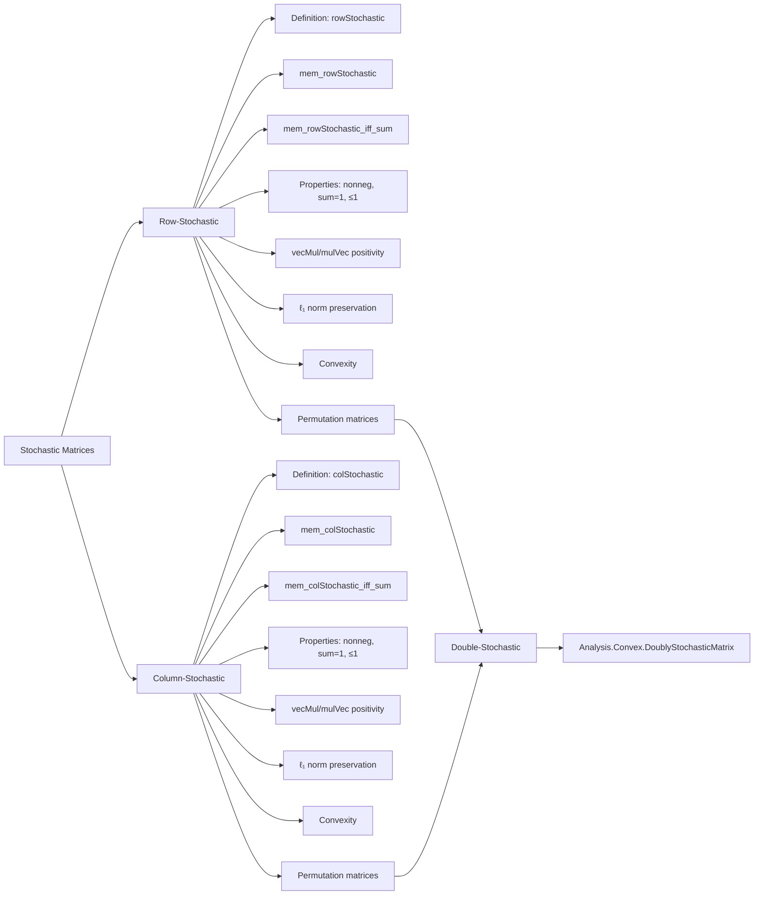

### Technical Brief: `Stochastic.lean`

---

#### **1. Key Definitions & Theorems**

| Name | Type / Signature | Purpose |
|------|------------------|---------|
| `rowStochastic R n` | `Submonoid (Matrix n n R)` | Defines the submonoid of row-stochastic matrices: non-negative entries and $ M \cdot \mathbf{1} = \mathbf{1} $. |
| `colStochastic R n` | `Submonoid (Matrix n n R)` | Defines the submonoid of column-stochastic matrices: non-negative entries and $ \mathbf{1} \cdot M = \mathbf{1} $. |
| `mem_rowStochastic` | `M ∈ rowStochastic R n ↔ (∀ i j, 0 ≤ M i j) ∧ M *ᵥ 1 = 1` | Characterizes membership in `rowStochastic`. |
| `mem_rowStochastic_iff_sum` | `M ∈ rowStochastic R n ↔ (∀ i j, 0 ≤ M i j) ∧ (∀ i, ∑ j, M i j = 1)` | Equivalent formulation using row sums. |
| `mem_colStochastic` | `M ∈ colStochastic R n ↔ (∀ i j, 0 ≤ M i j) ∧ 1 ᵥ* M = 1` | Characterizes membership in `colStochastic`. |
| `mem_colStochastic_iff_sum` | `M ∈ colStochastic R n ↔ (∀ i j, 0 ≤ M i j) ∧ (∀ j, ∑ i, M i j = 1)` | Equivalent formulation using column sums. |
| `permMatrix_mem_rowStochastic` | `{σ : Equiv.Perm n} → σ.permMatrix R ∈ rowStochastic R n` | Shows permutation matrices are row-stochastic. |
| `permMatrix_mem_colStochastic` | `{σ : Equiv.Perm n} → σ.permMatrix R ∈ colStochastic R n` | Shows permutation matrices are column-stochastic. |
| `transpose_mem_rowStochastic_iff_mem_colStochastic` | `Mᵀ ∈ rowStochastic R n ↔ M ∈ colStochastic R n` | Relates transpose to row/column stochasticity. |
| `convex_rowStochastic`, `convex_colStochastic` | `Convex R (rowStochastic R n)` / `Convex R (colStochastic R n)` | Proves convexity of both sets. |

---

#### **2. Naming Conventions**

- **Prefixes**:
  - `rowStochastic`, `colStochastic`: main definitions.
  - `nonneg_of_mem_`, `sum_row_of_mem_`, `le_one_of_mem_`, `one_vecMul_of_mem_`: properties derived from membership.
  - `vecMul_`, `mulVec_`: distinguishes left/right vector multiplication.
  - `transpose_`: for transpose-related equivalences.

- **Suffixes**:
  - `_iff_sum`: equivalence with sum condition.
  - `_rowStochastic`, `_colStochastic`: context-specific lemmas.

- **Pattern**:
  - `M ∈ rowStochastic R n ↔ ...` → `mem_rowStochastic`.
  - `M ∈ rowStochastic R n → P(M)` → `P_of_mem_rowStochastic`.

---

#### **3. Tactic Stack**

| Tactic | Usage Frequency | Purpose |
|--------|-----------------|---------|
| `simp` | Very High | Simplify membership, sums, vector ops, transpose. |
| `rw` | High | Rewrite using definitions, lemmas, hypotheses. |
| `refine` | Medium | Construct proofs with holes (`?_`). |
| `aesop` | Medium | Solve non-linear arithmetic / positivity goals. |
| `grind` | High (attribute) | Used in `@[grind =]` and `@[grind ←]` for automated rewriting. |
| `intro`, `apply`, `exact` | Medium | Standard proof steps. |
| `conv` (implicit via `grind`) | Medium | Used in `@[grind]` attributes for advanced rewriting. |

---

#### **4. Proof Logic**

- **Structure**:
  - Definitions are given as `Submonoid`s, requiring:
    - Carrier set definition.
    - Closure under multiplication (`mul_mem'`).
    - Contains identity (`one_mem'`).
  - Proofs of properties follow a pattern:
    1. Unfold membership via `mem_rowStochastic` / `mem_colStochastic`.
    2. Use `simp` to reduce to sum or dot product forms.
    3. Apply positivity assumptions (`mul_nonneg`, `sum_nonneg`).
    4. Use `Finset.sum_nonneg`, `single_le_sum`, etc., for bounds.
  - **Transpose lemmas** use `transpose_apply` and `forall_swap` to swap quantifiers.
  - **Convexity proofs**:
    - Assume convex combination $ a x + b y $.
    - Use `simp` to reduce to sum of non-negative terms.
    - Apply `mul_nonneg`, `add_nonneg`, and hypothesis `h : a + b = 1`.

- **Induction**: Not used — proofs are direct algebraic manipulations.

---

#### **5. Imports & Dependencies**

| Import | Role |
|--------|------|
| `Mathlib.Data.Matrix.Basic` | Matrix type, operations, notation (`*ᵥ`, `ᵛ*`, `transpose`). |
| `Mathlib.Data.Matrix.Mul` | Matrix multiplication, vector multiplication. |
| `Mathlib.Analysis.Convex.Basic` | Convex sets, convex combinations. |
| `Mathlib.LinearAlgebra.Matrix.Permutation` | Permutation matrices (`permMatrix`). |

**Key Typeclass assumptions**:
- `[Fintype n]`, `[DecidableEq n]`: finite index set for sums.
- `[Semiring R]`: allows matrix arithmetic.
- `[PartialOrder R]`, `[IsOrderedRing R]`: needed for non-negativity reasoning.

---

#### **6. Mermaid Diagrams**

##### **Dependency Graph (Module-Level)**

```mermaid
graph TD
  A[Stochastic.lean] --> B[Mathlib.Data.Matrix.Basic]
  A --> C[Mathlib.Data.Matrix.Mul]
  A --> D[Mathlib.Analysis.Convex.Basic]
  A --> E[Mathlib.LinearAlgebra.Matrix.Permutation]

  B --> F[Mathlib.Data.Matrix.Defs]
  C --> G[Mathlib.Data.Matrix.Defs]
  D --> H[Mathlib.Analysis.Convex.DoublyStochasticMatrix]  %% Note: doubly stochastic defined here
  E --> I[Mathlib.LinearAlgebra.Permutation.Matrix]
```

##### **Overview of File Structure**



---

#### **7. Notes**

- Doubly stochastic matrices are defined in a *separate* file (`Analysis.Convex.DoublyStochasticMatrix`), as noted in the docstring.
- The `grind` attribute is used heavily for automated rewriting — likely part of a custom tactic suite.
- All proofs are constructive and rely on finite sums over `Finset.univ`.
- The `transpose` lemmas show a clean symmetry: transpose swaps row/column stochasticity.

--- 

Let me know if you'd like a formalized dependency graph for `Analysis.Convex.DoublyStochasticMatrix` or a comparison with related files.
