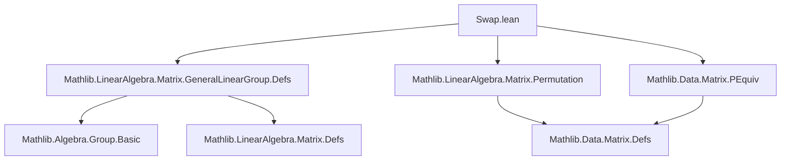
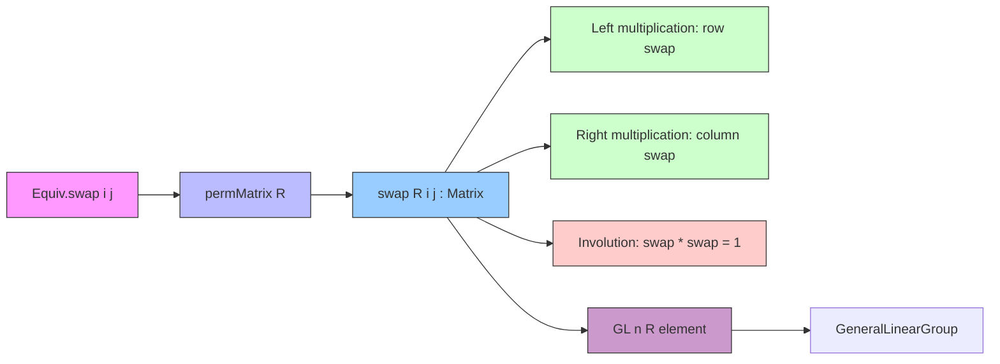

### Technical Brief: `Swap.lean`

---

#### **1. Key Definitions & Theorems**

| Name | Type / Signature | Purpose |
|------|------------------|---------|
| `swap R i j` | `Matrix n n R` | Defines the *swap matrix* swapping rows/columns indexed by `i` and `j`. Implemented as `Equiv.swap i j .permMatrix R`. |
| `swap_comm` | `swap R i j = swap R j i` | Symmetry of swap: swapping `i` and `j` is same as swapping `j` and `i`. |
| `transpose_swap` | `(swap R i j)ᵀ = swap R i j` | Swap matrices are symmetric. |
| `conjTranspose_swap` | `(swap R i j)† = swap R i j` | Swap matrices are self-conjugate-transpose (Hermitian) under star ring. |
| `map_swap` (matrix) | `(swap R i j).map f = swap S i j` | Compatibility of `swap` with ring homomorphisms. |
| `swap_mulVec` | `swap R i j *ᵥ a = a ∘ Equiv.swap i j` | Left multiplication by `swap` permutes vector entries via `Equiv.swap`. |
| `vecMul_swap` | `a ᵥ* swap R i j = a ∘ Equiv.swap i j` | Right multiplication by `swap` permutes covector entries. |
| `swap_mulVec_apply` / `vecMul_swap_apply` | `(swap *ᵥ a) i = a j` | Explicit action: result at index `i` is original value at `j`. |
| `swap_mul_apply_left` / `swap_mul_apply_right` | `(swap * g) i = g j`, `(swap * g) j = g i` | Row-swapping behavior on matrices. |
| `swap_mul_of_ne` | If `a ≠ i, j`, then `(swap * g) a = g a` | Rows other than `i`, `j` unchanged. |
| `mul_swap_apply_left` / `mul_swap_apply_right` | `(g * swap) _ i = g _ j`, `(g * swap) _ j = g _ i` | Column-swapping behavior on matrices. |
| `mul_swap_of_ne` | If `b ≠ i, j`, then `(g * swap) _ b = g _ b` | Columns other than `i`, `j` unchanged. |
| `swap_mul_self` | `swap R i j * swap R i j = 1` | Swap matrix is an involution (its own inverse). |
| `swap` (in `GL n R`) | `GL n R` | View `swap` as an invertible matrix (element of general linear group). |
| `map_swap` (in `GL`) | `(swap R i j).map f = swap S i j` | Compatibility of `GL`-swap with ring homomorphisms. |

---

#### **2. Naming Conventions**

- **Prefix `swap_`**: All definitions/lemmas related to swap matrices start with `swap_`.
- **Suffix `_apply_left` / `_apply_right`**: Indicate left/right multiplication effect (row/column swap).
- **Suffix `_of_ne`**: Lemmas for behavior when index is *not* involved in swap.
- **`_comm`**: Commutativity of swap arguments.
- **`_transpose` / `_conjTranspose`**: Symmetry properties.
- **`_mulVec` / `vecMul_`**: Vector multiplication variants.
- **`_self`**: Involution property (`swap * swap = 1`).

---

#### **3. Tactic Stack**

Frequent tactics used:
- `simp` — heavily used, especially with `swap`, `Equiv.swap`, `PEquiv.toMatrix`, etc.
- `rw` — for rewriting using `swap_comm`, `swap_mul_apply_left`, etc.
- `ext` — in `GL`-swap `map_swap` proof to extend by extensionality.
- `simp only [...]` — for precise simplification (e.g., in `swap_mul_self`).
- `rw [← Equiv.swap_inv, Equiv.Perm.inv_def]` — to connect matrix inversion with permutation group theory.

No heavy automation (e.g., `linarith`, `ring`, `aesop`) — proofs are mostly structural and rely on `simp` + known lemmas about `Equiv.swap` and `PEquiv`.

---

#### **4. Proof Logic**

- **Core idea**: Leverage equivalence with permutation matrices via `Equiv.swap i j .permMatrix`.
- **Row/column action**: Proven by reducing to `PEquiv.toMatrix_toPEquiv_mulVec` / `mul` lemmas.
- **Involution**: Uses `Equiv.swap_inv` and `PEquiv.toMatrix_trans`.
- **General Linear Group embedding**: Uses `swap_mul_self` to construct inverse; `@[simps]` auto-generates projections.
- **Structure preservation**: `map_swap` proofs use `ext` + `simp` to lift ring homomorphism action.

Induction is *not* used — proofs are mostly equational reasoning with `simp` and known permutation lemmas.

---

#### **5. Imports**

| Import | Role |
|--------|------|
| `Mathlib.LinearAlgebra.Matrix.GeneralLinearGroup.Defs` | Defines `GL n R`, `val`, `inv`, etc. |
| `Mathlib.LinearAlgebra.Matrix.Permutation` | Defines `permMatrix`, permutation matrix construction. |
| `Mathlib.Data.Matrix.PEquiv` | Provides `PEquiv`, `toMatrix`, and multiplication lemmas linking permutations and matrices. |

These imports define the foundational bridge between permutation theory and matrix algebra.

---

#### **6. Mermaid Diagrams**

##### **Dependency Graph (Module-Level)**

##### **Conceptual Overview (Theory Flow)**

---

#### **7. Summary**

This module formalizes *swap matrices* — elementary matrices corresponding to transpositions — as a thin wrapper over permutation matrices induced by `Equiv.swap`. It establishes their algebraic properties (symmetry, involution), action on vectors/matrices (row/column swapping), and embeds them into the general linear group. The proofs are clean and rely on the existing theory of permutations and `PEquiv`, avoiding ad-hoc matrix reasoning.

--- 

Let me know if you'd like a formalized dependency graph for `PEquiv.toMatrix` or a comparison with transvection matrices (`Transvection.lean`).
