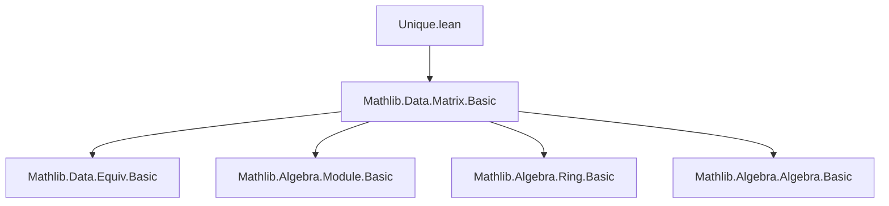
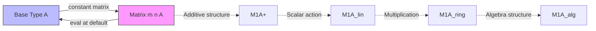

**Technical Brief: `Unique.lean` — One-by-One Matrices over a Base Type**

---

### 1. **Key Definitions & Theorems**

| Name | Type | Purpose |
|------|------|---------|
| `uniqueEquiv` | `Matrix m n A ≃ A` | Canonical equivalence (bijection) between $m \times n$ matrices (with $m,n$ unique) and the base type $A$. Maps a matrix to its unique entry. |
| `uniqueAddEquiv` | `Matrix m n A ≃+ A` | Additive group isomorphism when $A$ has an addition; extends `uniqueEquiv` to preserve addition. |
| `uniqueLinearEquiv` | `Matrix m n A ≃ₗ[R] A` | Linear equivalence of $R$-modules when $A$ is an $R$-module; extends to scalar multiplication. |
| `uniqueRingEquiv` | `Matrix m m A ≃+* A` | Ring isomorphism for square $1 \times 1$ matrices over a non-unital non-associative semiring $A$. |
| `uniqueAlgEquiv` | `Matrix m m A ≃ₐ[R] A` | Algebra isomorphism over a commutative semiring $R$, when $A$ is an $R$-algebra. |

All definitions are annotated with `@[simps]` or `@[simps!]`, indicating they are optimized for simplifier use (e.g., `simp` reduces projections to the underlying element).

---

### 2. **Naming Conventions**

- **Prefix `unique_`**: Indicates constructions rely on `Unique m` and `Unique n`, i.e., types with exactly one element (e.g., `uniqueEquiv`, `uniqueAddEquiv`).
- **Suffix `_equiv` / `_add_equiv` / `_linear_equiv` / `_ring_equiv` / `_alg_equiv`**: Denotes increasing algebraic structure preservation:
  - `_equiv`: bare equivalence (bijection).
  - `_add_equiv`: additive group isomorphism.
  - `_linear_equiv`: module linear equivalence.
  - `_ring_equiv`: ring isomorphism.
  - `_alg_equiv`: algebra isomorphism.

---

### 3. **Tactic Stack**

- `simp`: Dominant tactic, used in proofs of `left_inv`, `right_inv`, `map_add'`, `map_mul'`, `map_smul'`, `commutes'`.
- `aesop`: Used in `commutes'` for automated reasoning about algebraic structures.
- `ext`: Used in `left_inv` to extend extensionality over matrix indices.
- `simp [mul_apply]`: Explicitly used to unfold multiplication in matrix ring.

No induction, cases, or complex rewriting beyond `simp` and `aesop`.

---

### 4. **Proof Logic**

- **Core idea**: Leverage `Unique m` and `Unique n` to reduce matrix indices to `default`, making all entries equal.
- **Structure of proofs**:
  1. Define forward map as evaluation at `(default, default)`.
  2. Define inverse as constant matrix function.
  3. Prove inverse properties using `Subsingleton.elim` (since `Unique` implies `Subsingleton`).
  4. For algebraic structure, lift the equivalence and verify homomorphism laws via `simp` and `aesop`.

No heavy machinery—proofs are short and rely on definitional equality and simplifier automation.

---

### 5. **Imports**

- `Mathlib.Data.Matrix.Basic`: Provides foundational matrix definitions (`Matrix`, `of`, `mul_apply`, etc.).
- Implicitly depends on:
  - `Mathlib.Data.Equiv.Basic` (for `≃`)
  - `Mathlib.Algebra.Module.Basic` (for `Module`, `AddCommMonoid`)
  - `Mathlib.Algebra.Ring.Basic` (for `Semiring`, `NonUnitalNonAssocSemiring`)
  - `Mathlib.Algebra.Algebra.Basic` (for `Algebra`, `CommSemiring`)

---

### 6. **Mermaid Diagrams**

#### **Dependency Graph (Module-Level)**



#### **Theory Overview (Conceptual Flow)**



#### **Structure Lifting Diagram**

```mermaid
graph LR
  uniqueEquiv[uniqueEquiv : Matrix m n A ≃ A]
  uniqueAddEquiv[uniqueAddEquiv : Matrix m n A ≃+ A]
  uniqueLinearEquiv[uniqueLinearEquiv : Matrix m n A ≃ₗ[R] A]
  uniqueRingEquiv[uniqueRingEquiv : Matrix m m A ≃+* A]
  uniqueAlgEquiv[uniqueAlgEquiv : Matrix m m A ≃ₐ[R] A]

  uniqueEquiv -->|additive| uniqueAddEquiv
  uniqueAddEquiv -->|scalar| uniqueLinearEquiv
  uniqueLinearEquiv -->|square + mul| uniqueRingEquiv
  uniqueRingEquiv -->|algebra| uniqueAlgEquiv
```

---

### 7. **Summary**

This module formalizes the elementary but foundational fact that matrices of shape $1 \times 1$ over a type $A$ are canonically equivalent to $A$, and that this equivalence respects increasingly rich algebraic structures (additive, linear, ring, algebra). The proofs are highly automated, leveraging Lean’s simplifier and uniqueness of indices. It serves as a building block for larger matrix theory developments where degenerate cases (e.g., scalar matrices) must be identified with their underlying elements.
