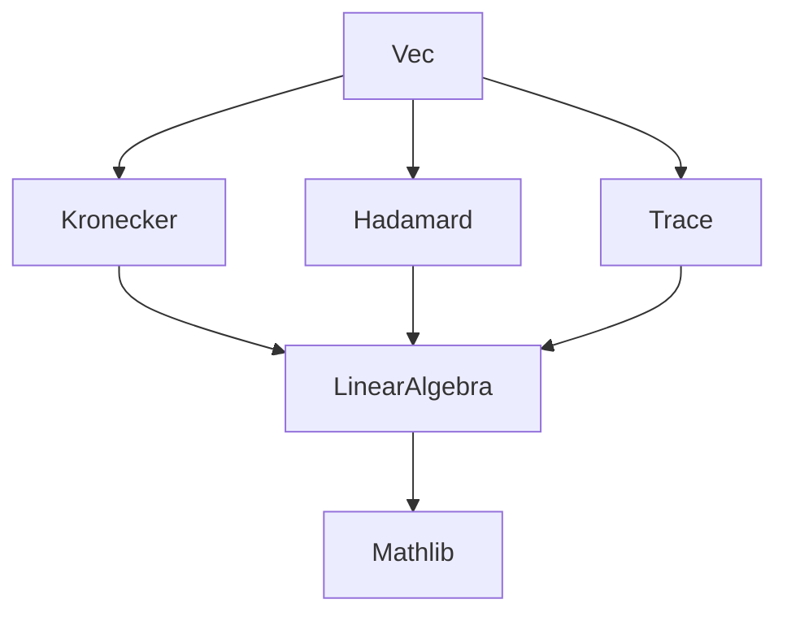

### Technical Brief: `Vec.lean` — Vectorization of Matrices in Lean 4

---

#### **1. Key Definitions & Theorems**

| Name | Type / Signature | Purpose |
|------|------------------|---------|
| `vec` | `Matrix m n R → n × m → R` | Stacks columns of a matrix into a column vector indexed by `n × m`. |
| `vec_of` | `vec (of f) = Function.uncurry (flip f)` | Describes `vec` on matrices defined by a function. |
| `vec_transpose` | `vec Aᵀ = vec A ∘ Prod.swap` | Relates vectorization of transpose to swapping indices. |
| `vec_eq_uncurry` | `vec A = Function.uncurry fun i j => A j i` | Alternative definition of `vec` as uncurrying flipped entries. |
| `vec_inj` | `A.vec = B.vec ↔ A = B` | Injectivity of `vec`. |
| `vec_bijective` | `Function.Bijective vec` | `vec` is a bijection between matrices and functions `n × m → R`. |
| `vec_map` | `vec (A.map f) = f ∘ vec A` | Compatibility with map. |
| `vec_zero`, `vec_add`, `vec_neg`, `vec_sub`, `vec_smul` | Various algebraic laws | `vec` preserves additive and scalar structure. |
| `vec_sum` | `vec (∑ i ∈ s, A i) = ∑ i ∈ s, vec (A i)` | `vec` commutes with finite sums. |
| `vec_dotProduct_vec` | `vec A ⬝ᵥ vec B = (Aᵀ * B).trace` | Dot product of vectorizations equals trace of `Aᵀ * B`. |
| `star_vec` | `star x.vec = (x.map star).vec` | Compatibility with `star` operation. |
| `star_vec_dotProduct_vec` | `star (vec A) ⬝ᵥ vec B = (Aᴴ * B).trace` | Hermitian inner product via vectorization. |
| `vec_hadamard` | `vec (A ⊙ B) = vec A * vec B` | Vectorization respects Hadamard (entrywise) product. |
| `vec_single` | `vec (Matrix.single i j r) = Pi.single (j, i) r` | Vectorization of a single-entry matrix. |
| `kronecker_mulVec_vec` | `(B ⊗ₖ A) *ᵥ vec X = vec (A * X * Bᵀ)` | Interaction of `vec` with Kronecker product and matrix multiplication. |
| `vec_vecMul_kronecker` | `vec X ᵥ* (B ⊗ₖ A) = vec (Aᵀ * X * B)` | Dual version for row vector multiplication. |
| `vec_mul_eq_mulVec` | `vec (A * B) = (1 ⊗ₖ A) *ᵥ vec B` | Vectorization of product as Kronecker action. |
| `vec_mul_eq_vecMul` | `vec (A * B) = A.vec ᵥ* (B ⊗ₖ 1)` | Vectorization of product as right Kronecker action. |

---

#### **2. Naming Conventions**

- **Prefixes**:
  - `vec_`: All functions/theorems related to vectorization.
  - `kronecker_`, `vec_*_kronecker`: Technical lemmas for Kronecker interactions.
- **Suffixes**:
  - `_of_commute`: For lemmas requiring a commutativity hypothesis.
  - `_hada`, `_dotProduct`, `_star`: Domain-specific suffixes for operations (Hadamard, dot product, star).
- **Notable patterns**:
  - `vec_*` for structural properties.
  - `*_vec` for properties where `vec` appears on the right-hand side (e.g., `vec_mul_eq_mulVec`).
  - `vec_*_vec` for bilinear forms involving two vectorizations.

---

#### **3. Tactic Stack**

Frequently used tactics in proofs:

| Tactic | Usage |
|--------|-------|
| `rfl` | For definitional equalities (e.g., `vec_of`, `vec_transpose`, `vec_eq_uncurry`). |
| `simp_rw` | Rewriting with `vec`-related lemmas and simplifying expressions. |
| `ext` | Extensionality to prove function equality (e.g., in `vec_inj`, `vec_sum`, Kronecker lemmas). |
| `simp` | Simplifying dot products, sums, `vec`, `transpose`, etc. |
| `rw` | Rewriting using lemmas like `kronecker_mulVec_vec_of_commute`, `transpose_one`. |
| `obtain rfl | hij := eq_or_ne i j` | Case analysis on equality of indices (used in `vec_mul_eq_mulVec`, `vec_mul_eq_vecMul`). |
| `exact`, `intro`, `apply` | Standard proof scripting. |
| `Finset.sum_product`, `Finset.univ_product_univ` | To reorganize double sums over product types. |

---

#### **4. Proof Logic**

- **Structural proofs** (e.g., `vec_inj`, `vec_bijective`, `vec_map`) rely on:
  - Extensionality (`ext`) + simplification (`simp`/`simp_rw`) using definitions.
- **Algebraic lemmas** (e.g., `vec_add`, `vec_smul`) are definitional (`rfl`).
- **Summation lemmas** (`vec_sum`, `vec_dotProduct_vec`) use:
  - Extensionality + `simp_rw` with `Finset.sum_apply`, `Matrix.sum_apply`, etc.
- **Kronecker interaction lemmas**:
  - Use `ext ⟨k, l⟩` to reduce to index-wise verification.
  - Expand definitions (`mulVec`, `vec`, `kroneckerMap_apply`, etc.).
  - Apply commutativity assumptions (`hB`, `hA`) to reorder sums/products.
  - Use `Finset.sum_product` to factor double sums.
- **Matrix multiplication vectorization** (`vec_mul_eq_mulVec`, `vec_mul_eq_vecMul`):
  - Reduce to `kronecker_mulVec_vec_of_commute` / `vec_vecMul_kronecker_of_commute`.
  - Use `transpose_one`, `Matrix.mul_one`, `Matrix.one_mul`.
  - Handle index cases (`eq_or_ne`) and simplify.

---

#### **5. Imports**

| Module | Purpose |
|--------|---------|
| `Mathlib.LinearAlgebra.Matrix.Hadamard` | For Hadamard product `⊙`. |
| `Mathlib.LinearAlgebra.Matrix.Kronecker` | For Kronecker product `⊗ₖ`, `kroneckerMap`, `mulVec`, `vecMul`. |
| `Mathlib.LinearAlgebra.Matrix.Trace` | For trace, used in `vec_dotProduct_vec`. |

---

#### **6. Dependency & Theory Overview**

##### **Mermaid Diagram: Module Dependencies**



##### **Mermaid Diagram: Theory Flow**

```mermaid
graph TD
  A[Matrix m n R] -->|vec| B[n × m → R]
  B -->|dotProduct| C[trace(Aᵀ * B)]
  B -->|star| D[star(vec A) = vec(x.map star)]
  B -->|Kronecker| E[(B ⊗ₖ A) *ᵥ vec X = vec(A * X * Bᵀ)]
  E --> F[vec(A * B) = (1 ⊗ₖ A) *ᵥ vec B]
  C --> G[Inner product structure]
  D --> H[Star-Hilbert structure]
  F --> I[Vectorization as linear isomorphism]
```

##### **Key Theoretical Insights**

- `vec` is a **linear isomorphism** between `Matrix m n R` and `(n × m) → R`.
- It encodes the standard **column-wise vectorization** used in linear algebra (e.g., Kronecker product identities).
- The indexing choice `n × m` (instead of `m × n`) aligns with the convention that `vec(A)` stacks **columns**, matching literature (e.g., Magnus & Neudecker).
- The Kronecker identities (`vec(A * X * Bᵀ) = (B ⊗ₖ A) *ᵥ vec X`) are foundational for matrix calculus and tensor algebra.

---

Let me know if you'd like a formalized summary in Lean or a diagram for the `vec`-induced isomorphism of algebras.
