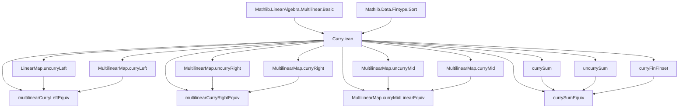
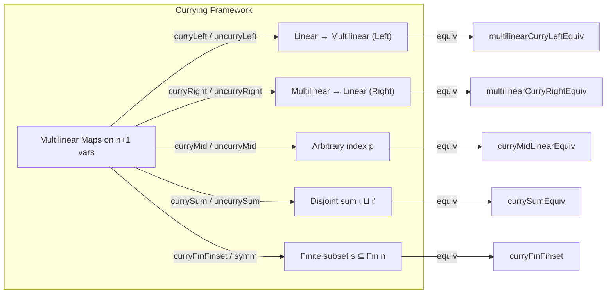

### Technical Brief: Curry.lean — Currying of Multilinear Maps in Lean 4

---

#### **1. Key Definitions & Theorems**

| Name | Type / Signature | Purpose |
|------|------------------|---------|
| `LinearMap.uncurryLeft` | `(M 0 →ₗ[R] MultilinearMap R (fun i : Fin n => M i.succ) M₂) → MultilinearMap R M M₂` | Constructs a multilinear map on `n+1` variables from a linear map into `n`-variable multilinear maps, using `cons`/`tail`. |
| `MultilinearMap.curryLeft` | `MultilinearMap R M M₂ → M 0 →ₗ[R] MultilinearMap R (fun i : Fin n => M i.succ) M₂` | Splits off the first variable of an `(n+1)`-variable multilinear map into a linear map into `n`-variable maps. |
| `multilinearCurryLeftEquiv` | `MultilinearMap R M M₂ ≃ₗ[R] (M 0 →ₗ[R] MultilinearMap R (fun i : Fin n => M i.succ) M₂)` | Linear equivalence expressing currying/un-currying for the first variable. |
| `MultilinearMap.uncurryRight` | `MultilinearMap R (fun i : Fin n => M (castSucc i)) (M (last n) →ₗ[R] M₂) → MultilinearMap R M M₂` | Uncurries a multilinear map valued in linear maps (on last variable). |
| `MultilinearMap.curryRight` | `MultilinearMap R M M₂ → MultilinearMap R (fun i : Fin n => M (castSucc i)) (M (last n) →ₗ[R] M₂)` | Curries a multilinear map by separating the last variable. |
| `multilinearCurryRightEquiv` | `MultilinearMap R M M₂ ≃ₗ[R] MultilinearMap R (fun i : Fin n => M (castSucc i)) (M (last n) →ₗ[R] M₂)` | Linear equivalence for currying/un-currying the last variable. |
| `LinearMap.uncurryMid` | `M p →ₗ[R] MultilinearMap R (fun i ↦ M (p.succAbove i)) M₂ → MultilinearMap R M M₂` | Uncurries with respect to an arbitrary index `p : Fin (n+1)`. |
| `MultilinearMap.curryMid` | `MultilinearMap R M M₂ → M p →ₗ[R] MultilinearMap R (fun i ↦ M (p.succAbove i)) M₂` | Curries with respect to an arbitrary index `p`. |
| `MultilinearMap.curryMidLinearEquiv` | `MultilinearMap R M M₂ ≃ₗ[R] M p →ₗ[R] MultilinearMap R (fun i ↦ M (p.succAbove i)) M₂` | Linear equivalence for currying at arbitrary position `p`. |
| `currySum` | `MultilinearMap R N M₂ → MultilinearMap R (fun i : ι ↦ N (.inl i)) (MultilinearMap R (fun i : ι' ↦ N (.inr i)) M₂)` | Curries over a sum type `ι ⊕ ι'`. |
| `uncurrySum` | `MultilinearMap R (fun i : ι ↦ N (.inl i)) (MultilinearMap R (fun i : ι' ↦ N (.inr i)) M₂) → MultilinearMap R N M₂` | Uncurries over `ι ⊕ ι'`. |
| `currySumEquiv` | `MultilinearMap R N M₂ ≃ₗ[R] MultilinearMap R (fun i : ι ↦ N (.inl i)) (MultilinearMap R (fun i : ι' ↦ N (.inr i)) M₂)` | Linear equivalence for currying over disjoint sum of index types. |
| `curryFinFinset` | `MultilinearMap R (fun _ : Fin n => M') M₂ ≃ₗ[R] MultilinearMap R (fun _ : Fin k => M') (MultilinearMap R (fun _ : Fin l => M') M₂)` | Curries with respect to a finite subset `s ⊆ Fin n` of size `k`, complement size `l`. |

**Key Theorems (Simp lemmas):**
- `LinearMap.curry_uncurryLeft`, `MultilinearMap.uncurry_curryLeft`
- `MultilinearMap.curry_uncurryRight`, `MultilinearMap.uncurry_curryRight`
- `LinearMap.curryMid_uncurryMid`, `MultilinearMap.uncurryMid_curryMid`
- `uncurrySum_currySum`, `currySum_uncurrySum`
- `curryFinFinset_symm_apply`, `curryFinFinset_apply`, `curryFinFinset_apply_const`, etc.

All equivalences are proven by showing mutual inverses via `rfl` or `simp`-friendly reductions.

---

#### **2. Naming Conventions**

- **Prefixes:**
  - `curry*`: forward direction (splitting a variable).
  - `uncurry*`: inverse direction (recombining variables).
  - `mid`: for arbitrary index `p` (not just first/last).
  - `sum`: for currying over disjoint sum of index types.
  - `finset`: for currying with respect to a subset of `Fin n`.

- **Suffixes:**
  - `Left`: first variable (index `0`).
  - `Right`: last variable (index `last n`).
  - `Mid`: arbitrary index `p`.
  - `Sum`: over `ι ⊕ ι'`.
  - `Finset`: over finite subsets of `Fin n`.

- **Equivalences:**
  - Named `*Equiv`, `*LinearEquiv`, or `*Equiv` (e.g., `currySumEquiv`, `curryMidLinearEquiv`).

---

#### **3. Tactic Stack**

- **Core tactics used repeatedly:**
  - `rfl`: for definitional equalities.
  - `simp` / `simp only` / `simp_rw`: for simplifying using `@[simp]` lemmas.
  - `ext`: extensionality for functions/multilinear maps.
  - `cases i using Fin.cases`, `Fin.lastCases`, `Fin.succAboveCases`, `Fin.insertNth`, `Fin.removeNth`: case analysis on finite indices.
  - `aesop`: for automated reasoning in `map_update_*` proofs (especially with `Classical.decEq`).
  - `congr`: for congruence reasoning in `curryFinFinset_symm_apply_piecewise_const`.
  - `rw [init_snoc, snoc_last]`: rewriting using known lemmas about `init`/`snoc`.

---

#### **4. Proof Logic**

- **Structure of proofs:**
  - **Definitional lemmas** (`@[simp]`) are proven by `rfl`.
  - **Inverse properties** (e.g., `uncurry_curryLeft`) are proven by:
    - `ext m`: extensionality on input tuple `m`.
    - `simp` to reduce to definitions (`cons`, `tail`, `init`, `snoc`, etc.).
  - **Multilinearity checks** (in `mk'`) use:
    - `cases i using Fin.cases <;> simp [Ne.symm]` — case split on position `i`, then simplify.
    - Similar for `Fin.lastCases`, `Fin.succAboveCases`.
  - **Equivalence proofs** (`left_inv`, `right_inv`) rely on the inverse lemmas already established.
  - **Subset-based currying** (`curryFinFinset`) uses:
    - `domDomCongrLinearEquiv` to reindex via `finSumEquivOfFinset`.
    - Then composes with `currySumEquiv`.

- **Induction is not used** — all arguments are definitional or rely on structural properties of `Fin`, `cons`, `tail`, `init`, `snoc`, `insertNth`, `removeNth`.

---

#### **5. Imports**

- `Mathlib.Data.Fintype.Sort`: for finite types and cardinality reasoning.
- `Mathlib.LinearAlgebra.Multilinear.Basic`: core multilinear map infrastructure (`MultilinearMap`, `mk'`, `cons`, `tail`, `init`, `snoc`, `last`, `castSucc`, `insertNth`, `removeNth`, etc.).

---

#### **6. Mermaid Diagrams**

##### **Dependency Graph (High-Level)**

##### **Overview of Curry.lean Theory**

---

#### **7. Summary**

This module formalizes **currying for multilinear maps** in multiple dimensions:
- First/last variable separation (`curryLeft`, `curryRight`)
- Arbitrary variable separation (`curryMid`)
- Disjoint sum of index types (`currySum`)
- Subset-based separation (`curryFinFinset`)

All constructions come with:
- Explicit definitions (`def`)
- Simplification lemmas (`@[simp]`)
- Linear equivalences (`≃ₗ[R]`)
- Proofs of inverse properties via `simp` and case analysis.

The design reflects **Lean’s emphasis on definitional equality and structural induction over finite types**, avoiding heavy machinery (e.g., no induction on `n`), and leveraging `Fin`-specific operations (`cons`, `tail`, `init`, `snoc`, `insertNth`, `removeNth`, `succAbove`) for clean, reusable abstractions.

--- 

Let me know if you'd like a formalized dependency graph (e.g., `.lean`-level imports), or a visualization of the `curryMid`/`uncurryMid` mechanics.
