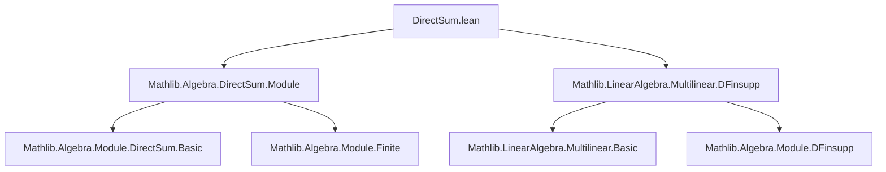
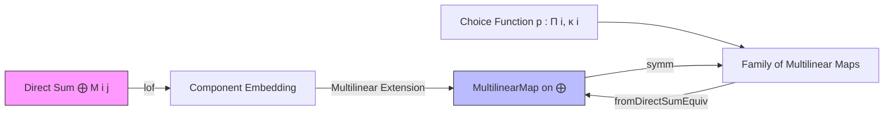

**Technical Brief: `DirectSum.lean` — Multilinear Maps from Direct Sums**

---

### 1. **Key Definitions & Theorems**

| Name | Type / Signature | Purpose |
|------|------------------|---------|
| `directSum_ext` | `∀ ⦃f g : MultilinearMap R (fun i ↦ ⨁ j, M i j) M'⦄, (∀ p, f ∘ (lof ∘ p) = g ∘ (lof ∘ p)) → f = g` | Extensionality principle: two multilinear maps on a finite direct sum are equal if they agree on all *generator embeddings* `lof`. |
| `fromDirectSumEquiv` | `((p : Π i, κ i) → MultilinearMap R (fun i ↦ M i (p i)) M') ≃ₗ[R] MultilinearMap R (fun i ↦ ⨁ j, M i j) M'` | Linear equivalence between:  • Families of multilinear maps indexed by choice functions `p`, and  • Multilinear maps on the *iterated direct sum* `⨁ j, M i j`. |
| `fromDirectSumEquiv_lof` | `fromDirectSumEquiv f (lof … (x i)) = f p x` | Simplification rule: evaluating the equivalence on a pure tensor (i.e., image of `lof`) recovers the original family evaluation. |
| `fromDirectSumEquiv_apply` | `fromDirectSumEquiv f x = ∑ p ∈ Fintype.piFinset … , f p (fun i ↦ x i (p i))` | Explicit formula for the equivalence on arbitrary (finite support) inputs — sums over all choice functions `p` supported in `x`. |
| `fromDirectSumEquiv_symm_apply` | `fromDirectSumEquiv.symm f p = f ∘ (lof ∘ p)` | Description of the inverse: precomposing a multilinear map on the direct sum with the canonical inclusions `lof` yields the family of multilinear maps on each component. |

---

### 2. **Naming Conventions**

- **Prefixes**:
  - `fromDirectSumEquiv_`: indicates constructions involving the equivalence *from* a direct sum.
  - `lof`: standard notation for the canonical inclusion map into a direct sum (`lof R ι κ M i j x` embeds `x : M i j` into `⨁ i, ⨁ j, M i j`).
- **Suffixes**:
  - `_ext`: extensionality theorems.
  - `_apply`: evaluation formulas.
  - `_symm_apply`: inverse direction formulas.
- **Variables**:
  - `p : Π i, κ i`: choice function selecting one index per `i`.
  - `x : ⨁ i, ⨁ j, M i j`: a finitely supported family of elements.

---

### 3. **Tactic Stack**

- `simp_rw`: used to rewrite using simplification lemmas with dependent types.
- `convert rfl`: to reduce goals to definitional equality via unification.
- `rw [← fromDFinsuppEquiv_single]`, `rw [← fromDFinsuppEquiv_apply]`: leverages prior equivalences from `DFinsupp`.
- `haveI : Fintype ι := Fintype.ofFinite ι`: typeclass inference for finiteness.
- ` Classical.typeDecidableEq (κ i)`: to obtain decidable equality for indexing types.

---

### 4. **Proof Logic**

- **Structure**: Proofs rely heavily on the equivalence between multilinear maps on direct sums and families of multilinear maps on componentwise choices — this is formalized via `fromDFinsuppEquiv` (from `MultilinearMap.DFinsupp`).
- **Strategy**:
  1. Use `ext` (via `directSum_ext`) to reduce equality of multilinear maps to equality on generators (`lof`).
  2. For the equivalence itself, invoke `fromDFinsuppEquiv` — a pre-existing equivalence for multilinear maps on `Π` vs `⨁`.
  3. Simplify using `simp` and `rw` with lemmas about `lof`, `fromDFinsuppEquiv`, and `Fintype.piFinset`.
  4. For the inverse, use `simp_rw` to unfold the equivalence and apply known lemmas about `lof` and composition.

---

### 5. **Imports & Dependencies**

| Module | Role |
|--------|------|
| `Mathlib.Algebra.DirectSum.Module` | Provides `DirectSum`, `lof`, basic properties of direct sums of modules. |
| `Mathlib.LinearAlgebra.Multilinear.DFinsupp` | Supplies `fromDFinsuppEquiv`, the core equivalence used to define `fromDirectSumEquiv`. |

> **Note**: The file is built on top of `DFinsupp`-based multilinear map theory, and crucially assumes:
> - `R` is a commutative semiring.
> - All `M i j` are `R`-modules.
> - `ι` is finite (or at least `Fintype`) for the equivalence to hold.

---

### 6. **Mermaid Diagrams**

#### **Dependency Graph**

#### **Overview of Theory Flow**

---

### 7. **Summary**

This file establishes a foundational linear equivalence between multilinear maps on an *iterated direct sum* and families of multilinear maps indexed by *choice functions*. It is a key step in formalizing universal properties of multilinear maps over direct sums, and is used extensively in higher algebra (e.g., tensor products, exterior powers, symmetric powers). The equivalence is constructive and computationally meaningful, with explicit formulas for both directions.
