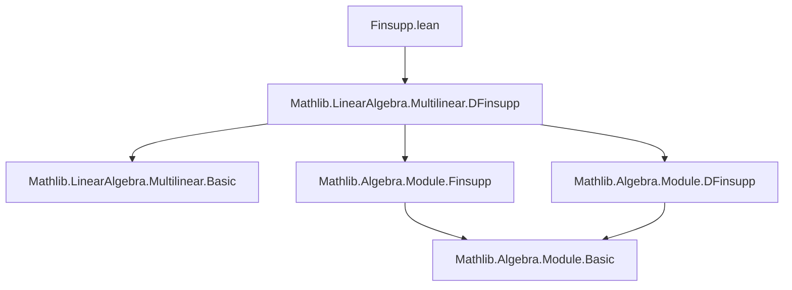

### Technical Brief: `Finsupp.lean` Module — Interactions between Finitely-Supported Functions and Multilinear Maps

---

#### **1. Key Definitions & Theorems**

| Name | Type | Purpose |
|------|------|---------|
| `freeFinsuppEquiv` | `(((Π i, κ i) × ι') →₀ R) ≃ₗ[R] MultilinearMap R (fun i => (κ i →₀ R)) (ι' →₀ R)` | Linear equivalence between finitely supported functions on `((Π i, κ i) × ι')` and multilinear maps from a product of free finitely-supported modules to another. |
| `freeFinsuppEquiv_def` | `∀ f, freeFinsuppEquiv f = …` | Explicit definition of `freeFinsuppEquiv` in terms of simpler equivalences (`finsuppLequivDFinsupp`, `freeDFinsuppEquiv`, etc.). |
| `freeFinsuppEquiv_single` | `∀ p r x, freeFinsuppEquiv (Finsupp.single p r) x = r • Finsupp.single p.2 (∏ i, (x i) (p.1 i))` | Describes action of `freeFinsuppEquiv` on a *single-point* support function: yields a multilinear map that scales by `r` and multiplies component evaluations. |
| `freeFinsuppEquiv_apply` | `∀ f x, freeFinsuppEquiv f x = ∑ p, f p • Finsupp.single p.2 (∏ i, (x i) (p.1 i))` | General evaluation formula: expresses the image of `x` under the multilinear map corresponding to `f` as a finite sum over support points. |

---

#### **2. Naming Conventions**

- **Prefixes**:
  - `free_`: Indicates constructions involving *free* modules (here, `κ i →₀ R`).
  - `multilinearMapCongr*`: Congruence lemmas for rewriting multilinear maps under equivalences.
- **Suffixes**:
  - `_equiv`: Denotes an equivalence (here, linear equivalence `≃ₗ`).
  - `_def`: Definition lemma (often `rfl` or derived via unfolding).
  - `_single`: Special case for `Finsupp.single`.
  - `_apply`: Evaluation formula.

---

#### **3. Tactic Stack**

- `simp`: Heavily used, especially with `[simp]` attributes on lemmas like `freeFinsuppEquiv_single`.
- `induction ... using Finsupp.induction_linear`: Structural induction on finitely supported functions (base: zero, step: add, single).
- `rfl`: Used in `freeFinsuppEquiv_def`.
- `simp [hf, hg, add_mul, Finset.sum_add_distrib]`: For additive decomposition in induction step.
- `≈`-style composition: `≪≫ₗ` (linear equivalence composition) used in definition.

---

#### **4. Proof Logic**

- **Definition**: `freeFinsuppEquiv` is built by chaining equivalences:
  1. `finsuppLequivDFinsupp`: Converts `→₀` to `Π₀` (finsupp ↔ dfinsupp).
  2. `freeDFinsuppEquiv`: Known equivalence for *dfinsupp* version (domain: `Π i, κ i`, codomain: `ι'`).
  3. Congruences (`multilinearMapCongrRight`, `multilinearMapCongrLeft`) adjust domain/codomain via equivalences.
  4. Symmetry (`symm`) used where needed.

- **Proofs**:
  - `freeFinsuppEquiv_single`: Immediate from `freeFinsuppEquiv_def` + `simp`.
  - `freeFinsuppEquiv_apply`: Proven by **induction on `f`** using `Finsupp.induction_linear`, reducing to `single` case (handled by `freeFinsuppEquiv_single`), then using distributivity of scalar multiplication over addition.

---

#### **5. Imports & Dependencies**

- **Primary import**:
  ```lean
  import Mathlib.LinearAlgebra.Multilinear.DFinsupp
  ```
- **Implicit assumptions** (via `variable` + typeclass inference):
  - `[DecidableEq ι]`, `[Fintype ι]`, `[CommSemiring R]`, `[DecidableEq R]`
  - `[DecidableEq ι']`, `[∀ i, Fintype (κ i)]`, `[∀ i, DecidableEq (κ i)]`
- **Key underlying modules**:
  - `Finsupp`, `DFinsupp`, `MultilinearMap`, `LinearEquiv`
  - `finsuppLequivDFinsupp`, `freeDFinsuppEquiv`

---

#### **8. Mermaid Diagrams**

##### **Dependency Graph (Module-Level)**



##### **Overview of `freeFinsuppEquiv` Construction**

```mermaid
flowchart LR
  A[(((Π i, κ i) × ι') →₀ R)] 
    -- finsuppLequivDFinsupp --> B[(Π i, κ i) × ι' →₀ R] ≃ₗ [(Π i, κ i) × ι' →₀ R]
  B -- freeDFinsuppEquiv --> C[MultilinearMap R (fun i => κ i →₀ R) (ι' →₀ R)]
  C -- multilinearMapCongrRight --> D[...]
  D -- symm & multilinearMapCongrLeft --> E[MultilinearMap R (fun i => κ i →₀ R) (ι' →₀ R)]
  
  style A fill:#f9f,stroke:#333
  style E fill:#9f9,stroke:#333
```

##### **Proof Strategy for `freeFinsuppEquiv_apply`**

```mermaid
flowchart TD
  S[Start: f : ((Π i, κ i) × ι') →₀ R] --> I[Induction on f]
  I -->|zero| Z[0 ↦ 0 multilinear map]
  I -->|add| A[Additivity: sum of two cases]
  I -->|single| Sng[Use freeFinsuppEquiv_single]
  Sng --> Eval[Explicit sum formula]
  A --> Eval
  Z --> Eval
  Eval --> QED
```

---

This module formalizes a foundational bridge between *finitely-supported functions* and *multilinear maps* over free modules, enabling transport of structure and simplifying reasoning about multilinear operations in terms of pointwise sums and products.
