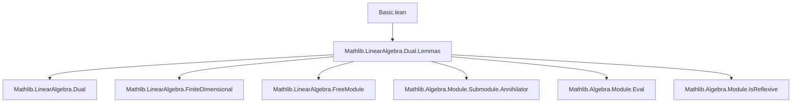
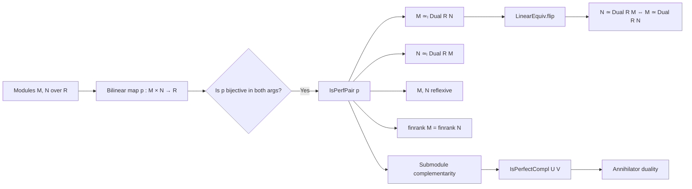
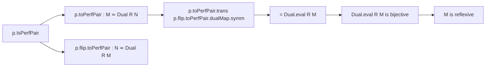

**Technical Brief: `Basic.lean` — Perfect Pairings in Lean 4**

---

### 1. KEY DEFINITIONS & THEOREMS

| Name | Type / Signature | Purpose |
|------|------------------|---------|
| `IsPerfPair` | `class IsPerfPair (p : M →ₗ[R] N →ₗ[R] R)` | Defines a *perfect pairing* as a bilinear map `p` such that both `p` and its flip are bijective. |
| `flip` | `IsPerfPair.flip (hp : p.IsPerfPair) : p.flip.IsPerfPair` | Symmetry: swapping arguments preserves perfection. |
| `toPerfPair` | `noncomputable def toPerfPair : M ≃ₗ[R] Dual R N` | Constructs a linear equivalence from `M` to the dual of `N` using bijectivity of `p`. |
| `of_isPerfPair` | `Module.IsReflexive.of_isPerfPair` | Shows that if a perfect pairing exists, then `M` is reflexive. |
| `finrank_of_isPerfPair` | `[Module.Finite R M] [Module.Free R M] ⇒ finrank R M = finrank R N` | Equality of finite free ranks under a perfect pairing. |
| `id`, `dualEval` | `instance IsPerfPair.id`, `IsPerfPair.dualEval` | Canonical perfect pairings on reflexive modules: evaluation and its flip. |
| `compl₁₂` | `instance IsPerfPair.compl₁₂` | Base-change of perfect pairings along linear equivalences. |
| `congr` | `lemma IsPerfPair.congr` | Transfer of `IsPerfPair` along congruent pairings. |
| `of_bijective` | `lemma IsPerfPair.of_bijective` | If `N` is reflexive and `p` is bijective, then `p` is a perfect pairing. |
| `of_injective` / `of_injective'` | `lemma IsPerfPair.of_injective`, `of_injective'` | Over a field, injectivity of `p` and `p.flip` (plus finite-dimensionality) suffices for perfection. |
| `IsPerfectCompl` | `structure IsPerfectCompl (U : Submodule R M) (V : Submodule R N)` | Defines *perfectly complementary* submodules via annihilators under the pairing. |
| `flip` (on `IsPerfectCompl`) | `IsPerfectCompl.flip` | Symmetry of perfect complementarity. |
| `LinearEquiv.flip` | `def LinearEquiv.flip : M ≃ₗ[R] Dual R N` | Given `e : N ≃ₗ[R] Dual R M`, constructs the dual pairing `e.flip`. |
| `isReflexive_of_equiv_dual_of_isReflexive` | `lemma` | If `N ≃ Dual R M` and `M` is reflexive, then `N` is reflexive. |
| `flip_flip` | `lemma` | Double flip recovers original equivalence. |
| `instance` `e.toLinearMap.IsPerfPair` | `instance` | The linear map underlying `e` is a perfect pairing. |
| `dualCoannihilator_map_linearEquiv_flip`, `map_dualAnnihilator_linearEquiv_flip_symm`, etc. | `lemma`s | Technical lemmas about annihilators/co-annihilators under linear equivalences induced by perfect pairings. |

---

### 2. NAMING CONVENTIONS

- **Prefixes**:
  - `is_`: Predicate classes/properties (`IsPerfPair`, `IsPerfectCompl`)
  - `to_`: Constructions *to* a canonical form (`toPerfPair`)
  - `flip`: Symmetry operations (`flip`, `flip_iff`, `flip_apply`)
  - `dual_`: Dual-space constructions (`dualEval`, `dualAnnihilator`, `dualCoannihilator`)
  - `of_`: Implication-based constructions (`of_isPerfPair`, `of_bijective`, `of_injective`)
  - `congr`: Congruence/transfer lemmas (`congr`, `congr_left`, `congr_right` — implicit via `compl₁₂`)

- **Suffixes**:
  - `_iff`: Biconditional characterizations (`flip_iff`, `left_top_iff`, `right_top_iff`)
  - `_symm`: Inverse-direction lemmas (`symm_flip`, `trans_dualMap_symm_flip`)
  - `_map_`: Interaction with `Submodule.map` (`dualCoannihilator_map_linearEquiv_flip`, etc.)

---

### 3. TACTIC STACK

Frequent tactics used in proofs:

| Tactic | Usage |
|--------|-------|
| `ext` | Extensionality for functions, linear maps, submodules |
| `simp` / `simp only` | Simplification using `@[simp]` lemmas (e.g., `toPerfPair_apply`, `flip_apply`) |
| `rw` | Rewriting using equalities (especially `←` for reverse direction) |
| `convert` | Goal-directed equality proof (e.g., in `of_isPerfPair`) |
| `rwa` | Rewrite + assumption (used in field case for finite-dimensionality) |
| `infer_instance` | Automatically infer typeclass instances (`IsPerfPair`, `IsReflexive`) |
| `subst` | Substitution in hypotheses (e.g., `obtain rfl : q = ...`) |
| `have` / `suffices` | Intermediate lemma introduction |
| `exact` / `apply` | Direct proof completion |
| `aesop` | Not used in this file — proofs are mostly manual or `simp`-driven |

---

### 4. PROOF LOGIC

- **Structure**: Most proofs follow a *constructive → verification* pattern:
  1. **Construct** an object (e.g., `toPerfPair`, `flip`, `IsPerfectCompl`) using bijectivity or equivalence data.
  2. **Verify** properties (e.g., bijectivity, symmetry, compatibility with annihilators) via:
     - `ext` + `simp` for extensionality,
     - `convert` + `bijective.comp` for bijectivity,
     - `rw` + `@[simp]` lemmas for computational content.

- **Induction**: Not used — all arguments are algebraic/structural.

- **Case analysis**: Minimal; mostly handled by `rw` and `simp`.

- **Reflexivity & finite-dimensionality**: Key assumptions for lifting injectivity to bijectivity (field case) or ensuring dual evaluation is iso.

- **Symmetry**: Central theme — many lemmas come in `flip`-pairs (`flip`, `flip_iff`, `flip_apply`, `flip_flip`), reflecting the symmetric nature of perfect pairings.

---

### 5. IMPORTS & DEPENDENCIES

- **Primary dependency**:  
  `Mathlib.LinearAlgebra.Dual.Lemmas` — provides foundational dual module lemmas (e.g., `Dual.eval`, `evalEquiv`, `dualMap`, `dualAnnihilator`, `dualCoannihilator`, `IsReflexive`, `FiniteDimensional` facts).

- **Implicit dependencies** (via `Mathlib.LinearAlgebra.Dual`):
  - `Mathlib.LinearAlgebra.Dual` (core dual module theory)
  - `Mathlib.LinearAlgebra.FiniteDimensional`
  - `Mathlib.LinearAlgebra.FreeModule`
  - `Mathlib.Algebra.Module.Submodule.Annihilator`
  - `Mathlib.Algebra.Module.Eval`
  - `Mathlib.Algebra.Module.IsReflexive`

---

### 6. MERMAID DIAGRAMS

#### A. Dependency Graph (Module-Level)

#### B. Theory Overview (Conceptual Flow)

#### C. Proof Strategy Flow (Example: `of_isPerfPair`)

---

### 7. SUMMARY

This file formalizes the theory of *perfect pairings* between modules over a commutative ring, with a focus on:
- Equivalence between bilinear perfect pairings and linear equivalences to duals,
- Reflexivity consequences,
- Rank equality in finite free case,
- Submodule complementarity via annihilators,
- Field-specific simplifications (injectivity ⇒ bijectivity).

It serves as a foundational module for duality theory in `Mathlib`, especially for applications in representation theory, symplectic geometry, and Pontryagin duality.

--- 

*End of Technical Brief.*
