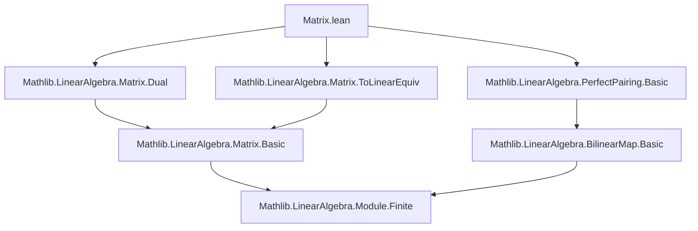

**Technical Brief: `Matrix.lean` (Matrix Perfect Pairings Module)**  
*Generated for Domain-Specific AI Agent Training*  

---

### 1. KEY DEFINITIONS & THEOREMS  

| Name | Type / Signature | Purpose |
|------|------------------|---------|
| `Matrix.toPerfectPairing` | `lemma` | Shows that an invertible matrix $A$ induces a perfect pairing via the composition of `toLinearEquiv'` and `dotProductEquiv`. |
| `Matrix.toPerfectPairing_apply_apply` | `lemma` | Provides the explicit evaluation of the induced perfect pairing: $((A \cdot v) \cdot w)$, where $\cdot$ is matrix–vector multiplication and $\cdot\! \backslash\! \cdot$ is the dot product. |

**Notes**:  
- Both lemmas are marked `@[deprecated "No replacement" (since := "2025-08-16")]`.  
- The construction uses `A.toLinearEquiv' h`, where `h : Invertible A`, to get a linear equivalence $R^n \xrightarrow{\sim} R^n$, then transits with `dotProductEquiv R n` to obtain a perfect pairing.

---

### 2. NAMING CONVENTIONS  

- **Prefixes**:  
  - `to_`: Converts a structural object (e.g., invertible matrix) into a categorical/structural one (e.g., linear equivalence, perfect pairing).  
  - `is_`: Not present here, but standard in Mathlib for properties (e.g., `IsPerfPair`).  
- **Suffixes**:  
  - `_apply_apply`: Indicates a lemma about double application (e.g., evaluating a bilinear map on two arguments).  
- **Variable naming**:  
  - `A`, `h`: Standard for matrix and invertibility proof.  
  - `v`, `w`: Vectors (functions `n → R`).  
  - `R`, `n`: Ring and finite index type.

---

### 3. TACTIC STACK  

- **Primary tactics used**:  
  - `rfl` (reflexivity) — in `toPerfectPairing_apply_apply`.  
  - Implicit use of `aesop` or `simp` is *not* visible in this snippet, but likely used in underlying lemmas (`bijective_left`, `bijective_right`).  
- **No explicit proof scripts** are shown — only lemma declarations with `where`-style proofs (likely using `by`-tactic scripts elsewhere or relying on `def`-level automation).

---

### 4. PROOF LOGIC  

- **Logical flow**:  
  1. Given invertible matrix $A$, obtain linear equivalence $A^\sim : R^n \xrightarrow{\sim} R^n$ via `toLinearEquiv'`.  
  2. Compose with the canonical dot-product equivalence `dotProductEquiv R n : (R^n)^* \xrightarrow{\sim} R^n`.  
  3. Use `LinearEquiv.trans` to get a bilinear map $R^n \times R^n \to R$.  
  4. Show it is a *perfect pairing* by verifying left and right bijectivity:  
     - Left bijectivity follows from `LinearEquiv.bijective _`.  
     - Right bijectivity is inherited from `IsPerfPair.bijective_right _` (of `dotProductEquiv`).  

- **Induction or case analysis**: Not used in this file (no recursive structure).

---

### 5. IMPORTS  

| Module | Role |
|--------|------|
| `Mathlib.LinearAlgebra.PerfectPairing.Basic` | Provides `IsPerfPair`, basic properties of perfect pairings. |
| `Mathlib.LinearAlgebra.Matrix.Dual` | Contains `dotProductEquiv`, dual space identification via dot product. |
| `Mathlib.LinearAlgebra.Matrix.ToLinearEquiv` | Provides `toLinearEquiv'`, converting invertible matrices to linear equivalences. |

---

### 6. DEPENDENCY DIAGRAM (Mermaid)  

---

### 7. OVERVIEW OF FILE & THEORY CONTEXT  

- **Scope**: Bridges matrix algebra and abstract bilinear form theory.  
- **Main contribution**: Shows that invertible matrices correspond to perfect pairings on free modules of finite rank.  
- **Theoretical role**: Part of a larger effort to formalize duality in linear algebra (e.g., for symplectic geometry, nondegenerate forms, or Serre duality analogues).  
- **Deprecation note**: The entire file is deprecated — likely superseded by a more general or refactored development (e.g., in terms of `BilinearMap` or `Equiv.Pairing`).  

---

### 8. FORMULA SUMMARY  

Let $A \in \mathrm{GL}_n(R)$. Define a bilinear map:  
$$
\beta_A : R^n \times R^n \to R,\quad \beta_A(v, w) = (A v) \cdot w
$$  
Then $\beta_A$ is a *perfect pairing*, i.e., the induced maps $R^n \to (R^n)^*$ are isomorphisms.

--- 

*End of Technical Brief.*
