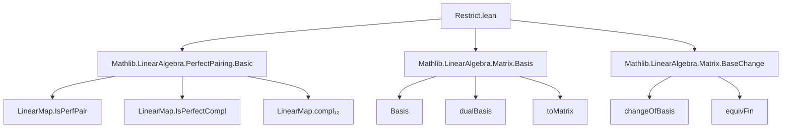
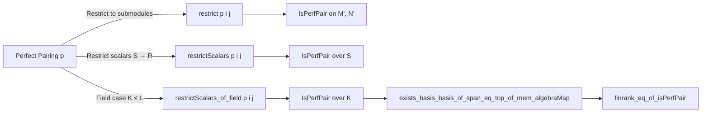

**Technical Brief: `Restrict.lean` — Restriction of Perfect Pairings**

---

### **1. Key Definitions & Theorems**

| Name | Type / Signature | Purpose |
|------|------------------|---------|
| `PerfectPairing.restrict` | `(p : M →ₗ N →ₗ R) [p.IsPerfPair] → (i : M' →ₗ M) (j : N' →ₗ N) → Injective i → Injective j → p.IsPerfectCompl (range i) (range j) → (p.compl₁₂ i j).IsPerfPair` | Restricts a perfect pairing to submodules via injective maps whose ranges are *perfectly complementary*. |
| `PerfectPairing.restrictScalars` | `(p : M →ₗ[R] N →ₗ[R] R) [p.IsPerfPair] → (i : M' →ₗ[S] M) (j : N' →ₗ[S] N) → Injective i → Injective j → span R (range i) = ⊤ → span R (range j) = ⊤ → (∀ g : Dual S N', ∃ m, …) → (∀ g : Dual S M', ∃ n, …) → (∀ m n, p (i m) (j n) ∈ range algebraMap) → (restrictScalarsRange₂ i j … p hp).IsPerfPair` | Restricts scalars of a perfect pairing along an algebra `S → R`, assuming full spans and compatibility of pairing values with `S`. |
| `PerfectPairing.restrictScalars_of_field` | `(p : M →ₗ[L] N →ₗ[L] L) [p.IsPerfPair] → (i : M' →ₗ[K] M) (j : N' →ₗ[K] N) → p.IsPerfectCompl (span L (range i)) (span L (range j)) → (∀ m n, p (i m) (j n) ∈ range algebraMap) → (restrictScalarsRange₂ … p hp).IsPerfPair` | Simultaneously restricts both domain (to `K`-subspaces) and scalars (from field `L` to subfield `K`) for perfect pairings over fields. |
| `exists_basis_basis_of_span_eq_top_of_mem_algebraMap` | `(p : M →ₗ[L] N →ₗ[L] L) [p.IsPerfPair] → M' ≤ M, N' ≤ N, span L M' = ⊤, span L N' = ⊤, (∀ x ∈ M', y ∈ N', p x y ∈ K) → ∃ n, b : Basis (Fin n) L M, b' : Basis (Fin n) K M', ∀ i, b i = b' i` | Shows that under compatibility with a subfield `K`, a perfect pairing over `L` induces a `K`-basis on a `K`-subspace `M'` compatible with an `L`-basis of `M`. |
| `finrank_eq_of_isPerfPair` | Same hypotheses as above → `finrank K M' = finrank L M` | Consequence of the previous: dimensions match over base and extension fields. |
| `restrictScalars_field_aux` | Auxiliary lemma used to prove `restrictScalars_of_field`. | Bridges the gap between general scalar restriction and field-specific case using finite-dimensionality. |
| `restrictScalarsRange₂_apply` | `algebraMap K L (restrictScalarsRange₂ … p hp x y) = p (i x) (j y)` | Describes how the restricted pairing relates to the original one. |

---

### **2. Naming Conventions**

- **Prefixes**:
  - `restrict_`: for operations that restrict structure (e.g., `restrict`, `restrictScalars`, `restrictScalars_field_aux`, `restrictScalars_of_field`).
  - `is_`: for properties (e.g., `IsPerfPair`, `IsPerfectCompl`).
  - `mem_`, `span_`, `range_`, `dual_`: for submodule/linear algebra constructs.
- **Suffixes**:
  - `_aux`: auxiliary lemmas used in proofs of main results.
  - `_of_`: for specialized variants (e.g., `restrictScalars_of_field`).
  - `_apply_apply`: for lemmas about evaluation of bilinear maps.
- **Variable naming**:
  - `i`, `j`: injective linear maps into original modules.
  - `M'`, `N'`: submodules or restricted modules.
  - `p`: the bilinear pairing.
  - `hp`, `hM`, `hN`: hypotheses about pairing values, spans, etc.

---

### **3. Tactic Stack**

Frequently used tactics in this file:

| Tactic | Usage |
|--------|-------|
| `simp` / `simp only` | Simplifying submodule membership, linear map composition, dual pairings. |
| `aesop` | Automated reasoning for basic module/linear algebra goals (e.g., `add`, `zero`, `smul` cases in induction). |
| `rw` / `apply_fun` / `congr_fun` | Rewriting equalities involving linear maps and module homomorphisms. |
| `induction` | Structural induction over submodule membership (via `Submodule.span_induction`). |
| `exact`, `refine`, `obtain`, `have`, `suffices` | Proof structuring and goal decomposition. |
| `ext` | Extensionality for linear maps and functions. |
| `convert` / `change` | Adjusting goals to match known lemmas. |
| `rw [← LinearEquiv.symm_apply_eq]`, `rw [LinearEquiv.symm_symm]` | Manipulating equivalences and their inverses. |
| `exact_mod_cast`, `change … at …` | Typeclass and coercion management. |

---

### **4. Proof Logic**

The logical flow across the file follows a **structured decomposition** pattern:

1. **Inductive/structural arguments** for submodule membership (e.g., `span_induction`).
2. **Equivalence-based reasoning** using `LinearEquiv` and `Basis` to transfer properties.
3. **Dimensional arguments** (e.g., `finrank_eq_card_basis`) to conclude finite-dimensionality.
4. **Complementarity assumptions** (`IsPerfectCompl`) used to decompose elements uniquely.
5. **Field-specific tricks**:
   - Use of `dualBasis`, `toMatrix`, and `mem_subfield` to show closure under field operations.
   - Exploitation of `FiniteDimensional` and `Fintype` to get finite bases.

**Typical proof skeleton**:
- For `restrict`: Show injectivity of both sides via `restrict_aux`, using `IsPerfectCompl` to decompose elements and show surjectivity/injectivity.
- For `restrictScalars`: Prove injectivity via annihilator arguments and surjectivity via lifting dual vectors.
- For fields: Use basis existence (`exists_basis_basis_of_span_eq_top_of_mem_algebraMap`) to reduce to finite-dimensional linear algebra over `K`.

---

### **5. Imports**

| Module | Purpose |
|--------|---------|
| `Mathlib.LinearAlgebra.PerfectPairing.Basic` | Core definitions: `IsPerfPair`, `compl₁₂`, `IsPerfectCompl`, `Dual`, etc. |
| `Mathlib.LinearAlgebra.Matrix.Basis` | Basis-related matrix constructions (`dualBasis`, `toMatrix`, `map`, `repr`). |
| `Mathlib.LinearAlgebra.Matrix.BaseChange` | Change-of-basis machinery, used implicitly via `reindex`, `equivFin`. |

---

### **6. Mermaid Diagrams**

#### **Dependency Graph (Top-Level)**

#### **Overview of Theory Flow**

---

### **7. Summary**

This file formalizes the *restriction* of perfect pairings in three key settings:

1. **Submodule restriction** (`restrict`): when submodules are perfectly complementary.
2. **Scalar restriction** (`restrictScalars`): for algebras of domains with full spans and dual-lifting conditions.
3. **Field restriction** (`restrictScalars_of_field`): a streamlined version for fields, leveraging finite-dimensionality and basis compatibility.

It demonstrates a high degree of modularity and reuse of existing `Mathlib` infrastructure, especially around duality, bases, and module theory. The field case is particularly sophisticated, using matrix representations and subfield closure arguments to ensure the restricted pairing remains perfect over the smaller field.

--- 

Let me know if you'd like a formalized summary in Lean syntax or a dependency graph for specific lemmas.
