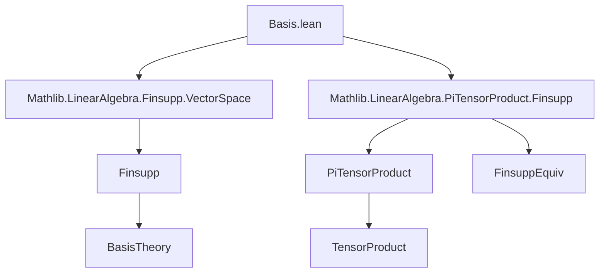

**Technical Brief: Basis for `PiTensorProduct` in Lean 4**

---

### 1. **Key Definitions & Theorems**

| Name | Type | Purpose |
|------|------|---------|
| `Basis.piTensorProduct` | `[Finite ι] → (Π i, Basis (κ i) R (M i)) → Basis (Π i, κ i) R (⨂[R] i, M i)` | Constructs a basis for the tensor product over a finite index family, given bases on each component module. |
| `Basis.piTensorProduct_repr_tprod_apply` | `(b : Π i, Basis (κ i) R (M i)) → (x : Π i, M i) → (p : Π i, κ i) → (Basis.piTensorProduct b).repr (tprod R x) p = ∏ i, (b i).repr (x i) (p i)` | Describes the coordinate function (repr) of a pure tensor under the constructed basis: evaluates as the product of coordinates in each factor. |
| `Basis.piTensorProduct_apply` | `[Finite ι] → (b : Π i, Basis (κ i) R (M i)) → (p : Π i, κ i) → Basis.piTensorProduct b p = ⨂ₜ[R] i, (b i) (p i)` | Explicitly identifies the basis elements: the image of a tuple `p` is the pure tensor of basis elements `b i (p i)`. |

---

### 2. **Naming Conventions**

- **Prefixes**:
  - `piTensorProduct`: Indicates construction over `PiTensorProduct`.
  - `repr`: Standard for coordinate functions w.r.t. a basis.
  - `tprod`: Tensor product of a family of elements (`tprod R x` = ⨂ₜ[R] i, x i).
- **Suffixes**:
  - `_apply`: For lemmas about the action of a definition on inputs.
  - `_repr_…_apply`: For coordinate formulas.

---

### 3. **Tactic Stack**

Frequently used tactics in proofs:
- `rw`: Rewriting using definitions and lemmas.
- `simp`: Simplification, especially with `@[simp]` lemmas and `Fintype`/`Finite` instances.
- `refine`: To construct proofs via intermediate goals (e.g., `ext_elem`).
- `classical`: To enable classical choice when needed (e.g., for basis existence).
- `ext_elem`, `funext_iff`: For extensionality arguments in basis proofs.
- `prod_ite_zero`: Simplification of products over finite types with conditional terms.

---

### 4. **Proof Logic**

- **Structure**:
  - Use of `Finsupp.basisSingleOne.map` to build the basis via equivalence chains:
    - `PiTensorProduct.congr` (using coordinate isomorphisms `repr` from component bases),
    - `ofFinsuppEquiv` (isomorphism between `PiTensorProduct` and `Finsupp` under finite support),
    - `Finsupp.lcongr` with `constantBaseRingEquiv` to adjust scalars.
  - Symmetry (`symm`) to get a basis *on* the tensor product.
- **Proofs**:
  - `piTensorProduct_repr_tprod_apply`: Uses `Subsingleton.elim` on `Fintype.ofFinite ι` to reduce to a unique inhabitant, then `simp`.
  - `piTensorProduct_apply`: Uses `ext_elem` (basis extensionality) and simplifies using `Finsupp.single_apply`, `prod_ite_zero`, and functional extensionality.

---

### 5. **Imports**

| Import | Role |
|--------|------|
| `Mathlib.LinearAlgebra.Finsupp.VectorSpace` | Provides `Finsupp.basisSingleOne`, `ofFinsuppEquiv`, and vector space structure on `Finsupp`. |
| `Mathlib.LinearAlgebra.PiTensorProduct.Finsupp` | Contains `PiTensorProduct.congr`, `ofFinsuppEquiv`, and the equivalence between `PiTensorProduct` and `Finsupp`-based constructions. |

---

### 8. **Mermaid Diagrams**

#### **Dependency Graph (Module-Level)**



#### **Overview of Theoretical Flow**

```mermaid
flowchart LR
  subgraph Setup
    ι[Finite index type]
    M[Family of R-modules M i]
    b[Bases b i : κ i → M i]
  end

  subgraph Construction
    FinsuppBasis[Finsupp.basisSingleOne]
    Congr[PiTensorProduct.congr (b i).repr]
    Equiv[ofFinsuppEquiv]
    Lcongr[Finsupp.lcongr ...]
  end

  subgraph Result
    PiTensorBasis[Basis.piTensorProduct b]
  end

  Setup --> Congr
  Congr --> Equiv
  Equiv --> Lcongr
  Lcongr --> FinsuppBasis
  FinsuppBasis --> PiTensorBasis

  PiTensorBasis --> repr[repr formula]
  PiTensorBasis --> apply[apply formula]
```

---

**Summary**: This module formalizes the classical result that the tensor product of a finite family of free modules inherits a basis from the component bases — the *pure tensors of basis elements* form a basis. The construction leverages equivalences between `PiTensorProduct` and `Finsupp`, and the proof relies heavily on finite-type reasoning and simplification.
