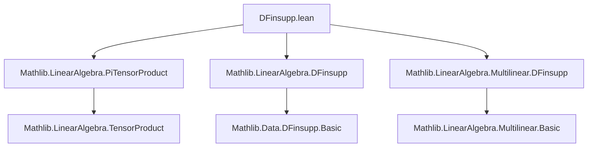

### Technical Brief: `DFinsupp.lean` — Tensor Products of Finitely Supported Functions

---

#### **1. Key Definitions & Theorems**

| Name | Type | Purpose |
|------|------|---------|
| `ofDFinsuppEquiv` | `(⨂[R] i, (Π₀ j : κ i, M i j)) ≃ₗ[R] Π₀ p : Π i, κ i, ⨂[R] i, M i (p i)` | Linear equivalence showing that tensor product commutes with finitely supported functions (`DFinsupp`) in all arguments. |
| `ofDFinsuppEquiv_tprod_single` | `ofDFinsuppEquiv (⨂ₜ[R] i, DFinsupp.single (p i) (x i)) = DFinsupp.single p (⨂ₜ[R] i, x i)` | Describes the action of `ofDFinsuppEquiv` on simple tensors built from `DFinsupp.single`. |
| `ofDFinsuppEquiv_symm_single_tprod` | `ofDFinsuppEquiv.symm (DFinsupp.single p (tprod R x)) = (⨂ₜ[R] i, DFinsupp.single (p i) (x i))` | Describes the inverse equivalence on `DFinsupp.single` of a simple tensor. |
| `ofDFinsuppEquiv_tprod_apply` | `ofDFinsuppEquiv (tprod R x) p = ⨂ₜ[R] i, x i (p i)` | Evaluates the equivalence on a pure tensor of `DFinsupp`-valued functions at a point `p`. |

---

#### **2. Naming Conventions**

- **Prefixes**:
  - `ofDFinsuppEquiv`: Indicates construction *from* `DFinsupp`s.
  - `tprod`: Short for *tensor product* over a family (`tprod R x` ≡ ⨂ₜ[R] i, x i).
  - `lsingle`, `lsum`: Linear versions of `single`/`sum` for `DFinsupp` (used in `MultilinearMap.fromDFinsuppEquiv`).
- **Suffixes**:
  - `_equiv`: Denotes a linear equivalence (`≃ₗ[R]`).
  - `_tprod_single`, `_symm_single_tprod`, `_tprod_apply`: Describe behavior on specific canonical forms (pure tensors, singletons, application).

---

#### **3. Tactic Stack**

- **Core tactics**:
  - `ext`: Extensionality for functions/maps.
  - `simp`: Heavy use of simplifier, especially with `@[simp]` lemmas.
  - `rw`, `apply`, `exact`: For applying equivalences and linear maps.
  - `classical`: Used to enable classical reasoning when needed (e.g., for `ofDFinsuppEquiv_tprod_apply`).
- **Domain-specific tactics**:
  - `lift`: Lifts multilinear maps to tensor products.
  - `compMultilinearMap`: Composes multilinear maps with linear maps.
  - `map_coord_zero`: Used in simplifying coordinate-wise behavior of multilinear maps.

---

#### **4. Proof Logic**

- **Construction of `ofDFinsuppEquiv`**:
  - Defined via `LinearEquiv.ofLinear`, requiring two linear maps (forward and backward) and proofs of mutual inverses.
  - Forward map: `lift` of a multilinear map built from `MultilinearMap.fromDFinsuppEquiv`.
  - Backward map: `DFinsupp.lsum` of lifted multilinear maps using `PiTensorProduct.map`.
- **Proofs of inverses**:
  - Both use `ext` + `simp`, leveraging simplifier lemmas for `DFinsupp`, tensor products, and multilinear maps.
  - `ofDFinsuppEquiv_tprod_apply` uses `map_coord_zero` to reduce to coordinate-wise evaluation.

---

#### **5. Imports & Dependencies**

| Import | Role |
|--------|------|
| `Mathlib.LinearAlgebra.PiTensorProduct` | Core tensor product over dependent families (`PiTensorProduct`). |
| `Mathlib.LinearAlgebra.DFinsupp` | Theory of finitely supported functions (`Π₀`). |
| `Mathlib.LinearAlgebra.Multilinear.DFinsupp` | Multilinear maps and their interaction with `DFinsupp`. |

---

#### **8. Mermaid Diagrams**

##### **Dependency Graph (Module-Level)**



##### **Overview of Theoretical Flow**

```mermaid
flowchart LR
  subgraph Setup
    R[CommSemiring R]
    ι[Fintype ι]
    κ[Family κ : ι → Type*]
    M[Family M : (i : ι) → κ i → Type*]
  end

  subgraph Domain
    D1[(⨂[R] i, Π₀ j, M i j)]
  end

  subgraph Codomain
    D2[Π₀ p : Π i, κ i, ⨂[R] i, M i (p i)]
  end

  D1 -- ofDFinsuppEquiv --> D2
  D2 -- ofDFinsuppEquiv.symm --> D1

  subgraph Construction
    ML[MultilinearMap.fromDFinsuppEquiv]
    LM[LinearMap.lift]
    DLS[DFinsupp.lsum]
  end

  ML --> LM
  LM --> D1
  DLS --> D2
```

##### **Key Equivalence Commutative Diagram**

```mermaid
graph LR
  A[(⨂ₜ[R] i, DFinsupp.single (p i) (x i))] -- ofDFinsuppEquiv --> B[DFinsupp.single p (⨂ₜ[R] i, x i)]
  C[⨂ₜ[R] i, x i (p i)] -- DFinsupp.single --> B
  A -- tprod_apply --> C
  style A fill:#f9f,stroke:#333
  style B fill:#9f9,stroke:#333
  style C fill:#99f,stroke:#333
```

---

This file formalizes a foundational structural result: **tensor products commute with finitely supported function spaces**, enabling efficient manipulation of multilinear maps over dependent families in homological algebra and representation theory contexts.
