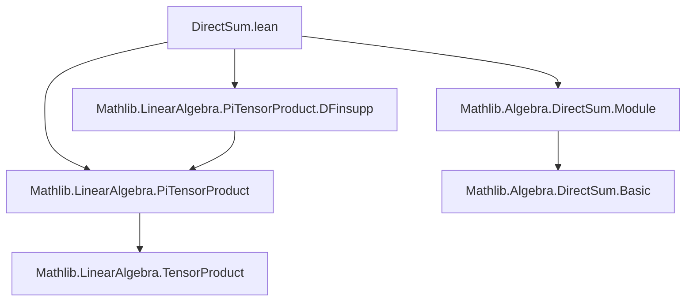

**Technical Brief: `DirectSum.lean` — Tensor Products Distribute Over Direct Sums**

---

### 1. **Key Definitions & Theorems**

| Name | Type | Purpose |
|------|------|---------|
| `ofDirectSumEquiv` | `(⨂[R] i, (⨁ j : κ i, M i j)) ≃ₗ[R] ⨁ p : Π i, κ i, ⨂[R] i, M i (p i)` | Linear equivalence showing that the tensor product over a finite index set `ι` distributes over direct sums in each argument. |
| `ofDirectSumEquiv_tprod_lof` | `ofDirectSumEquiv (⨂ₜ[R] i, DirectSum.lof R _ _ (p i) (x i)) = DirectSum.lof R _ _ p (⨂ₜ[R] i, x i)` | Describes the action of `ofDirectSumEquiv` on simple tensors built from `lof` (the canonical injection into the direct sum). |
| `ofDirectSumEquiv_symm_lof_tprod` | `ofDirectSumEquiv.symm (DirectSum.lof R _ _ p (tprod R x)) = (⨂ₜ[R] i, DirectSum.lof R _ _ (p i) (x i))` | Describes the inverse map on canonical generators of the target direct sum. |
| `ofDirectSumEquiv_tprod_apply` | `ofDirectSumEquiv (tprod R x) p = ⨂ₜ[R] i, x i (p i)` | Explicit formula for evaluating the image of a simple tensor under `ofDirectSumEquiv` at a choice of indices `p : Π i, κ i`. |

---

### 2. **Naming Conventions**

- **Prefixes**:
  - `ofDirectSumEquiv`: indicates a canonical equivalence *from* a tensor product of direct sums *to* a direct sum of tensor products.
  - `lof`: standard notation in `DirectSum` for the canonical injection `M i j → ⨁ k, M i k`.
  - `tprod`: standard notation for the tensor product of a family of elements (i.e., simple tensor).
- **Suffixes**:
  - `_tprod_lof`, `_symm_lof_tprod`, `_apply`: indicate the structure of the argument (tensor of injections, inverse on injection of tensor, or pointwise evaluation).

---

### 3. **Tactic Stack**

- `classical`: used to enable classical choice (needed for `ofDFinsuppEquiv`).
- `rw [ofDirectSumEquiv]`: rewrites definition of the main equivalence.
- `convert`: used to reduce proof obligations to known lemmas about `ofDFinsuppEquiv`.
- `have : Fintype ι := Fintype.ofFinite ι`: extracts finite type instance from `Finite ι`.

No heavy automation (`aesop`, `ring`, `simp`) is used — proofs are mostly definitional and rely on `convert` to known lemmas.

---

### 4. **Proof Logic**

- **Strategy**: Reduce to the known equivalence `ofDFinsuppEquiv` (for `PiTensorProduct` over `DFinsupp`), using the identification:
  $$
  \bigoplus_{j : \kappa i} M(i,j) \cong \texttt{DFinsupp}(\kappa i, M i)
  $$
- **Structure**:
  1. Define `ofDirectSumEquiv` as `ofDFinsuppEquiv` under the above identification.
  2. Prove its behavior on generators (`lof` and `tprod`) by:
     - Rewriting the definition,
     - Applying `convert` to a corresponding lemma for `ofDFinsuppEquiv`,
     - Using `classical` to ensure existence of choice functions (for finite `ι`).
- **Key insight**: The finite index set `ι` ensures that the tensor product and direct sum interact nicely (infinite versions would require topological considerations).

---

### 5. **Imports**

| Import | Role |
|--------|------|
| `Mathlib.LinearAlgebra.PiTensorProduct` | Core theory of `PiTensorProduct`, including `tprod`, `ofDFinsuppEquiv`. |
| `Mathlib.LinearAlgebra.PiTensorProduct.DFinsupp` | Identification of `PiTensorProduct` over `DFinsupp` with tensor product of sections. |
| `Mathlib.Algebra.DirectSum.Module` | Module structure on `DirectSum`, including `lof`, `DirectSum.equivFunOnFintype`, etc. |

---

### 8. **Mermaid Diagrams**

#### **Dependency Graph (Module-Level)**



#### **Theoretical Overview (Data Flow)**

```mermaid
flowchart LR
  A[Direct Sums ⨁ j, M i j] -->|canonical injection lof| B[Module of sections]
  B -->|DFinsupp identification| C[PiTensorProduct over DFinsupp]
  C -->|ofDFinsuppEquiv| D[Tensor product of sections]
  D -->|reindexing by p : Π i, κ i| E[Direct sum over Π i, κ i of ⨂ M i (p i)]
  
  A -.->|finite ι| C
  E -.->|ofDirectSumEquiv| A
```

#### **Main Equivalence Commutative Diagram**

```mermaid
graph LR
  ⨂[R] i, (⨁ j, M i j)  -->|ofDirectSumEquiv| ⨁ p, ⨂[R] i, M i (p i)
  (⨂ₜ i, lof (p i) (x i)) |--> (lof p (⨂ₜ i, x i))
  ⨂ₜ i, x i(p i) <--> (⨂ₜ i, lof (p i) (x i(p i)))
```

---

### Summary

This file formalizes a foundational structural isomorphism in multilinear algebra:  
$$
\bigotimes_{i \in \iota} \left( \bigoplus_{j \in \kappa i} M_{i,j} \right) \cong \bigoplus_{p \in \prod_{i \in \iota} \kappa i} \left( \bigotimes_{i \in \iota} M_{i, p(i)} \right)
$$
for finite `ι`, over a commutative semiring `R`. It leverages existing machinery for `PiTensorProduct` over `DFinsupp`, and provides explicit computational lemmas for generators.
