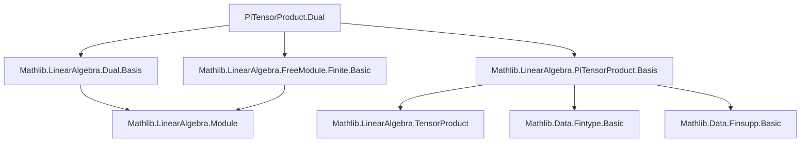
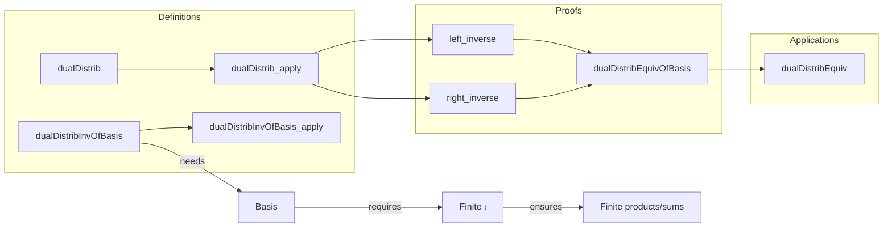

### Technical Brief: `Dual.lean` — Tensor Products of Dual Spaces

---

#### **1. Key Definitions & Theorems**

| Name | Type / Signature | Purpose |
|------|------------------|---------|
| `dualDistrib` | `(⨂[R] i, Dual R (M i)) →ₗ[R] Dual R (⨂[R] i, M i)` | Canonical linear map sending a pure tensor of linear functionals to the functional on the tensor product defined by pointwise multiplication. |
| `dualDistrib_apply` | `dualDistrib (⨂ₜ i, f i) (⨂ₜ i, m i) = ∏ i, f i (m i)` | Describes action of `dualDistrib` on pure tensors. |
| `dualDistribInvOfBasis` | `Dual R (⨂[R] i, M i) →ₗ[R] ⨂[R] i, Dual R (M i)` | Constructed using a family of bases `b`, gives a candidate inverse to `dualDistrib`. |
| `dualDistribInvOfBasis_apply` | Explicit summation formula for `dualDistribInvOfBasis f` | Evaluates the inverse on a functional `f` via evaluation on basis tensors and dual basis tensors. |
| `dualDistrib_dualDistribInvOfBasis_left_inverse` | `(dualDistrib ∘ₗ dualDistribInvOfBasis b) = LinearMap.id` | Proves left-inverse property (surjectivity of `dualDistrib`). |
| `dualDistrib_dualDistribInvOfBasis_right_inverse` | `(dualDistribInvOfBasis b ∘ₗ dualDistrib) = LinearMap.id` | Proves right-inverse property (injectivity of `dualDistrib`). |
| `dualDistribEquivOfBasis` | `(⨂[R] i, Dual R (M i)) ≃ₗ[R] Dual R (⨂[R] i, M i)` | Linear equivalence constructed from a choice of bases. |
| `dualDistribEquiv` | `(⨂[R] i, Dual R (M i)) ≃ₗ[R] Dual R (⨂[R] i, M i)` | Canonical equivalence when all `M i` are finite free (uses `Module.Free.chooseBasis`). |

---

#### **2. Naming Conventions**

- **Prefixes**:
  - `dualDistrib*`: All definitions and theorems related to the canonical map from tensor product of duals to dual of tensor product.
  - `dualDistribInvOfBasis*`: Inverse construction depending on a basis.
- **Suffixes**:
  - `*OfBasis`: Indicates dependence on a specific basis.
  - `*left_inverse`, `*right_inverse`: Used for proving inverse properties.
- **Function-style naming**:
  - `applyₗ`, `ringLmapEquivSelf`, `constantBaseRingEquiv`: Standard Mathlib naming for linear maps and equivalences.

---

#### **3. Tactic Stack**

- **Core tactics**:
  - `simp` / `simp only`: Extensively used to simplify expressions involving tensor products, dual bases, and sums.
  - `rw`: Rewriting using definitions and lemmas (e.g., `dualDistrib`, `dualDistribInvOfBasis`).
  - `convert rfl`: Used to reduce goals to definitional equality after `simp`.
  - `refine`: For structured proofs, especially when applying basis extension lemmas.
  - `classical`: Used to enable classical choice when constructing inverses.
  - `haveI := Fintype.ofFinite _`: To supply finite type instances for indexing sets.
  - `ext`, `ext_elem`: For proving equality of linear maps or tensors using basis extension lemmas.

---

#### **4. Proof Logic**

- **Structure**:
  1. Define `dualDistrib` via composition: `compRight ∘ piTensorHomMap`.
  2. Prove its action on pure tensors using `simp` and `Subsingleton.elim`.
  3. Assuming bases exist for each `M i`, define `dualDistribInvOfBasis` as a sum over multi-indices `p : Π i, κ i`.
  4. Use basis extension lemmas (`Basis.piTensorProduct`) to prove both left and right inverse properties.
  5. Conclude linear equivalence via `LinearEquiv.ofLinear`.
  6. For finite free modules, instantiate with canonical bases from `Module.Free.chooseBasis`.

- **Key proof technique**:
  - **Basis expansion**: Every tensor in `⨂[R] i, M i` expands uniquely in terms of `PiTensorProduct.basis`.
  - **Dual basis evaluation**: The dual basis `b i .dualBasis` satisfies `(b i .dualBasis j) (b i k) = δ_{j,k}`.
  - **Finite indexing**: Crucial for finiteness of sums and products; relies on `Finite ι` and `Finite (κ i)`.

---

#### **5. Imports & Dependencies**

| Import | Purpose |
|--------|---------|
| `Mathlib.LinearAlgebra.Dual.Basis` | Dual bases, `dualBasis`, properties of dual modules. |
| `Mathlib.LinearAlgebra.FreeModule.Finite.Basic` | Finite free modules, `chooseBasis`, `Module.Finite`, `Module.Free`. |
| `Mathlib.LinearAlgebra.PiTensorProduct.Basis` | Tensor product over finite families, basis construction `PiTensorProduct.basis`. |

**Core Mathlib modules used**:
- `PiTensorProduct`, `TensorProduct`, `LinearMap`, `Module`, `Basis`, `Fintype`, `Finsupp`.

---

#### **6. Mermaid Diagrams**

##### **Dependency Graph (Module-Level)**

##### **Overview of Theoretical Flow**

---

#### **7. Summary**

This file establishes a foundational result in multilinear algebra: for finite families of finite free modules over a commutative ring, the tensor product of duals is naturally isomorphic to the dual of the tensor product. The isomorphism is explicit and basis-independent in its effect (though construction uses bases), and is implemented as a `LinearEquiv`. The key insight is that a pure tensor of linear functionals acts on a pure tensor of vectors by multiplying all pairings — a generalization of the familiar finite-dimensional matrix trace pairing.

This result is essential for:
- Formalizing determinant and trace constructions,
- Working with volume forms and top exterior powers,
- Interpreting multilinear forms as linear functionals on tensor powers.

--- 

Let me know if you'd like a formalized version of the above in Lean docstring format or a visualization of the `dualDistrib` map in terms of universal properties.
