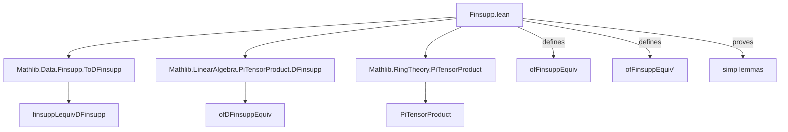
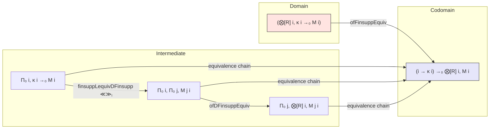
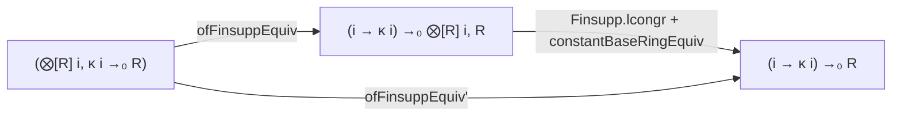

**Technical Brief: `Finsupp.lean` — Tensor Product of Finitely Supported Functions**

---

### 1. **Key Definitions & Theorems**

| Name | Type | Purpose |
|------|------|---------|
| `ofFinsuppEquiv` | `(⨂[R] i, κ i →₀ M i) ≃ₗ[R] ((i : ι) → κ i) →₀ ⨂[R] i, M i` | Linear equivalence between tensor product of finitely supported functions and finitely supported functions into the tensor product. Core structural result. |
| `ofFinsuppEquiv_tprod_single` | `ofFinsuppEquiv (⨂ₜ[R] i, Finsupp.single (p i) (m i)) = Finsupp.single p (⨂ₜ[R] i, m i)` | Describes action of `ofFinsuppEquiv` on simple tensors of point-supported functions. |
| `ofFinsuppEquiv_apply` | `ofFinsuppEquiv (⨂ₜ[R] i, f i) p = ⨂ₜ[R] i, f i (p i)` | General evaluation formula for `ofFinsuppEquiv` on simple tensors. |
| `ofFinsuppEquiv_symm_single_tprod` | `ofFinsuppEquiv.symm (Finsupp.single p (⨂ₜ[R] i, m i)) = ⨂ₜ[R] i, Finsupp.single (p i) (m i)` | Inverse direction: how point-supported functions in the codomain lift to simple tensors in the domain. |
| `ofFinsuppEquiv'` | `(⨂[R] i, (κ i →₀ R)) ≃ₗ[R] ((i : ι) → κ i) →₀ R` | Special case where all modules are the base ring $R$; simplifies codomain via `constantBaseRingEquiv`. |
| `ofFinsuppEquiv'_apply_apply` | `ofFinsuppEquiv' (⨂ₜ[R] i, f i) p = ∏ i, f i (p i)` | Evaluation formula in the scalar case: tensor maps to pointwise product. |
| `ofFinsuppEquiv'_tprod_single` | `ofFinsuppEquiv' (⨂ₜ[R] i, Finsupp.single (p i) (r i)) = Finsupp.single p (∏ i, r i)` | Image of simple tensor of singletons under `ofFinsuppEquiv'`. |

---

### 2. **Naming Conventions**

- **Prefixes**:
  - `ofFinsuppEquiv*`: Indicates constructions *from* finitely supported function spaces.
  - `tprod_single`: Tensor product of `single` functions.
  - `apply_apply`: Double application (e.g., function applied to point, then evaluated).
- **Suffixes**:
  - `Equiv`: Linear equivalence (`≃ₗ`).
  - `single`: Refers to `Finsupp.single`.
  - `tprod`: Tensor product of a family (`⨂ₜ`).
- **Operators**:
  - `≪≫ₗ`: Composition of linear equivalences.
  - `finsuppLequivDFinsupp`: Standard equivalence between `→₀` and `Π₀` (finsupp vs dfinsupp).
  - `constantBaseRingEquiv`: Equivalence $R^κ \cong (κ →₀ R)$.

---

### 3. **Tactic Stack**

- **`simp`**: Dominant tactic; used to reduce definitions via `@[simp]` lemmas.
- **`ext`**: Implicit via `attribute [local ext] TensorProduct.ext`.
- **`rw` / `simp_rw`**: Not explicit, but `simp` handles rewriting of `ofFinsuppEquiv` definitions.
- **`linear_combination` / `ring`**: Not used here; proofs are purely definitional/simplificational.
- **`classical`**: Used via `haveI := Classical.typeDecidableEq ...` to supply decidable equality for codomain.

> **Proof style**: Almost entirely definitional — lemmas are `simp`-friendly and rely on `@[simp]` annotations and simplifier normalization.

---

### 4. **Proof Logic**

- **Structure**: All proofs are *definitionally trivial* after unfolding `ofFinsuppEquiv` and applying `simp`.
- **Typical flow**:
  1. Unfold `ofFinsuppEquiv` as composition:  
     `PiTensorProduct.congr ... ≪≫ₗ ofDFinsuppEquiv ≪≫ₗ ...`
  2. Apply `simp` to reduce using:
     - `PiTensorProduct.congr_apply`, `ofDFinsuppEquiv_apply`, `finsuppLequivDFinsupp_apply`, etc.
     - `Finsupp.single_apply`, `TensorProduct.tprod_apply`, etc.
  3. For inverse lemmas, use `LinearEquiv.symm_apply_eq` + `simp`.

- **No induction or case analysis** is needed — the equivalences are constructed via known equivalences (`congr`, `ofDFinsuppEquiv`, `finsuppLequivDFinsupp`), and their behavior on generators is verified.

---

### 5. **Imports & Dependencies**

| Import | Role |
|--------|------|
| `Mathlib.Data.Finsupp.ToDFinsupp` | Provides `finsuppLequivDFinsupp`, the equivalence `κ →₀ M ≅ Π₀ i, M`. |
| `Mathlib.LinearAlgebra.PiTensorProduct.DFinsupp` | Provides `ofDFinsuppEquiv`, the key equivalence for dfinsupp: `⨂[R] i, Π₀ j, N j i ≅ Π₀ j, ⨂[R] i, N j i`. |
| `Mathlib.RingTheory.PiTensorProduct` | General tensor product over product types; foundational for `PiTensorProduct`. |

> **Core theory**: This file sits at the intersection of:
> - **Finitely supported functions** (`finsupp`)
> - **Tensor products over families** (`PiTensorProduct`)
> - **DFinsupp (dependent finitely supported functions)**

---

### 6. **Mermaid Diagrams**

#### **Dependency Graph (Module-Level)**

#### **Conceptual Overview (Theory Flow)**

#### **Special Case (`ofFinsuppEquiv'`)**

> Here, $\bigotimes_{i} R \cong R$ canonically, so the codomain simplifies to scalar-valued finsupp.

---

### 7. **Mathematical Significance**

- **Universal property**: This equivalence is the *finitely supported* analogue of the canonical isomorphism  
  $\bigotimes_{i} \operatorname{Fun}_{\text{fin}}(\kappa_i, M_i) \cong \operatorname{Fun}_{\text{fin}}\left(\prod_i \kappa_i, \bigotimes_i M_i\right)$.
- **Applications**:
  - Constructing multilinear maps from linear maps on tensor products of function spaces.
  - Defining integration/summing operators on tensor products of discrete measures.
  - Basis-free description of tensor algebras over free modules with finite support.

---

**End of Technical Brief**
