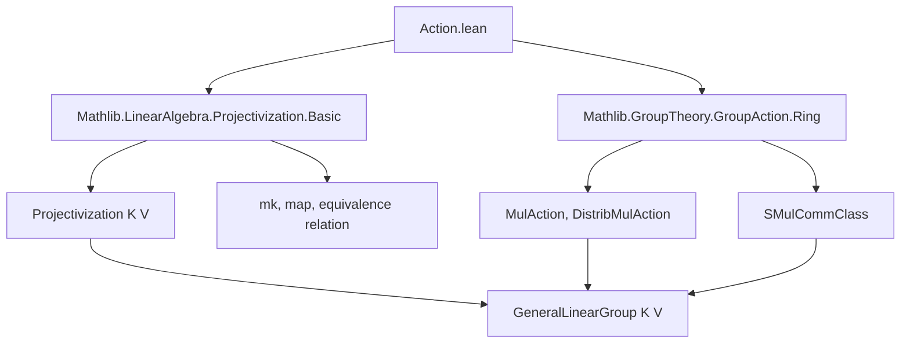
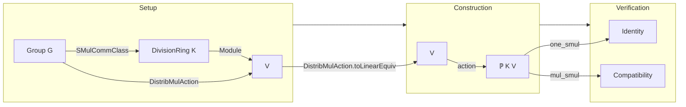

**Technical Brief: `Action.lean` — Group Actions on Projectivization**

---

### 1. **Key Definitions & Theorems**

| Name | Type / Signature | Purpose |
|------|------------------|---------|
| `instance : MulAction G (ℙ K V)` | `MulAction G (Projectivization K V)` | Constructs the canonical multiplicative action of a group `G` (acting `K`-linearly on `V`) on the projectivization `ℙ K V`. |
| `generalLinearGroup_smul_def` | `g • x = x.map g.toLinearEquiv.toLinearMap g.toLinearEquiv.injective` | Identifies the action of an element `g` of the general linear group (viewed as a `LinearEquiv`) on a point `x` in projectivization. |
| `smul_mk` | `g • mk K v hv = mk K (g • v) ((smul_ne_zero_iff_ne g).mpr hv)` | Describes the action on a point represented by a nonzero vector `v`: the action sends the equivalence class of `v` to that of `g • v`. |
| `one_smul` | `1 • x = x` | Verifies identity preservation for the action. |
| `mul_smul` | `(g * g') • x = g • (g' • x)` | Verifies compatibility with group multiplication. |

---

### 2. **Naming Conventions**

- **Prefixes**:
  - `smul_`: standard for scalar/multiplication action lemmas (e.g., `smul_mk`).
  - `generalLinearGroup_`: domain-specific prefix for lemmas about the general linear group action.
- **Suffixes**:
  - `_def`: defines the action in terms of existing constructions (e.g., `generalLinearGroup_smul_def`).
- **Structure**:
  - `mk K v hv`: constructor for projectivization points (equivalence class of nonzero vector `v`).
  - `map f inj`: constructor for mapping a point under a linear map `f` with injectivity witness `inj`.

---

### 3. **Tactic Stack**

| Tactic | Usage |
|--------|-------|
| `rfl` | Used in `generalLinearGroup_smul_def` and `smul_mk` to unfold definitions and prove equality by definitional equality. |
| `simp` | In `one_smul`, simplifies using `map_one`, `Module.End.one_eq_id`. |
| `simp_rw` + `rw` + `map_comp` + `Function.comp_apply` | In `mul_smul`, rewrites composition of maps and uses functional extensionality. |
| `aesop` | *Not used* in this file — proof is mostly definitional. |
| `ring` | *Not used* — no ring normalization needed. |

---

### 4. **Proof Logic**

- **Structure**: The proof is *constructive and definitional*.
  - The `MulAction` instance is defined by mapping points via the linear endomorphism induced by the group action, using injectivity to ensure well-definedness on equivalence classes.
  - **Identity** and **compatibility with multiplication** are verified by:
    - Reducing to properties of `map` and `Module.End`.
    - Using `simp` and `simp_rw` to unfold definitions and apply known lemmas (`map_one`, `map_mul`, `map_comp`).
- **No induction or case analysis** is required — the proofs rely on algebraic properties of module endomorphisms and projectivization.

---

### 5. **Imports**

| Import | Purpose |
|--------|---------|
| `Mathlib.LinearAlgebra.Projectivization.Basic` | Provides `ℙ K V`, `mk`, `map`, and basic properties of projectivization. |
| `Mathlib.GroupTheory.GroupAction.Ring` | Provides `MulAction`, `DistribMulAction`, `SMulCommClass`, and related typeclasses for group actions compatible with ring/module structure. |

---

### 6. **Domain-Specific Theory Overview**

#### **Mermaid Diagram: Dependency Graph**

#### **Mermaid Diagram: Theory Flow**

---

### 7. **Key Insight**

This module formalizes the *natural action* of the general linear group (and more generally, any group acting by `K`-linear automorphisms) on projective space. The construction leverages:
- The universal property of projectivization as a quotient of nonzero vectors.
- The fact that `G`-equivariant linear maps descend to well-defined maps on projectivization.
- The `map` function on `ℙ K V`, which takes a linear map with injectivity witness and produces a function on projective points.

This is foundational for studying projective representations and symmetries of projective geometry in Lean.

--- 

Let me know if you'd like a formalized dependency graph for the broader `Mathlib.LinearAlgebra.Projectivization` module family.
