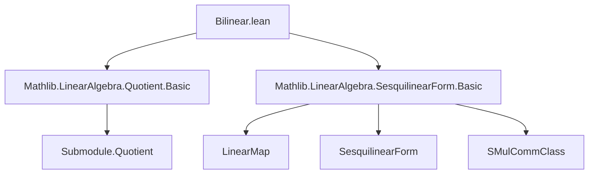
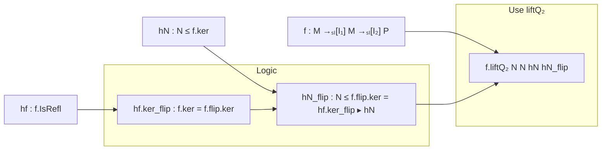

### Technical Brief: `Bilinear.lean`

---

#### **1. Key Definitions & Theorems**

| Name | Type | Purpose |
|------|------|---------|
| `liftQ₂` | `M' : Submodule R M → N' : Submodule S N → f : M →ₛₗ[ρ] N →ₛₗ[σ] P → M' ≤ f.ker → N' ≤ f.flip.ker → M ⧸ M' →ₛₗ[ρ] N ⧸ N' →ₛₗ[σ] P` | Lifts a bilinear map `f : M × N → P` (with appropriate kernel conditions) to a well-defined bilinear map on the quotient modules `M/M' × N/N'`. |
| `liftQ₂_mk` | `∀ m n, f.liftQ₂ M' N' hM' hN' (mk m) (mk n) = f m n` | Shows that the lifted map agrees with the original on representatives (i.e., commutes with quotient projection). |
| `IsRefl.liftQ₂` | `f : M →ₛₗ[I₁] M →ₛₗ[I₂] P → N ≤ f.ker → f.IsRefl → M ⧸ N →ₛₗ[I₁] M ⧸ N →ₛₗ[I₂] P` | Specialization of `liftQ₂` to the symmetric case where domain and codomain are the same module; uses `f.IsRefl` to ensure the flip kernel condition. |

> **Note**: `f.ker` is the left kernel: `{ m ∈ M | ∀ n, f m n = 0 }`.  
> `f.flip` is the flipped map: `flip f n m := f m n`.  
> `hf.ker_flip` is the right kernel of `f`, i.e., `ker (flip f)`.

---

#### **2. Naming Conventions**

- **Prefixes**:
  - `liftQ₂`: “lift to quotient, 2-ary” — standard pattern for lifting bilinear maps.
  - `mk`: standard for quotient module injection (`Submodule.Quotient.mk`).
- **Suffixes**:
  - `₂` in `liftQ₂` indicates arity (binary).
  - `IsRefl.liftQ₂` uses `IsRefl` to denote symmetry condition (reflexivity of the bilinear form).
- **Variable naming**:
  - `M', N'` for submodules being quotiented out.
  - `hM', hN'` for hypotheses that submodules lie in respective kernels.

---

#### **3. Tactic Stack**

- `simp_rw`: Used to rewrite using definitional equalities and lemmas like `LinearMap.flip_apply`, `Submodule.Quotient.forall`, etc.
- `simp`: Implicitly via `simp_rw`; also used in `show ... from ...` to simplify goals.
- `rfl`: Used in `liftQ₂_mk` to prove equality by definitional equality.
- `fun n hn ↦ by ...`: Standard lambda + `by` tactic block for constructing proofs.
- `show ... from ...`: Used to assert and prove intermediate facts (e.g., `show f.flip n = 0 from hN' hn`).

No heavy automation (e.g., `aesop`, `ring`, `linarith`) is used — the proof is mostly definitional and relies on `simp`-style simplifications.

---

#### **4. Proof Logic**

- **Goal**: Define a bilinear map on quotients from one on the original modules.
- **Strategy**:
  1. Use the universal property of quotient modules: a map `M → N ⧸ N'` lifts to `M ⧸ ker → N ⧸ N'` iff the kernel contains the submodule being quotiented.
  2. For bilinear maps, need to ensure both arguments descend:
     - First lift w.r.t. first argument: `M →ₛₗ[ρ] N →ₛₗ[σ] P` → `M ⧸ M' →ₛₗ[ρ] N →ₛₗ[σ] P`, using `hM' : M' ≤ f.ker`.
     - Then lift w.r.t. second argument: need `N' ≤ (lifted f).flip.ker`. This is verified using `hN'` and symmetry of bilinearity.
  3. Flip back to get final map `M ⧸ M' →ₛₗ[ρ] N ⧸ N' →ₛₗ[σ] P`.
- **Symmetric case**:
  - Uses `IsRefl` to equate left and right kernels: `f.IsRefl` implies `f.ker = f.flip.ker`.
  - Then `N ≤ f.ker` implies `N ≤ f.flip.ker`, so both kernel conditions are satisfied.

---

#### **5. Imports**

- `Mathlib.LinearAlgebra.Quotient.Basic`: Provides `Submodule.Quotient`, `liftQ`, `mk`, etc.
- `Mathlib.LinearAlgebra.SesquilinearForm.Basic`: Provides:
  - `LinearMap`, `→ₛₗ[ρ]`, `flip`, `ker`, `IsRefl`, `SMulCommClass`, etc.

> **Note**: `SMulCommClass R₂ S₂ P` ensures compatibility of scalar actions from `R₂` and `S₂` on `P`, needed for bilinearity over different rings.

---

#### **6. Mermaid Diagrams**

##### **Dependency Graph (Module-Level)**



##### **Overview of Theory Flow**

```mermaid
flowchart LR
  subgraph "Input"
    f["f : M →ₛₗ[ρ] N →ₛₗ[σ] P"]
    hM'[hM' : M' ≤ f.ker]
    hN'[hN' : N' ≤ f.flip.ker]
  end

  subgraph "Construction"
    liftQ["M'.liftQ f hM'"]
    liftQ2["N'.liftQ (liftQ.flip) this"]
    flip["flip liftQ2"]
  end

  subgraph "Output"
    L["liftQ₂ f hM' hN' : M ⧸ M' →ₛₗ[ρ] N ⧸ N' →ₛₗ[σ] P"]
  end

  f --> liftQ
  hM' --> liftQ
  liftQ --> flip
  hN' --> |"verify N' ≤ ker flip"|
  flip --> liftQ2
  liftQ2 --> L
```

##### **Symmetric Case Specialization**



---

#### **7. Summary**

This module formalizes the standard categorical construction of lifting bilinear maps through quotient modules, under kernel containment hypotheses. It distinguishes the general asymmetric case (`liftQ₂`) and the symmetric case (`IsRefl.liftQ₂`). The proofs are mostly definitional, relying on `simp`-based simplifications and the universal property of quotients. The use of `SMulCommClass` ensures compatibility of scalar actions across rings, enabling bilinearity over non-identical base rings.
