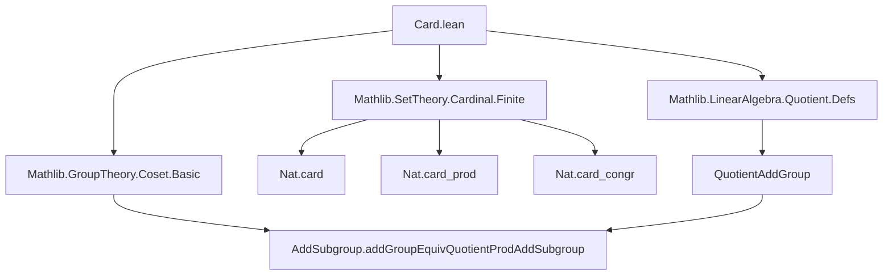

**Technical Brief: `Card.lean` — Cardinality of Quotient Modules**

---

### 1. **Key Definitions & Theorems**

| Name | Type / Signature | Purpose |
|------|------------------|---------|
| `card_eq_card_quotient_mul_card` | `∀ (S : Submodule R M), Nat.card M = Nat.card S * Nat.card (M ⧸ S)` | Relates the cardinality of a module $M$ to that of a submodule $S$ and the quotient module $M/S$. This is the module-theoretic analog of the group-theoretic fact $|G| = |H| \cdot |G/H|$ for finite groups. |

- **`Nat.card`**: Returns the cardinality (as a natural number) of a finite type.
- **`M ⧸ S`**: Quotient module (implemented via `QuotientAddGroup.quotient` underlyingly).
- **`AddSubgroup.addGroupEquivQuotientProdAddSubgroup`**: An equivalence (bijection) between $M$ and $S \times (M/S)$ when $S \leq M$ is a submodule; used to transfer cardinalities.

---

### 2. **Naming Conventions**

- **Prefixes**:
  - `card_`: Used for theorems about cardinalities (`card_eq_card_quotient_mul_card`).
- **Suffixes**:
  - `_mul_card`: Indicates a multiplicative decomposition of cardinalities.
- **Module-theoretic terms**:
  - `Submodule`, `Quotient`, `Module`, `LinearMap` — standard Mathlib naming.

---

### 3. **Tactic Stack**

- `rw`: Rewriting using definitions and lemmas (e.g., `mul_comm`, `← Nat.card_prod`).
- `exact`: Applying a pre-proved equivalence/congruence (`Nat.card_congr` + `AddSubgroup.addGroupEquivQuotientProdAddSubgroup`).
- Implicit use of:
  - `Nat.card_congr`: If $A \simeq B$, then $|A| = |B|$.
  - `AddSubgroup.addGroupEquivQuotientProdAddSubgroup`: Provides the bijection $M \simeq S \times M/S$.

No heavy automation (e.g., `aesop`, `ring`, `simp`) is used — the proof is *declarative* and relies on pre-existing structure.

---

### 4. **Proof Logic**

The proof proceeds as follows:

1. **Rewrite** `Nat.card M` as `Nat.card (S × M/S)` using the equivalence from `AddSubgroup.addGroupEquivQuotientProdAddSubgroup`.
2. **Apply** `Nat.card_congr` to transfer cardinality along the equivalence.
3. **Rewrite** `Nat.card (S × M/S)` as `Nat.card S * Nat.card (M/S)` via `← Nat.card_prod`.
4. **Reorder** the product using `mul_comm` to match the target statement.

This is a standard *bijection-based cardinality argument*, leveraging the structure of modules as abelian groups.

---

### 5. **Imports**

| Import | Role |
|--------|------|
| `Mathlib.LinearAlgebra.Quotient.Defs` | Defines quotient modules and their additive structure. |
| `Mathlib.SetTheory/Cardinal/Finite` | Provides `Nat.card`, finite cardinal arithmetic, and `Nat.card_prod`, `Nat.card_congr`. |
| `Mathlib.GroupTheory.Coset.Basic` | Contains `AddSubgroup.addGroupEquivQuotientProdAddSubgroup`, the key bijection. |

> **Note**: The proof crucially uses that modules are abelian groups (via `[AddCommGroup M]`), allowing coset decomposition and product structure.

---

### 6. **Mermaid Diagrams**

#### **Dependency Graph**


#### **Overview of Theory Flow**
```mermaid
flowchart LR
  M[Module M over R] --> S[Submodule S ≤ M]
  S --> Q[Quotient Module M ⧸ S]
  S -->|inclusion| M
  Q -->|proj| M
  M <-->|bijection| S × Q
  S × Q -->|cardinality| Nat.card S * Nat.card Q
  M -->|cardinality| Nat.card M
  Nat.card M = Nat.card S * Nat.card Q
```

---

### 7. **Domain Context**

- **Area**: Homological / module theory, combinatorial algebra.
- **Use Cases**:
  - Counting elements in finite modules (e.g., vector spaces over finite fields).
  - Justifying Lagrange-type theorems in module theory.
  - Supporting proofs in representation theory or coding theory where finite module sizes matter.

---

### 8. **Formalization Notes**

- The theorem assumes *finiteness* implicitly via `Nat.card` (which returns `0` for infinite types, but the equality only holds meaningfully when all three cardinals are finite).
- The proof is *structure-based*, not inductive — it relies on the categorical equivalence of modules with abelian groups and the splitting of short exact sequences $0 \to S \to M \to M/S \to 0$ *as sets* (not necessarily as modules).

--- 

Let me know if you'd like a generalization to infinite cardinals or a version for filtered colimits.
