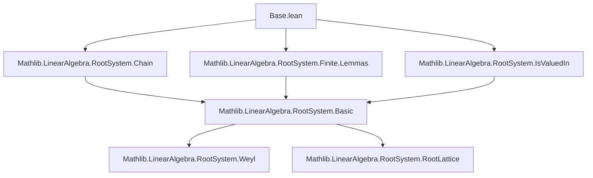
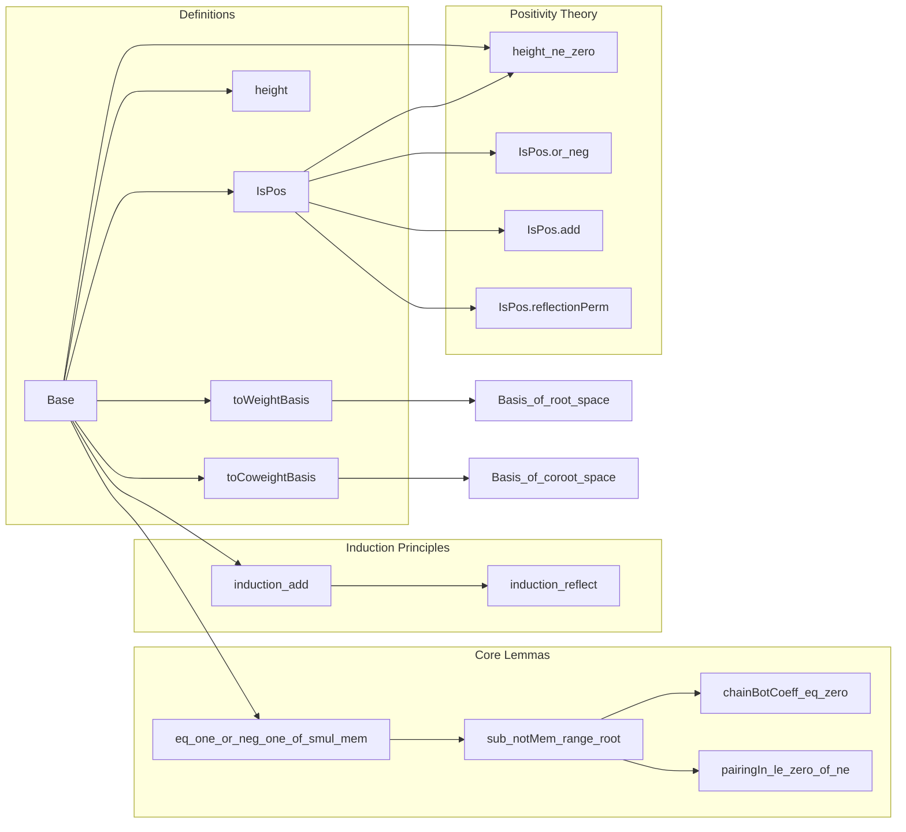

### Technical Brief: `Base.lean` — Theory of Bases for Root Pairings

---

#### **1. Key Definitions & Theorems**

| Name | Type / Signature | Purpose |
|------|------------------|---------|
| `RootPairing.Base` | `structure` | A *base* (or *simple system*) of a root pairing `P`, encoding a finite subset of indices (`support`) such that the corresponding roots and coroots are linearly independent and every root/coroot is a signed integer combination of them. |
| `RootPairing.Base.flip` | `b : P.Base → P.flip.Base` | Swaps roots and coroots; shows base symmetry under flip of pairing. |
| `RootPairing.Base.IsPos` | `ι → Prop` | Predicate: a (co)root indexed by `i` is *positive* w.r.t. base `b` iff `0 < b.height i`. |
| `RootPairing.Base.height` | `ι → ℤ` | *Height* of a root relative to base: sum of coefficients in its unique expression over simple roots. |
| `RootPairing.Base.induction_add` | `∀ i, p i` | Induction principle: if a predicate holds on simple roots and is preserved under addition of a simple root, it holds for all positive roots. |
| `RootPairing.Base.induction_reflect` | `∀ i, p i` | Induction principle: if a predicate holds on simple roots and is preserved under reflection in a simple root, it holds for all roots. |
| `RootPairing.Base.toWeightBasis` | `Basis b.support R M` | For a *root system*, a base yields a basis of the root space (via simple roots). |
| `RootPairing.Base.toCoweightBasis` | `Basis b.support R N` | Dually, yields a basis of the coroot space. |
| `RootPairing.Base.eq_one_or_neg_one_of_mem_support_of_smul_mem` | `t • αᵢ ∈ range α ⇒ t = ±1` | In reduced systems over `CharZero`, scalar multiples of simple roots in the root set force the scalar to be `±1`. |
| `RootPairing.Base.sub_notMem_range_root` | `αᵢ − αⱼ ∉ range α` | Difference of two simple roots is never a root (key for crystallographic theory). |
| `RootPairing.Base.chainBotCoeff_eq_zero` | `P.chainBotCoeff i j = 0` | For `i ≠ j` in support, the bottom coefficient in the `i`–`j` chain is zero (consequence of above). |
| `RootPairing.Base.exists_root_eq_sum_int` | `∃ f, P.root i = ∑ f j • αⱼ ∧ 0 < f ∨ f < 0` | Every root has a unique signed integer combination over the base with nonzero sum of coefficients. |

---

#### **2. Naming Conventions**

- **Prefixes**:
  - `isPos_`: predicates about positivity relative to a base.
  - `height_`: functions/lemmas about height.
  - `induction_`: induction principles (e.g., `induction_add`, `induction_reflect`).
  - `mem_span_`, `mem_range_`: membership in spans/ranges.
  - `eq_one_or_neg_one_`: characterizations of scalars preserving root membership.
- **Suffixes**:
  - `_support`: referring to the base’s `support`.
  - `_int`: integer-span related (e.g., `span_int_root_support`).
  - `_flip`: derived by flipping roots/coroots.
  - `_perm`: involving permutation under Weyl group actions (e.g., `reflectionPerm`).
- **Structure fields**:
  - `support`, `linearIndepOn_root`, `linearIndepOn_coroot`, `root_mem_or_neg_mem`, `coroot_mem_or_neg_mem`.

---

#### **3. Tactic Stack**

Frequent tactics used in proofs:
- `aesop` — for automated reasoning with linear arithmetic and set membership.
- `simp` / `simp_rw` — simplification with definitional equalities and rewrite rules.
- `rcases` / `obtain` — destructuring existential/universal hypotheses.
- `rw` — rewriting using lemmas or definitions.
- `linarith` / `lia` — linear integer arithmetic.
- `induction ... using Int.induction_on` — structural induction on integers.
- `ext` — extensionality for functions/sets.
- `convert`, `congr_arg`, `congr_arg₂` — equality manipulation.
- `norm_cast` — for lifting integer equalities to real/characteristic-zero rings.
- `tauto` — propositional logic automation.

---

#### **4. Proof Logic**

The proofs follow a *structured, inductive* pattern:

1. **Linear algebraic groundwork**:
   - Use linear independence to deduce uniqueness of expressions.
   - Use `span` and `AddSubmonoid.closure` to relate roots to their simple combinations.

2. **Height-based analysis**:
   - Define height as sum of coefficients.
   - Prove key properties: nonzero, additive under root addition, sign flips under reflection.

3. **Induction principles**:
   - For `induction_add`: induct on height (using `Int.induction_on`), reduce via existence of a simple root with positive pairing (via `exists_mem_support_pos_pairingIn`).
   - For `induction_reflect`: induct on `|height|` (using `Nat.strongRecOn`), reflect to lower height.

4. **Crystallographic & reduced assumptions**:
   - Many results (e.g., `pairingIn_le_zero_of_ne`, `chainBotCoeff_eq_zero`) require `IsCrystallographic` and often `IsReduced`.
   - Use `sub_notMem_range_root` to rule out root differences, enabling chain arguments.

5. **Symmetry via flip**:
   - Coroot analogues are often deduced by applying lemmas to `P.flip`.

---

#### **5. Imports & Dependencies**

```lean
public import Mathlib.LinearAlgebra.RootSystem.Chain
public import Mathlib.LinearAlgebra.RootSystem.Finite.Lemmas
public import Mathlib.LinearAlgebra.RootSystem.IsValuedIn
```

- **Core dependencies**:
  - `Chain`: theory of root strings/chains.
  - `Finite.Lemmas`: finite-dimensional root system lemmas.
  - `IsValuedIn`: valuation and pairing properties.

- **Key typeclass assumptions used**:
  - `[CommRing R]`, `[AddCommGroup M]`, `[Module R M]`, etc.
  - `[CharZero R]`, `[IsDomain R]`, `[IsReduced]`, `[IsCrystallographic]`, `[Finite ι]`, `[IsAddTorsionFree]`.

---

#### **6. Mermaid Diagrams**

##### **Dependency Graph (Module Level)**



##### **Overview of `Base.lean` Theory**



---

#### **7. Summary**

This file formalizes the foundational theory of *bases* (simple systems) for root pairings, extending classical definitions to handle both reduced and non-reduced cases. It introduces:

- A robust notion of base (`Base`) with support, linear independence, and closure properties.
- Height function and positivity predicate (`IsPos`) to stratify roots.
- Powerful induction principles (`induction_add`, `induction_reflect`) enabling structural proofs over root systems.
- Basis constructions (`toWeightBasis`, `toCoweightBasis`) linking bases to linear algebra.

The theory is tightly integrated with crystallographic and reduced assumptions, and heavily leverages integer arithmetic, linear independence, and Weyl group symmetry. It serves as the logical foundation for higher-level developments (e.g., Weyl group actions, classification, representation theory).
