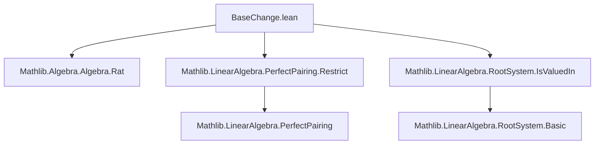
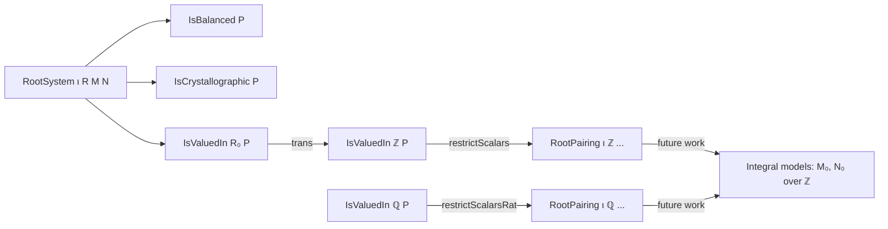

**Technical Brief: `BaseChange.lean` — Base Change for Root Pairings**

---

### 1. KEY DEFINITIONS & THEOREMS

| Name | Type / Signature | Purpose |
|------|------------------|---------|
| `IsBalanced` | `class IsBalanced {ι R M N} [...] (P : RootPairing ι R M N) : Prop` | States that the root span and coroot span form a *perfect complement* under the pairing. Ensures well-behaved restriction of scalars. |
| `restrictScalars'` | `def restrictScalars' [...] : RootPairing ι K (...)` | Constructs a root pairing over a subfield `K ⊆ L` when the original pairing takes values in `K`. Core construction for scalar restriction. |
| `restrictScalars` | `abbrev restrictScalars [...] : RootPairing ι K (...)` | Specialization of `restrictScalars'` to *crystallographic* root pairings (uses `IsValuedIn.trans` to get `ℤ`-valuedness). |
| `restrictScalarsRat` | `abbrev restrictScalarsRat [...] : RootPairing ι ℚ (...)` | Restricts a crystallographic root pairing in characteristic zero to `ℚ`. Enables passage to a minimal integral model. |
| `IsBalanced.isPerfectCompl` | `P.IsBalanced → P.toLinearMap.IsPerfectCompl (P.rootSpan R) (P.corootSpan R)` | Hypothesis enabling perfect pairing descent under restriction. |
| `restrictScalars'_toLinearMap` | `toLinearMap := .restrictScalarsRange₂ ...` | Uses `restrictScalarsRange₂` to descend the linear map to the `K`-span of roots/coroorts. |
| `restrictScalars'_isPerfPair_toLinearMap` | `isPerfPair_toLinearMap := .restrictScalars_of_field ...` | Verifies the descended map remains a perfect pairing (uses field assumption). |

**Key lemmas**:
- `restrictScalars_toLinearMap_apply_apply`: Compatibility of the descended pairing with the original under `algebraMap K L`.
- `restrictScalars_coe_root`, `restrictScalars_coe_coroot`: Inclusion of roots/coroorts is preserved.
- `restrictScalars_pairing`: Pairing values descend correctly.
- `span_root_eq_top`, `span_coroot_eq_top`: The restricted pairing is again a *root system* (i.e., spans are top).

---

### 2. NAMING CONVENTIONS

- **Prefixes**:
  - `restrictScalars_...`: For scalar restriction constructions and lemmas.
  - `is_...`: For properties (`IsBalanced`, `IsRootSystem`, `IsCrystallographic`, `IsValuedIn`).
- **Suffixes**:
  - `'` (prime): Used for more general constructions (`restrictScalars'`) vs. specialized ones (`restrictScalars`).
  - `toLinearMap`, `root`, `coroot`, `pairing`: Standard components of `RootPairing`.
- **Type parameters**:
  - `ι`: Index type (simple roots).
  - `L`: Base field (large field).
  - `K`: Subfield (small field).
  - `M`, `N`: Modules (root/coroot lattices).
  - `R`: Base ring (used in general `RootPairing` definition).

---

### 3. TACTIC STACK

| Tactic | Usage |
|--------|-------|
| `simp` | Dominant: simplifies goals using lemmas like `restrictScalars_pairing`, `algebraMap_intCast`, `subset_span`, etc. |
| `ext` | Used to prove equality of functions/elements in spans (extensionality of `subtype`/`span`). |
| `rw` | Rewrites using equalities like `← Int.cast_two`. |
| `congr` | To reduce equality of sets to element-wise equality (e.g., `span_setOf_mem_eq_top`). |
| `exact`, `assumption`, `intro` | Minor role; mostly in `by simp`-driven proofs. |
| `have`, `let` | To introduce intermediate facts (e.g., `have := IsValuedIn.trans ...`). |
| `simpa using ...` | To discharge goals by simplifying with a hypothesis. |

No heavy automation (e.g., `aesop`, `linarith`) is used — proofs are largely structural and rely on `simp`-based simplification.

---

### 4. PROOF LOGIC

The logical flow is **constructive descent**:

1. **Assumptions**:
   - `L` is a field, `K ⊆ L` a subfield (via `Algebra K L`).
   - `M`, `N` are `K`-modules compatibly with `L`-scalar multiplication (`IsScalarTower`).
   - `P` is *balanced* (ensures perfect complement).
   - `P` is *valued in `K`* (`IsValuedIn K`): all pairings land in `K`.

2. **Construction**:
   - Define new root/coroot sets as `K`-spans of original ones.
   - Descend the linear map using `restrictScalarsRange₂`, verifying faithfulness and perfectness.

3. **Verification**:
   - Show the descended pairing satisfies all `RootPairing` axioms:
     - `root_coroot_two`: Uses injectivity of `algebraMap K L` and `map_intCast`.
     - `reflectionPerm_*`: Follows from compatibility of scalar extension with reflections.
   - Prove it is a *root system* (`IsRootSystem`) by checking spans are top.

4. **Specializations**:
   - For *crystallographic* `P`, use `IsValuedIn.trans` to get `ℤ`-valuedness, then apply `restrictScalars'`.
   - For char. 0 crystallographic `P`, compose `ℚ → L` to get `restrictScalarsRat`.

---

### 5. IMPORTS

| Module | Role |
|--------|------|
| `Mathlib.Algebra.Algebra.Rat` | Enables `ℚ`-module structures via `algebraMap ℚ L`. |
| `Mathlib.LinearAlgebra.PerfectPairing.Restrict` | Provides `restrictScalars_of_field`, `restrictScalarsRange₂`, and perfect pairing descent lemmas. |
| `Mathlib.LinearAlgebra.RootSystem.IsValuedIn` | Defines `IsValuedIn` and tools like `IsValuedIn.trans`. |

These imports indicate the file lives in the *linear algebra over fields* and *root system* ecosystem of Mathlib.

---

### 6. MERMAID DIAGRAMS

#### Dependency Graph (Top-Level)



#### Overview of `BaseChange.lean`

```mermaid
flowchart LR
  subgraph Input
    P[P : RootPairing ι L M N]
    K[Field K, Algebra K L]
    M_K[Module K M]
    N_K[Module K N]
    Balanced[P.IsBalanced]
    Valued[P.IsValuedIn K]
  end

  subgraph Construction
    SpanR[span K (range P.root)]
    SpanCR[span K (range P.coroot)]
    Restrict[restrictScalars' K]
  end

  subgraph Output
    RP[RootPairing ι K SpanR SpanCR]
    IsRS[IsRootSystem]
  end

  Input -->|def| Construction
  Construction -->|instance| Output
  Balanced & Valued -->|needed for| Construction
```

#### Theory Context (Root Systems & Base Change)



---

### 7. TODO & FUTURE WORK (from docstring)

- **Extension of scalars**: Dual construction to `restrictScalars'`.
- **Integral models**: Show crystallographic root systems over `ℚ` arise as base change of `ℤ`-root systems (via `restrictScalarsRat`).
- **Functoriality**: Prove `restrictScalars'` is functorial in `K` and compatible with composition of subfields.

---

### 8. SUMMARY

This module formalizes *scalar restriction* for root pairings: when a root pairing over a field `L` takes values in a subfield `K`, one can descend it to a root pairing over `K`. The key technical condition is *balancedness*, which ensures the perfect pairing descends. The construction is used to define canonical `ℤ`- and `ℚ`-models for crystallographic root systems — a foundational step toward integral representation theory and classification.
