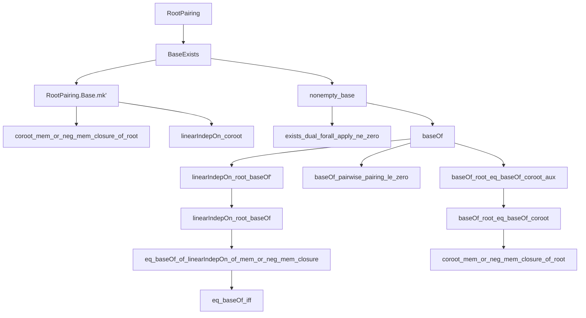
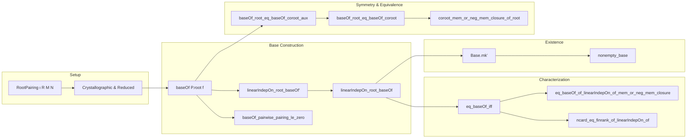

### Technical Brief: `BaseExists.lean`

---

#### **1. Key Definitions & Theorems**

| Name | Type / Signature | Purpose |
|------|------------------|---------|
| `baseOf` | `P.root → (M →+ S) → Set ι` | Constructs a subset of indices (a *base*) from a linear functional `f` on the root system, selecting those roots where `f` attains positive values (in a suitable ordered module `S`). |
| `RootPairing.Base.mk'` | `s : Set ι → LinearIndepOn R P.root s → (∀ i, P.root i ∈ closure ∨ -P.root i ∈ closure) → P.Base` | Alternate constructor for `RootPairing.Base`, requiring only root-theoretic axioms (not coroots), enabling construction of bases without assuming coroot closure properties. |
| `RootPairing.nonempty_base` | `Nonempty P.Base` | Proves existence of a base for any reduced crystallographic root system over a field of characteristic zero. |
| `RootPairing.linearIndepOn_root_baseOf'` | `LinearIndepOn S P.root (baseOf P.root f)` | Establishes linear independence of roots indexed by `baseOf` over a more general coefficient ring `S` (e.g., `ℤ`, `ℚ`), under structural assumptions (`IsValuedIn`, `IsCrystallographic`). |
| `RootPairing.linearIndepOn_root_baseOf` | `LinearIndepOn R P.root (baseOf P.root f)` | Specialization of the above to the field case (`R` a field, `f : M →+ ℚ`). |
| `RootPairing.eq_baseOf_iff` | `s = baseOf P.root f ↔ LinearIndepOn R P.root s ∧ closure condition` | Characterizes bases as exactly those subsets satisfying linear independence and closure-under-negation conditions. |
| `RootPairing.baseOf_root_eq_baseOf_coroot` | `baseOf P.root f = baseOf P.coroot g` | Shows that under compatibility of positivity conditions (`0 < f(root i) ↔ 0 < g(coroot i)`), the base constructed from roots equals that from coroots. |
| `RootPairing.coroot_mem_or_neg_mem_closure_of_root` | `P.coroot i ∈ closure ∨ -P.coroot i ∈ closure` | Proves that if roots satisfy the closure condition, so do coroots — key for `mk'` correctness. |

---

#### **2. Naming Conventions**

- **Prefixes**:
  - `baseOf_`: functions/lemmas about constructing bases via functionals.
  - `linearIndepOn_root_`: lemmas about linear independence of roots over various coefficient structures.
  - `coroot_mem_or_neg_mem_closure_of_root`: relational lemmas linking root/coroot closure properties.
  - `eq_baseOf_`: characterizations of when a set equals a base.
- **Suffixes**:
  - `'` (prime): alternate or more general version (e.g., `linearIndepOn_root_baseOf'`).
  - `aux`: auxiliary lemmas (e.g., `baseOf_root_eq_baseOf_coroot_aux`).
- **Notation**:
  - `P.root i`, `P.coroot i`: root and coroot functions.
  - `P.pairingIn ℤ i j`: integer-valued pairing (crystallographic condition).
  - `baseOf P.root f`: base indexed by functional `f`.

---

#### **3. Tactic Stack**

Frequently used tactics in proofs:

| Tactic | Role |
|--------|------|
| `aesop` | Automated reasoning for arithmetic, set membership, and basic algebraic simplifications. |
| `simp` / `simp_rw` | Simplification with definitional equalities and lemmas (e.g., `map_add`, `smul_smul`). |
| `grind` | Custom tactic (likely from `Mathlib.Tactic`) for solving linear arithmetic over ordered structures. |
| `ring` / `ring_nf` | Polynomial simplification and normalization. |
| `linarith` / `lia` | Linear integer arithmetic (used in `eq_baseOf_of_linearIndepOn_of_mem_or_neg_mem_closure`). |
| `obtain ⟨...⟩` / `rcases` | Existential elimination and case analysis. |
| `convert` / `rw [eq_comm]` | Equality manipulation and substitution. |
| `module` | Custom tactic for module-theoretic reasoning (e.g., in `baseOf_root_eq_baseOf_coroot_aux`). |

---

#### **4. Proof Logic**

The logical flow follows a **structured decomposition** strategy:

1. **Induction & Construction**:
   - Use `baseOf` to construct candidate bases from functionals.
   - Prove key properties (pairwise nonpositive pairing, linear independence, closure) stepwise.

2. **Coefficient Flexibility**:
   - First prove results over general ordered coefficient monoids `S` (e.g., `ℤ`, `ℚ`), then specialize to fields.
   - Use `restrictScalars` to pass between `R`- and `ℚ`-structures.

3. **Equivalence via Cardinality & Inclusion**:
   - Prove `s = baseOf P.root f` by showing mutual inclusion + equal cardinality (`ncard_eq_finrank_of_linearIndepOn_of`).
   - Use `Finset.card_eq` and `finrank_eq_card_basis` to bridge set-theoretic and linear-algebraic notions.

4. **Symmetry via Positivity Compatibility**:
   - Prove `baseOf_root = baseOf_coroot` by double inclusion using `subset_antisymm`, relying on positivity equivalence and closure properties.

5. **Existence via Dual Elements**:
   - Use `exists_dual_forall_apply_ne_zero` to get a functional `f` with `f(root i) ≠ 0`.
   - Apply `Base.mk'` to `baseOf P.root f` to produce a base.

---

#### **5. Imports & Dependencies**

| Module | Purpose |
|--------|---------|
| `Mathlib.Algebra.Group.Irreducible.Indecomposable` | Provides `IsAddIndecomposable`, used in `baseOf_pairwise_pairing_le_zero`. |
| `Mathlib.Algebra.Module.LinearMap.Rat` | Enables extension of `ℤ`-linear maps to `ℚ`-linear maps (`toRatLinearMap`). |
| `Mathlib.Algebra.Module.Submodule.Union` | Used for closure and span arguments (e.g., `AddSubmonoid.closure`). |
| `Mathlib.LinearAlgebra.Dimension.OrzechProperty` | Underlies dimension arguments (e.g., `ncard_eq_finrank`). |
| `Mathlib.LinearAlgebra.QuadraticForm.Dual` | Provides `RootPositiveForm`, `posRootForm`, and positivity tools. |
| `Mathlib.LinearAlgebra.RootSystem.Base` | Defines `RootPairing.Base` and basic base theory. |
| `Mathlib.LinearAlgebra.RootSystem.Finite.Lemmas` | Finite root system lemmas (e.g., `indexNeg`, `ne_zero`). |

---

#### **6. Mermaid Diagrams**

##### **Dependency Graph (High-Level)**

##### **Overview of File Structure**

---

#### **7. Summary**

This file establishes the **existence of bases** for reduced crystallographic root systems over fields of characteristic zero, using a **two-coefficient approach** (`S = ℚ`, `R` general). It introduces `Base.mk'` to bypass coroot axioms in base construction and proves key equivalences between linear independence, closure, and base membership. The proofs rely heavily on ordered module theory, duality, and positivity arguments, with heavy use of `aesop`, `simp`, and custom tactics for arithmetic and module reasoning.

The results are foundational for further development of root system theory (e.g., Weyl groups, Dynkin diagrams), and the `mk'` construction is especially valuable for avoiding redundant coroot assumptions in formalizations.
