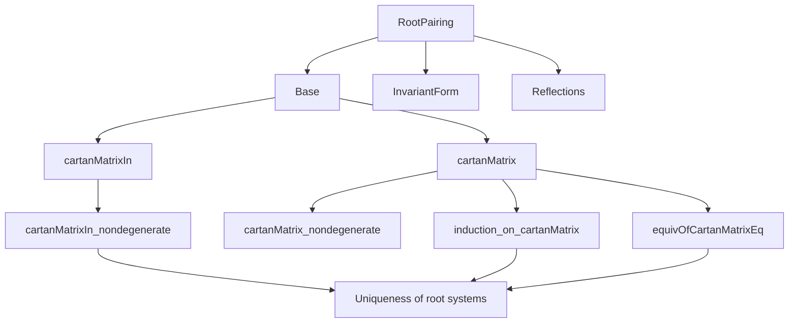
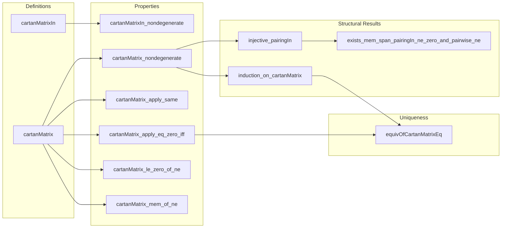

**Technical Brief: CartanMatrix.lean**

---

### 1. KEY DEFINITIONS & THEOREMS

| Name | Type / Signature | Purpose |
|------|------------------|---------|
| `cartanMatrixIn` | `Matrix b.support b.support S` | Defines the Cartan matrix of a root pairing *relative to an algebra `S`*, using the pairing function `P.pairingIn S`. |
| `cartanMatrix` | `Matrix b.support b.support ℤ` | The *integer-valued* Cartan matrix for a crystallographic root pairing (specialization of `cartanMatrixIn` to `S = ℤ`). |
| `cartanMatrixIn_nondegenerate` | `(b.cartanMatrixIn S).Nondegenerate` | Proves that the Cartan matrix (over `S`) is non-degenerate under suitable hypotheses (domain, faithful SMul, anisotropic). |
| `cartanMatrix_nondegenerate` | `b.cartanMatrix.Nondegenerate` | Integer Cartan matrix is non-degenerate for irreducible crystallographic root systems. |
| `induction_on_cartanMatrix` | `p j` under connectivity assumptions | Induction principle expressing *connectedness of the Dynkin diagram* for irreducible root systems via the Cartan matrix. |
| `equivOfCartanMatrixEq` | `P.Equiv P₂` | Constructs an equivalence of root systems from an isomorphism of their Cartan matrices (up to relabeling of simple roots). |
| `injective_pairingIn` | `Injective (fun i k ↦ P.pairingIn ℤ i k)` | Injectivity of the integer pairing on simple roots — key for uniqueness arguments. |
| `exists_mem_span_pairingIn_ne_zero_and_pairwise_ne` | `∃ d ∈ span …` | Existence of a vector in the span of integer pairings with all coordinates nonzero and pairwise distinct — used in structural arguments. |

---

### 2. NAMING CONVENTIONS

- **Prefixes**:
  - `cartanMatrixIn_`, `cartanMatrix_`: for definitions and lemmas about Cartan matrices over general `S` or ℤ.
  - `apply_mem_range_root_of_`: for lemmas about images of roots under linear equivalences preserving Cartan structure.
  - `induction_on_`: for induction principles tied to structural properties (e.g., connectedness).
- **Suffixes**:
  - `_def`: definition lemmas (`rfl`-provable equalities).
  - `_apply_same`, `_apply_eq_zero_iff`, `_apply_eq_zero_iff_symm`: pattern for elementwise properties.
  - `_mem_of_ne`, `_le_zero_of_ne`: properties under inequality assumptions.
  - `_equiv`: for equivalences constructed from matrix data.
- **Notable patterns**:
  - `algebraMap_…`, `cartanMatrix_map_…`: interaction with ring homomorphisms.
  - `abs_cartanMatrix_`, `cartanMatrix_nondegenerate`: structural properties (symmetry, definiteness).

---

### 3. TACTIC STACK

Frequently used tactics in proofs:

| Tactic | Role |
|--------|------|
| `simp` / `simp_rw` | Simplification using lemmas, especially `rfl`, `map_*`, `pairing_*`, `cartanMatrix_*`. |
| `aesop` | Automated reasoning for linear algebra, module theory, and set-theoretic goals. |
| `rw` / `rwa` | Rewriting using equivalences, often with `ne_eq`, `eq_iff`, or `nondegenerate_iff`. |
| `ext` | Extensionality for matrices, linear maps, functions. |
| `cases` / `rcases` | Case analysis on equality (`eq_or_ne`) or membership. |
| `by_contra` | Contrapositive reasoning (e.g., to rule out `-4` in Cartan entries). |
| `induction … using Submodule.span_induction` | Structural induction over submodules. |
| `exact`, `refine`, `apply` | Goal-directed proof construction. |
| `tauto` | Tautology solving for logical combinations. |
| `rwa`, `convert`, `congr_arg` | For manipulating equalities under ring/module homomorphisms. |

---

### 4. PROOF LOGIC

**Typical proof structure**:

1. **Reduction to known structure**:
   - Use `cartanMatrixIn_mul_diagonal_eq` to relate Cartan matrix to invariant form.
   - Reduce non-degeneracy to determinant ≠ 0 via `Matrix.nondegenerate_iff_det_ne_zero`.

2. **Inductive reasoning on Dynkin diagram**:
   - Define a submodule `q = span (roots satisfying property p)`.
   - Show `q` is invariant under reflections → use irreducibility to deduce `q = ⊤`.
   - Conclude `p` holds everywhere.

3. **Uniqueness via matrix isomorphism**:
   - Build linear equivalence `f` from basis isomorphism.
   - Show `f` maps roots to roots using `induction_on_cartanMatrix`-style reflection arguments.
   - Lift to root system equivalence `P.Equiv P₂`.

4. **Injectivity & integrality**:
   - Express pairing vectors as `f' ᵥ* cartanMatrix`.
   - Use non-degeneracy to infer injectivity of `f ↦ f ᵥ* cartanMatrix`.

5. **Bounding entries**:
   - Use crystallographic condition + reflection identities to restrict possible values of `b.cartanMatrix i j` to `{0, -1, -2, -3}`.

---

### 5. IMPORTS (PRIMARY DEPENDENCIES)

| Module | Role |
|--------|------|
| `Mathlib.Algebra.CharZero.Infinite` | Ensures `2 ≠ 0` in characteristic zero rings. |
| `Mathlib.Algebra.Module.Submodule.Union` | For submodule generation and induction. |
| `Mathlib.LinearAlgebra.Matrix.BilinearForm` | Bilinear forms, non-degeneracy, determinant criteria. |
| `Mathlib.LinearAlgebra.RootSystem.Base` | Core definitions of root pairings, bases, weight bases. |
| `Mathlib.LinearAlgebra.RootSystem.Finite.Lemmas` | Finite-type lemmas (e.g., linear independence, spanning). |
| `Mathlib.LinearAlgebra.RootSystem.Finite.Nondegenerate` | Non-degeneracy of root forms, invariant forms. |

---

### 6. MERMAID DIAGRAMS

#### Dependency Graph (High-Level)

#### Overview of File Structure

---

### 7. DOMAIN-SPECIFIC INSIGHTS

- **Crystallographic condition** is essential for integrality (`cartanMatrix : ℤ`) and boundedness of off-diagonal entries.
- **Non-degeneracy** is the linchpin: it enables both uniqueness (`equivOfCartanMatrixEq`) and induction principles (`induction_on_cartanMatrix`).
- **Dynkin diagram connectedness** is encoded via the induction principle: if a property holds at one node and propagates along nonzero Cartan entries, it holds everywhere.
- **Cartan matrix determines root system up to equivalence** — a foundational result for classification.

--- 

Let me know if you'd like a formalized dependency graph (e.g., for Lean's `leanproject`), or a summary of the classification implications.
