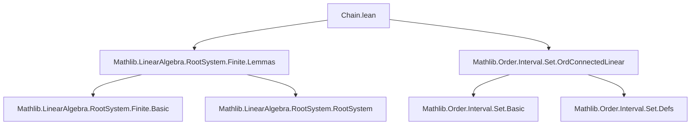

### Technical Brief: `Chain.lean`

---

#### **1. Key Definitions & Theorems**

| Name | Type / Signature | Purpose |
|------|------------------|---------|
| `setOf_root_add_zsmul_eq_Icc_of_linearIndependent` | `LinearIndependent R ![P.root i, P.root j] → ∃ q ≤ 0, p ≥ 0, {z : ℤ | P.root j + z • P.root i ∈ range P.root} = Icc q p` | Proves that the set of integers `z` such that `β + zα` is a root forms an integer interval when `α, β` are linearly independent. |
| `chainTopCoeff` | `ℕ` | Natural number `p` such that the top of the `α`-chain through `β` is `β + pα`. Junk value `0` if `α, β` linearly dependent. |
| `chainBotCoeff` | `ℕ` | Natural number `q` such that the bottom of the `α`-chain through `β` is `β - qα`. Junk value `0` if `α, β` linearly dependent. |
| `root_add_zsmul_mem_range_iff` | `P.root j + z • P.root i ∈ range P.root ↔ z ∈ Icc (-P.chainBotCoeff i j) (P.chainTopCoeff i j)` | Characterizes membership in the root chain as an integer interval — i.e., *unbroken chain*. |
| `chainBotCoeff_add_chainTopCoeff_le` | `P.chainBotCoeff i j + P.chainTopCoeff i j ≤ 3` | Length of any root chain in a finite crystallographic root system is ≤ 3. |
| `chainBotCoeff_sub_chainTopCoeff` | `P.chainBotCoeff i j - P.chainTopCoeff i j = P.pairingIn ℤ j i` | Relates chain coefficients to the Cartan integer (pairing with coroot). |
| `chainTopIdx`, `chainBotIdx` | `ι` | Indices of the top/bottom roots in the chain: `P.root (chainTopIdx i j) = P.root j + p • P.root i`, etc. |
| `chainBotCoeff_chainTopIdx`, `chainTopCoeff_chainTopIdx` | `ℕ` equalities | Recursive behavior of chain coefficients under translation by top/bottom roots. |
| `chainBotCoeff_add_chainTopCoeff_eq_pairingIn_chainTopIdx` | `P.chainBotCoeff i j + P.chainTopCoeff i j = P.pairingIn ℤ (chainTopIdx i j) i` | Connects chain length to Cartan integer of the top root. |

---

#### **2. Naming Conventions**

- **Prefixes**:
  - `chainTopCoeff`, `chainBotCoeff`: denote top/bottom offsets in chain.
  - `chainTopIdx`, `chainBotIdx`: denote *indices* of extremal roots in chain.
  - `root_add_zsmul_mem_range_iff`, `root_sub_zsmul_mem_range_iff`: membership criteria for roots in chain.
- **Suffixes**:
  - `_eq_zero_iff`: characterizes when coefficient is zero.
  - `_of_add`, `_of_sub`: behavior under addition/subtraction of roots.
  - `_reflectionPerm_left/right`: symmetry under Weyl group reflections.
- **Pattern**:
  - `root_add_nsmul_mem_range_iff_le_chainTopCoeff`: `n ≤ chainTopCoeff ↔ root + n•α ∈ roots`.
  - `coe_chainTopCoeff_eq_sSup`: coercion of `ℕ` to `ℤ` equals supremum of chain indices.

---

#### **3. Tactic Stack**

Frequently used tactics in proofs:

| Tactic | Role |
|--------|------|
| `simp` / `simp only` | Simplify definitions, especially `reduceDIte`, `mem_setOf_eq`, `mem_Icc`, `smul`, `add_smul`. |
| `aesop` | Automated reasoning for arithmetic and set-theoretic goals (e.g., `chainBotCoeff_add_chainTopCoeff_le`). |
| `linarith` / `lia` | Linear integer arithmetic (especially after `have h₁ : 0 ≤ pairingIn ...`). |
| `rw` / `rwa` | Rewrite using lemmas, often with `algebraMap_pairingIn`, `root_coroot'_eq_pairing`, `reflection_apply_self`. |
| `ext` + `simp` | Prove set equality by extensionality. |
| `rcases z.eq_nat_or_neg` | Case split on integer sign. |
| `have h' := ...; rwa [...]` | Derive linear independence of reflected roots. |
| `apply algebraMap_injective ℤ R` | Lift equalities from `ℤ` to `R` (since `R` has char 0 and is domain). |
| `csSup_Iic`, `OrderIso.map_csSup'` | Manipulate suprema of intervals under order isomorphisms. |

---

#### **4. Proof Logic**

The logical flow follows a standard pattern for crystallographic root systems:

1. **Interval characterization**:
   - Assume linear independence.
   - Show the set `{z : ℤ | β + zα ∈ Φ}` is finite, nonempty (contains 0), and bounded.
   - Use `eq_Icc_iff_int` to conclude it's an interval `Icc q p`.

2. **Definition of coefficients**:
   - Define `chainTopCoeff`, `chainBotCoeff` as `p`, `q` (or 0 if dependent).
   - Prove equivalence: `n ≤ p ↔ β + nα ∈ Φ`, similarly for `q`.

3. **Symmetry under reflections**:
   - Use `root_reflectionPerm` and `reflection_apply_self` to relate chains under `s_i`, `s_j`.
   - Prove `chainTopCoeff s_i(i) j = chainBotCoeff i j`, etc.

4. **Cartan integer relation**:
   - Compute `s_i(β - qα)` in two ways to relate `q - p` to `⟨β, α∨⟩`.
   - Derive `q - p = ⟨β, α∨⟩`.

5. **Length bound**:
   - Use crystallographic condition: `⟨α, β∨⟩⟨β, α∨⟩ ∈ {0,1,2,3}`.
   - Since `p + q = |⟨β, α∨⟩|` (or via `chainTopIdx`), deduce `p + q ≤ 3`.

6. **Recursive behavior**:
   - Translate chain by top/bottom root: e.g., if `k = j + i`, then `chainBotCoeff i k = chainBotCoeff i j + 1`.

---

#### **5. Imports & Dependencies**

| Import | Purpose |
|--------|---------|
| `Mathlib.LinearAlgebra.RootSystem.Finite.Lemmas` | Core lemmas on finite crystallographic root systems: pairing, coroots, reflections, crystallographic condition. |
| `Mathlib.Order.Interval.Set.OrdConnectedLinear` | Interval theory, especially `Icc`, `Iic`, sup/inf properties in linear orders. |

**Key auxiliary structures used**:
- `RootPairing`, `IsCrystallographic`, `IsReduced`
- `LinearIndependent`, `range`, `smul`, `reflectionPerm`, `pairingIn`
- `Finite ι`, `CharZero R`, `IsDomain R`, `Module R M`

---

#### **6. Mermaid Diagrams**

##### **Dependency Graph (Module-Level)**



##### **Conceptual Overview of Chain Theory**

```mermaid
flowchart LR
  subgraph Setup
    A[Root Pairing P] --> B[α = P.root i, β = P.root j]
    B --> C{Linear Independent?}
  end

  subgraph Chain Definition
    C -->|Yes| D[Set S = {z | β + zα ∈ Φ}]
    D --> E[S = Icc(-q, p)]
    E --> F[chainTopCoeff = p, chainBotCoeff = q]
  end

  subgraph Properties
    F --> G[root_add_zsmul_mem_range_iff]
    F --> H[q - p = ⟨β, α∨⟩]
    F --> I[p + q ≤ 3]
    F --> J[Reflection symmetry]
  end

  subgraph Extremal Indices
    F --> K[chainTopIdx, chainBotIdx]
    K --> L[root(chainTopIdx) = β + pα]
    K --> M[root(chainBotIdx) = β - qα]
  end

  subgraph Applications
    G --> N[Root string lengths]
    H --> O[Cartan matrix bounds]
    I --> P[Classification of rank-2 systems]
  end
```

---

#### **7. Summary**

This module formalizes the classical *root string* (or *chain*) theory for finite crystallographic root systems. It establishes:

- **Structure**: Chains are unbroken intervals in `ℤ`.
- **Quantitative control**: Length ≤ 3, and determined by Cartan integers.
- **Symmetry**: Reflections swap top/bottom coefficients.
- **Algorithmic utility**: Extremal roots (`chainTopIdx`, `chainBotIdx`) are definable and computable.

The formalization is highly structured, leveraging Lean’s typeclass infrastructure (`RootPairing`, `IsCrystallographic`, `IsReduced`) and order-theoretic tools (`Icc`, `csSup`) to reason about discrete root systems.

--- 

*End of Technical Brief.*
