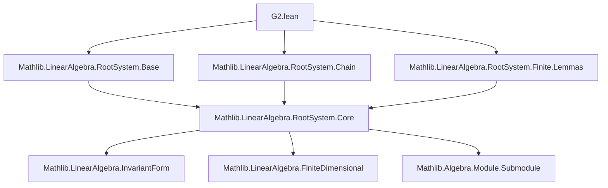
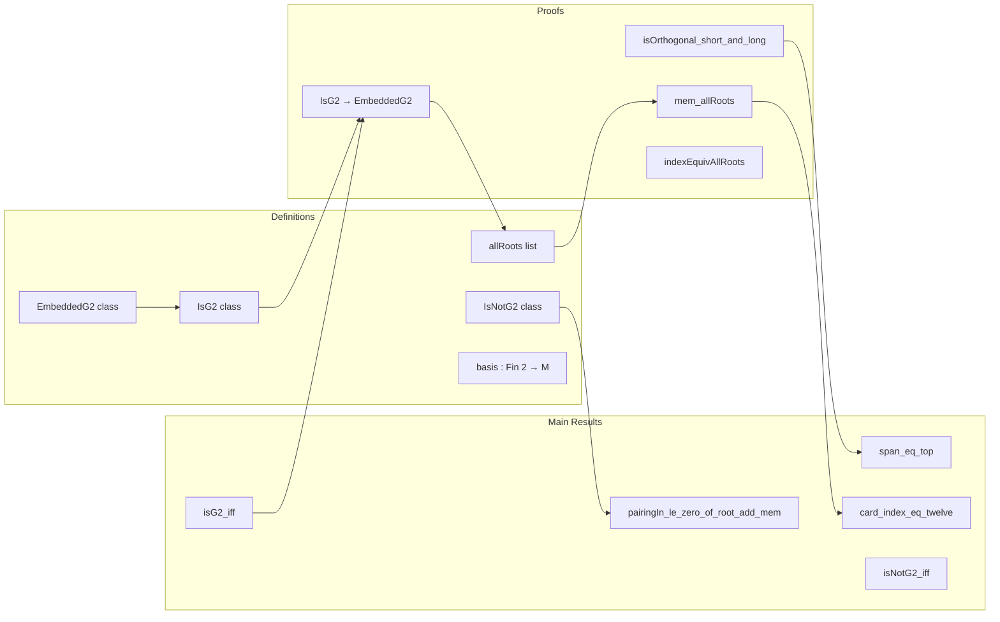

**Technical Brief: `G2.lean` — Formalization of the `𝔤₂` Root System in Lean 4**

---

### 1. KEY DEFINITIONS & THEOREMS

| Name | Type | Purpose |
|------|------|---------|
| `EmbeddedG2` | `class` | Data-bearing typeclass: distinguishes a pair of roots `(long, short)` with pairing `pairingIn ℤ long short = -3`. Sufficient for the span to be a `𝔤₂` root system. |
| `IsG2` | `class Prop` | Prop-valued: asserts existence of *any* pair of roots with pairing `-3` in a crystallographic, reduced, irreducible root system. |
| `IsNotG2` | `class Prop` | Prop-valued: asserts all pairwise pairings lie in `{-2, -1, 0, 1, 2}` — i.e., the system is *not* `𝔤₂`. |
| `shortRoot`, `longRoot` | `M` | The distinguished short and long roots (indices `short P`, `long P`). |
| `shortAddLong`, `twoShortAddLong`, `threeShortAddLong`, `threeShortAddTwoLong` | `ι` | Indices of the remaining roots in the `𝔤₂` system. |
| `allRoots` | `List M` | List of all 12 roots: ± each of the 6 distinct roots. |
| `span_eq_top` | `lemma` | If a crystallographic, reduced, irreducible root system contains a pair with pairing `-3`, then it is 2-dimensional, spanned by that pair. |
| `card_index_eq_twelve` | `lemma` | In an `EmbeddedG2` setting (hence `IsG2`), the index type `ι` has cardinality 12. |
| `isG2_iff`, `isNotG2_iff` | `lemma` | Logical equivalences: `IsG2 ↔ ∃ i j, pairingIn ℤ i j = -3`; `IsNotG2 ↔ ∀ i j, pairingIn ℤ i j ∈ {-2,-1,0,1,2}`. |
| `not_isG2_iff_isNotG2` | `lemma` | Under finite, char 0, domain assumptions: `¬ IsG2 ↔ IsNotG2`. |
| `pairingIn_le_zero_of_root_add_mem` | `lemma` | In `IsNotG2`, if `root i + root j` is a root, then `pairingIn ℤ i j ≤ 0`. |
| `chainBotCoeff_if_one_zero` | `lemma` | In `IsNotG2`, if `root i + root j` is a root, then `chainBotCoeff i j = 1` iff `pairingIn ℤ i j = 0`. |
| `isOrthogonal_short_and_long` | `lemma` | If a root is *not* in `allRoots`, it is orthogonal to both `short` and `long`. |
| `mem_allRoots` | `lemma` | Every root index maps into `allRoots` — i.e., `allRoots` exhausts the root system. |
| `indexEquivAllRoots` | `def` | Equivalence `ι ≃ allRoots.toFinset`, proving `ι` has 12 elements. |
| `basis` | `def` | `Module.Basis (Fin 2) R M` — the `𝔤₂` system is free of rank 2 over `R`. |

---

### 2. NAMING CONVENTIONS

- **Prefixes**:
  - `isG2`, `isNotG2`, `EmbeddedG2`: classify the root system.
  - `short`, `long`: denote distinguished roots.
  - `shortAddLong`, `twoShortAddLong`, etc.: compound names for derived roots.
  - `pairingIn_*`, `pairing_*`: for pairings (with/without `In` for ℤ-valued vs. R-valued).
  - `chainBotCoeff`, `chainTopCoeff`: coefficients in the string of reflections.
  - `allRoots`, `allCoeffs`: exhaustive lists of roots and their coordinates.

- **Suffixes**:
  - `_root`: for the actual root vector in `M`.
  - `_left`, `_right`: for `pairingIn` with index in first or second argument.
  - `_iff`: logical equivalences.
  - `_eq`: definitions or simplifications of equality.

- **Abbreviations**:
  - `P.EmbeddedG2`, `P.IsG2`, `P.IsNotG2`: typeclasses parameterized by `P : RootPairing`.
  - `shortRoot`, `longRoot`, etc.: abbreviations for `P.root (short P)` etc.

---

### 3. TACTIC STACK

Frequently used tactics in this file:

| Tactic | Usage |
|--------|-------|
| `simp` / `simp_rw` | Simplifying definitions, especially `pairingIn`, `reflection_apply_root`, `allRoots`, `allCoeffs`. |
| `aesop` | Automated reasoning for linear algebra, set membership, and basic arithmetic. |
| `omega` | Solving linear integer arithmetic goals (e.g., in `isOrthogonal_short_and_long_aux`). |
| `ring` / `linarith` / `lia` | Polynomial simplifications and linear integer reasoning. |
| `rw` | Rewriting using lemmas (especially `pairingIn_eq_add_of_root_eq_add`, `long_eq_three_mul_short`). |
| `rcases` / `obtain` | Destructuring existential or conjunction hypotheses. |
| `have` / `suffices` | Introducing intermediate claims. |
| `module` | Localizing module-theoretic reasoning (used to delimit scope of module assumptions). |
| `grind` | Custom tactic (likely from `Mathlib.Tactic`) for grinding through finite set inclusions. |
| `decide` | For decidable propositions (e.g., `nodup_map_iff`). |

---

### 4. PROOF LOGIC

The logical flow of proofs in this file follows a **structured case analysis + structural induction** pattern:

1. **Classification via pairing**:
   - Use `pairingIn_mem_set_of_isCrystal_of_isRed` to restrict possible pairings.
   - Distinguish between `IsG2` (exists `-3`) and `IsNotG2` (no `-3`).

2. **Case split on existence of `-3` pairing**:
   - If `IsG2`, pick a witness pair (`toEmbeddedG2`) and build the full root system.
   - If `IsNotG2`, derive constraints on chain coefficients and angles.

3. **Explicit construction in `EmbeddedG2`**:
   - Define all 6 roots via reflections.
   - Prove linear independence of `short`, `long`.
   - Show all roots are linear combinations of `short`, `long` with integer coefficients (`allCoeffs`).
   - Prove `allRoots` has no duplicates and exhausts the root system.

4. **Dimensionality and cardinality**:
   - Use orthogonality to show any root outside `allRoots` must be 0 → contradiction.
   - Conclude `ι` has 12 elements via equivalence `ι ≃ allRoots`.

5. **Invariant form analysis**:
   - Use `InvariantForm` to relate lengths: `B(long, long) = 3 B(short, short)`.
   - Classify roots as short/long via form values.

6. **Base support**:
   - In `IsG2`, any base has exactly two elements (`card_base_support_eq_two`).
   - Span of any two distinct base roots equals the integer root span.

---

### 5. IMPORTS

| Import | Purpose |
|--------|---------|
| `Mathlib.LinearAlgebra.RootSystem.Base` | Theory of bases (simple systems) in root systems. |
| `Mathlib.LinearAlgebra.RootSystem.Chain` | Chain coefficients, strings of roots under reflection. |
| `Mathlib.LinearAlgebra.RootSystem.Finite.Lemmas` | Finite-dimensional root system lemmas (e.g., `pairingIn_mem_set_of_isCrystal_of_isRed`). |

These imports provide the foundational API for `RootPairing`, including:
- `pairingIn`, `pairing`, `reflectionPerm`, `rootSpan`
- `IsCrystallographic`, `IsReduced`, `IsIrreducible`
- Chain coefficient lemmas, linear independence criteria.

---

### 6. MERMAID DIAGRAMS

#### Dependency Graph (Module-Level)

#### Overview of `G2.lean` Theory

---

### 7. SUMMARY

This file formalizes the *exceptional* rank-2 root system `𝔤₂` in the language of `RootPairing`. It distinguishes `𝔤₂` by the existence of a pair of roots with pairing `-3`, constructs all 12 roots explicitly via reflections, and proves key structural properties (e.g., 2-dimensionality, 12 roots, explicit basis, classification of short/long roots). The API is designed to support future work on classification of irreducible root systems and applications to Lie theory (e.g., Dynkin diagrams, Weyl groups). The `EmbeddedG2` typeclass is data-rich, enabling concrete computations, while `IsG2`/`IsNotG2` are logical characterizations for case analysis.

The formalization leverages:
- `InvariantForm` to relate root lengths,
- `Chain` theory to control reflection strings,
- `Finite` and `CharZero` assumptions to avoid degenerate cases.

It is a model of modern Lean 4 formalization: precise naming, modular typeclasses, and rich automation via `aesop`, `omega`, and `ring`.
