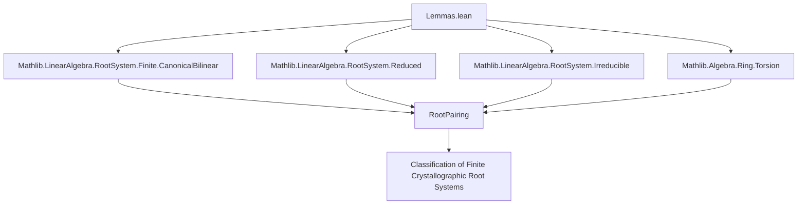
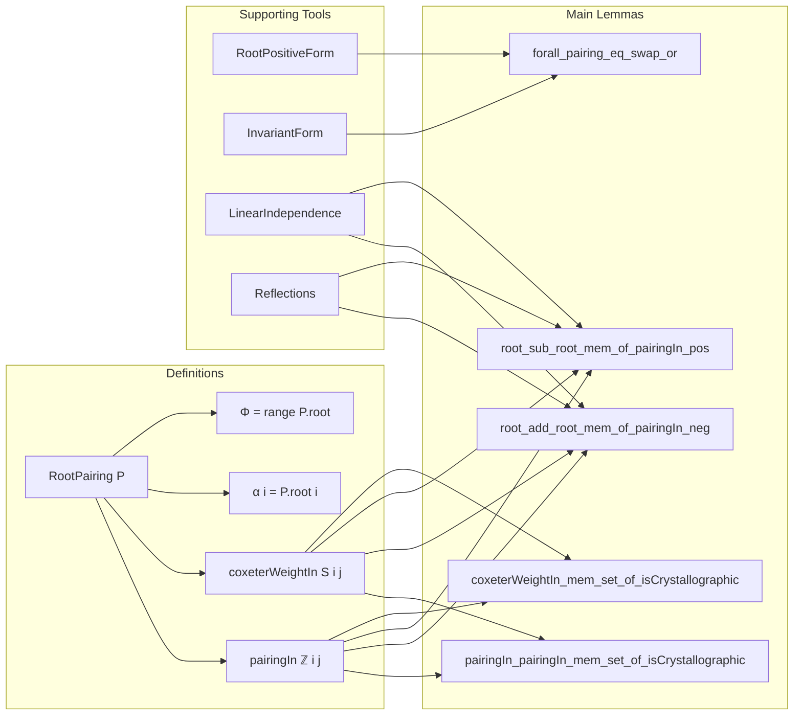

### Technical Brief: Structural Lemmas for Finite Crystallographic Root Pairings

---

#### **1. Key Definitions & Theorems**

| Name | Type / Signature | Purpose |
|------|------------------|---------|
| `RootPairing` | `Type → Type → Type → Type → Type` | A pairing between roots and coroots over a commutative ring, generalizing Cartan matrices. |
| `P.coxeterWeightIn S i j` | `S` (ordered ring) | Generalized Coxeter matrix entry: $ m_{ij} = \frac{4 \cdot \langle \alpha_i, \alpha_j \rangle^2}{\langle \alpha_i, \alpha_i \rangle \cdot \langle \alpha_j, \alpha_j \rangle} $. |
| `P.pairingIn ℤ i j` | `ℤ` | Integer-valued pairing $ \langle \alpha_i, \alpha_j^\vee \rangle $, i.e., coroot evaluation on root. |
| `Φ` | `range P.root` | Set of all roots. |
| `α i` | `M` | The $i$-th simple root (as element of module $M$). |

**Main Theorems:**

| Name | Statement | Significance |
|------|-----------|--------------|
| `coxeterWeightIn_le_four` | $ m_{ij} \le 4 $ | Boundedness of Coxeter weights in finite crystallographic cases. |
| `coxeterWeightIn_mem_set_of_isCrystallographic` | $ m_{ij} \in \{0,1,2,3,4\} $ | Classification constraint: only 5 possible Coxeter weights. |
| `pairingIn_pairingIn_mem_set_of_isCrystallographic` | $ (\langle \alpha_i, \alpha_j^\vee \rangle, \langle \alpha_j, \alpha_i^\vee \rangle) \in S_{\text{cryst}} $ | Full list of possible integer pairing pairs (16 total). |
| `pairingIn_pairingIn_mem_set_of_isCrystal_of_isRed` | Same as above, but excludes $(\pm1,\pm4),(\pm4,\pm1)$ under *reduced* assumption (12 total). |
| `root_sub_root_mem_of_pairingIn_pos` | If $ \langle \alpha_i, \alpha_j^\vee \rangle > 0 $ and $ i \ne j $, then $ \alpha_i - \alpha_j \in \Phi $ | Closure under subtraction when pairing positive. |
| `root_add_root_mem_of_pairingIn_neg` | If $ \langle \alpha_i, \alpha_j^\vee \rangle < 0 $ and $ \alpha_i \ne -\alpha_j $, then $ \alpha_i + \alpha_j \in \Phi $ | Closure under addition when pairing negative. |
| `forall_pairing_eq_swap_or` | For reduced irreducible finite crystallographic root pairings, all pairings satisfy either $ a = b $, $ a = 2b $, or $ b = 2a $, *or* $ a = 3b $, $ b = 3a $. | Underlies classification into types $A,D,E$ (equal lengths) vs $B,C,F,G$ (two lengths). |

---

#### **2. Naming Conventions**

- **Prefixes:**
  - `coxeterWeightIn_`: Coxeter weight computation.
  - `pairingIn_`: Integer pairing $ \langle \cdot, \cdot^\vee \rangle $.
  - `root_..._mem_...`: Membership of linear combinations of roots in root system.
  - `apply_...`: Evaluation of bilinear forms on roots.
  - `invariantForm_`, `rootPositiveForm_`: Associated structures.

- **Suffixes:**
  - `_le_four`, `_ne_four`: Bounds or exclusions on Coxeter weights.
  - `_mem_set_of_isCrystallographic`: Membership in finite set of allowed values.
  - `_of_pairingIn_...`: Conditioned on pairing values.
  - `_of_length_eq`, `_of_apply_ne`: Conditioned on form values.

- **Notation:**
  - `Φ` = `range P.root`
  - `α i` = `P.root i`
  - `⟨α, β⟩` = `P.pairing α β`
  - `⟨α, β^\vee⟩` = `P.pairingIn ℤ i j` for simple roots.

---

#### **3. Tactic Stack**

| Tactic | Frequency | Role |
|--------|-----------|------|
| `aesop` | Very High | Automated reasoning over set membership, inequalities, and arithmetic. |
| `simp` / `simp_rw` | High | Simplification using algebraic identities, especially `algebraMap_*`, `pairing_*`, `reflection_*`. |
| `lia` | High | Linear integer arithmetic (e.g., after simplifying inequalities). |
| `rcases` / `cases` | High | Case analysis on disjunctions (e.g., `eq_or_ne`, `or`). |
| `rw` | High | Rewriting using lemmas like `pairingIn_two_two_iff`, `rootLength_pos`, etc. |
| `obtain` / `have` | High | Introducing intermediate facts and witnesses. |
| `grind` | Medium | Goal-directed simplification for contradictions or arithmetic. |
| `norm_cast` | Medium | Managing embeddings $ \mathbb{Z} \to R $. |
| `rwa` | Medium | Rewriting + assumption. |
| `refine` | Medium | Structured proof construction. |

> ⚠️ Note: Comments like `-- https://github.com/leanprover-community/mathlib4/issues/24551` indicate known performance issues with `aesop`.

---

#### **4. Proof Logic**

The proofs follow a **structured case analysis + algebraic manipulation** pattern:

1. **Reduction to Integer Setting**: Use `IsCrystallographic` and `CharZero` to work over $ \mathbb{Z} $, leveraging `algebraMap_injective` to lift equalities.
2. **Bounding via Coxeter Weight**: Prove $ m_{ij} \in \{0,1,2,3,4\} $ using positivity and symmetry of the form.
3. **Case Splitting on Pairing Values**: Use finite sets of allowed $ (\langle \alpha_i, \alpha_j^\vee \rangle, \langle \alpha_j, \alpha_i^\vee \rangle) $ to narrow possibilities.
4. **Linear Independence vs Dependence**: For root addition/subtraction lemmas, split into:
   - *Independent case*: Use reflection symmetry and positivity to construct new roots.
   - *Dependent case*: Use proportionality and known pairing values (e.g., $ \pm1, \pm2, \pm3, \pm4 $) to reduce to known roots.
5. **Length Comparison**: Use `rootLength` from `RootPositiveForm` and pairing constraints to derive inequalities (e.g., `rootLength_le_of_pairingIn_eq`).
6. **Global Structure (Irreducible Case)**: Use connectedness (via irreducibility) to propagate local length relations to global ones (e.g., at most two root lengths).

---

#### **5. Imports & Dependencies**

| Module | Role |
|--------|------|
| `Mathlib.LinearAlgebra.RootSystem.Finite.CanonicalBilinear` | Canonical bilinear form and positivity tools. |
| `Mathlib.LinearAlgebra.RootSystem.Reduced` | Reduced root systems (no multiples of roots). |
| `Mathlib.LinearAlgebra.RootSystem.Irreducible` | Irreducibility (connected Dynkin diagrams). |
| `Mathlib.Algebra.Ring.Torsion` | Torsion-freeness for cancellation and embedding arguments. |

**Key Type Classes Used:**
- `[CommRing R]`, `[AddCommGroup M]`, `[Module R M]`
- `[P.IsCrystallographic]`, `[P.IsReduced]`, `[P.IsIrreducible]`
- `[CharZero R]`, `[IsDomain R]`, `[Finite ι]`

---

#### **6. Mermaid Diagrams**

##### **Dependency Graph (Module-Level)**

##### **Overview of File Structure**

---

#### **7. Theory Context**

This file sits at the **core of the classification of finite crystallographic root systems**, providing the *local combinatorial constraints* (pairing values, root closure properties) needed to prove:

- The **Dynkin diagram classification** (types $A_n, B_n, C_n, D_n, E_6, E_7, E_8, F_4, G_2$).
- That **only 5 Coxeter types** occur in the crystallographic case.
- That **root lengths are constrained** (≤2 distinct lengths, ratio $1:1, 1:2, 1:3$).

It bridges abstract root system theory (via `RootPairing`) and concrete Lie-theoretic classification (via Dynkin diagrams).

--- 

Let me know if you'd like a formalized dependency graph for `RootPairing` or a proof sketch of `forall_pairing_eq_swap_or`.
