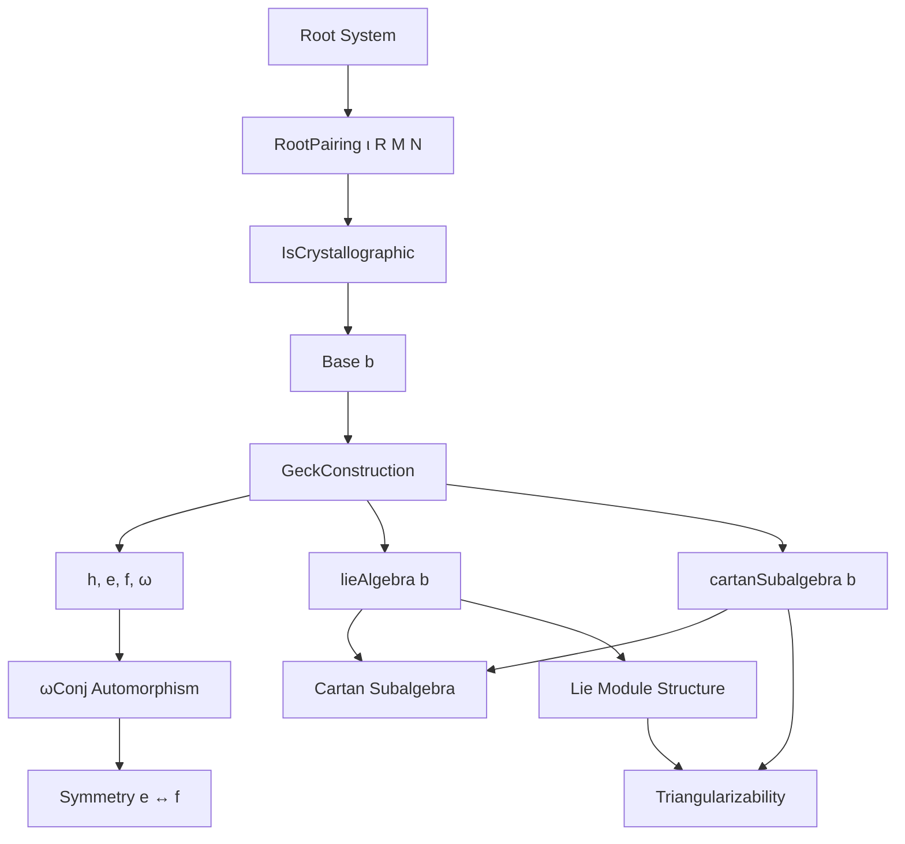

**Technical Brief: Geck’s Construction of a Lie Algebra from a Root System (Basic.lean)**  
*Prepared for Domain-Specific AI Agent Training*

---

### 1. KEY DEFINITIONS & THEOREMS

| Name | Type / Signature | Purpose |
|------|------------------|---------|
| `h (i : b.support)` | `Matrix (b.support ⊕ ι) (b.support ⊕ ι) R` | Defines the *Cartan element* $h_i$ as a block-diagonal matrix encoding the pairing $\langle \alpha_i^\vee, \alpha_j \rangle$; part of an $\mathfrak{sl}_2$-triple. |
| `e (i : b.support)` | `Matrix (b.support ⊕ ι) (b.support ⊕ Τ) R` | Defines the *raising operator* $e_i$, encoding positive root additions via chain coefficients. |
| `f (i : b.support)` | `Matrix (b.support ⊕ ι) (b.support ⊕ ι) R` | Defines the *lowering operator* $f_i$, encoding negative root additions. |
| `ω` | `Matrix (b.support ⊕ ι) (b.support ⊕ ι) R` | Involution swapping $e_i \leftrightarrow f_i$ via conjugation: $\omega h_i \omega = -h_i$, $\omega e_i \omega = f_i$, $\omega f_i \omega = e_i$. |
| `lieAlgebra b` | `LieSubalgebra R (Matrix … R)` | The Lie subalgebra generated by $\{h_i, e_i, f_i \mid i \in b.\text{support}\}$ — Geck’s construction of the semisimple Lie algebra. |
| `cartanSubalgebra b` | `LieSubalgebra R (Matrix … R)` | The abelian Lie subalgebra spanned by $\{h_i\}$; corresponds to a Cartan subalgebra. |
| `cartanSubalgebra' b` | `LieSubalgebra R (lieAlgebra b)` | The image of `cartanSubalgebra b` inside `lieAlgebra b` via inclusion. |
| `ωConj b` | `Matrix … ≃ₗ⁅R⁆ Matrix …` | Lie algebra automorphism given by $x \mapsto \omega x \omega$, implementing $e \leftrightarrow f$ symmetry. |
| `lie_h_h` | `⁅h i, h j⁆ = 0` | Proves the Cartan elements commute (abelianity of the Cartan subalgebra). |
| `lie_e_f_mul_ω` | `⁅e i, f j⁆ * ω = -ω * ⁅e j, f i⁆` | Key symmetry relation used to transfer identities between $[e_i, f_j]$ and $[e_j, f_i]$. |
| `e_lie_u`, `e_lie_v_ne`, `f_lie_v_same`, `f_lie_v_ne` | Vector action lemmas | Compute the action of $e_i, f_i$ on basis vectors $u_j, v_j$ (Geck’s notation for standard basis of $R^{b.\text{support} \oplus \iota}$). |
| `cartanSubalgebra_le_lieAlgebra` | `cartanSubalgebra b ≤ lieAlgebra b` | Shows the Cartan subalgebra is contained in the full Geck Lie algebra. |
| `instance IsLieAbelian (cartanSubalgebra b)` | `IsLieAbelian` | Formalizes that the Cartan subalgebra is abelian. |
| `instance LieModule.IsTriangularizable` | `IsTriangularizable` | Shows the natural module $R^{b.\text{support} \oplus \iota}$ is triangularizable under the Cartan subalgebra. |

---

### 2. NAMING CONVENTIONS

- **Prefixes**:
  - `h`, `e`, `f`: Standard Chevalley generators.
  - `ω`: Involution (Greek omega).
  - `u`, `v`: Basis vectors (Geck’s notation: `u(i)` = left copy, `v(i)` = right copy).
  - `cartanSubalgebra`, `cartanSubalgebra'`: Cartan subalgebra variants.
  - `lieAlgebra`: Full Lie algebra.

- **Suffixes**:
  - `'` (prime): “internalized” version (e.g., `cartanSubalgebra'` lives *in* `lieAlgebra`).
  - `'` in `h'`, `ωConj`: Term-level versions (not just submodule-level).
  - `mem_…`, `…_mem_…`: Membership lemmas.
  - `…_eq_…`, `…_iff_…`: Equality / equivalence lemmas.
  - `…_apply`: Action on vectors/functions (e.g., `lie_e_lie_f_apply`).

- **Module-level**:
  - `…_def`: Definition simplification lemmas.
  - `…_le_…`: Submodule inclusion.
  - `…_span_…`: Span-related lemmas.

---

### 3. TACTIC STACK

| Tactic | Frequency | Purpose |
|--------|-----------|---------|
| `simp` | Very High | Simplify matrix entries, block matrices, `Pi.single`, `Sum.elim`, `diagonal`, `fromBlocks`. |
| `ext` | High | Prove matrix/vector equality by extensionality (index-wise). |
| `aesop` | Medium | Handle routine arithmetic and simplification in matrix multiplication. |
| `rw` / `simp_rw` | High | Rewrite using definitions, lemmas, and equivalences. |
| `noncomm_ring` | Medium | Prove identities in noncommutative rings (e.g., Lie bracket expansions). |
| `induction … using span_induction` | Medium | Induction over spans (submodule generation). |
| `abel` | Low | Solve linear combinations in abelian groups/modules. |
| `rwa`, `convert`, `congr_arg` | Low-Medium | Advanced rewriting and congruence reasoning. |
| `have`, `suffices`, `exact` | High | Proof structuring. |

---

### 4. PROOF LOGIC

The proofs follow a **constructive-linear-algebraic** style, with heavy reliance on:

1. **Index-wise verification** (`ext (k | k) (l | l)`) for matrix identities.
2. **Induction over spans** (`span_induction`) to prove Lie subalgebra properties.
3. **Block-matrix calculations** using `fromBlocks`, `diagonal`, and `of`.
4. **Symmetry via involution `ω`**:
   - Prove a property for $e_i$ (e.g., $[e_i, f_j]$), then transfer to $f_i$ using $\omega$-conjugation.
5. **Module-theoretic reasoning**:
   - Use `LieSubalgebra.lieSpan`, `LieSubmodule.lie_mem`, `span_le`, etc.
6. **Case analysis on `Sum` types** (`j | j`) to handle left/right components.

**Typical proof flow**:
- Define candidate matrices (`h`, `e`, `f`, `ω`).
- Prove basic algebraic identities (`lie_h_h`, `ω_mul_h`, `ω_mul_e`, etc.).
- Show closure under Lie bracket via `lieSpan_induction`.
- Use `ω` to relate $e$ and $f$ and reduce symmetry-heavy proofs.
- Verify structural properties (abelianity, triangularizability) via module-theoretic instances.

---

### 5. IMPORTS & DEPENDENCIES

| Import | Role |
|--------|------|
| `Mathlib.Algebra.Lie.Matrix` | Lie algebra structure on matrices, `LieSubalgebra`, `LieBracket`. |
| `Mathlib.Algebra.Lie.OfAssociative` | Construction of Lie algebra from associative algebra via $[x,y] = xy - yx$. |
| `Mathlib.Algebra.Lie.Weights.Basic` | Weight theory, root pairings, crystallographic condition. |
| `Mathlib.LinearAlgebra.Eigenspace.Matrix` | Diagonalizable operators, eigenspaces (used in `h` and `ω` analysis). |
| `Mathlib.LinearAlgebra.RootSystem.CartanMatrix` | Cartan matrices, root systems, base, chain coefficients (`chainBotCoeff`, `chainTopCoeff`). |

**Key assumptions**:
- `P : RootPairing ι R M N` with `[P.IsCrystallographic]`
- `b : P.Base` (a chosen base/simple system)
- `[Fintype ι]`, `[DecidableEq ι]`, `[Finite ι]`, `[IsDomain R]`, `[CharZero R]` (for structural results)

---

### 6. MERMAID DIAGRAMS

#### Dependency Graph (High-Level Theory)



#### File Overview (Structure)

```mermaid
flowchart LR
  subgraph Definitions
    H[h i]
    E[e i]
    F[f i]
    Ω[ω]
    LA[lieAlgebra b]
    CA[cartanSubalgebra b]
    CA'[cartanSubalgebra' b]
    ΩC[ωConj b]
  end

  subgraph Properties
    LH[lie_h_h]
    LEF[lie_e_f_mul_ω]
    ωH[ω_mul_h]
    ωE[ω_mul_e]
    ωF[ω_mul_f]
    CLe[cartanSubalgebra_le_lieAlgebra]
  end

  subgraph Module Theory
    ILA[IsLieAbelian]
    IT[LieModule.IsTriangularizable]
    ωLM[ωConjLieSubmodule]
  end

  Definitions --> Properties
  Definitions --> Module Theory
  Properties --> Module Theory
  ΩC --> ωLM
```

---

### 7. SUMMARY FOR AI AGENT

- **Domain**: Lie theory, root systems, explicit matrix constructions.
- **Core idea**: Build a Lie algebra from a crystallographic root system with a chosen base, using Geck’s method (block matrices encoding root strings).
- **Key innovation**: Use of the involution `ω` to unify $e$ and $f$ and reduce symmetry-heavy proofs.
- **Proof style**: Highly computational, with heavy use of `ext`, `simp`, and block-matrix arithmetic.
- **Future extensions**: Could be extended to Kac-Moody algebras (via `Matrix.ToLieAlgebra`), but currently only finite-type (semisimple) is treated.

--- 

Let me know if you'd like a **Lean tactic recommendation engine** or **proof sketch automation plan** based on this metadata.
