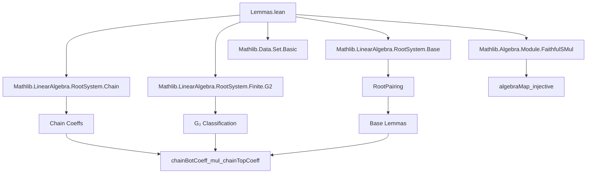
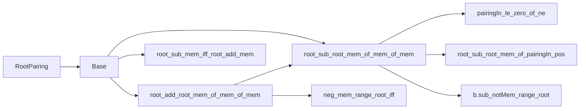

**Technical Brief: Supporting Lemmas for Geck’s Construction of a Lie Algebra from a Root System**

---

### **1. Key Definitions & Theorems**

| Name | Type / Signature | Purpose |
|------|------------------|---------|
| `root_sub_root_mem_of_mem_of_mem` | `α k + α i - α j ∈ Φ → k ≠ j → α k + α i ∈ Φ → α k - α j ∈ Φ` | Lemma 2.5(a) from Geck: closure under certain root differences when a 3-term combination is a root. |
| `root_add_root_mem_of_mem_of_mem` | `α k + α i - α j ∈ Φ → α k ≠ -α i → α k - α j ∈ Φ → α k + α i ∈ Φ` | Lemma 2.5(b) from Geck: closure under addition when a shifted difference is a root. |
| `root_sub_mem_iff_root_add_mem` | `α k - α j ∈ Φ ↔ α k + α i ∈ Φ` (under conditions) | Equivalence derived from (a) and (b); central to structural reasoning about root strings. |
| `chainBotCoeff_mul_chainTopCoeff` | `(P.chainBotCoeff i m + 1) * (P.chainTopCoeff j k + 1) = (P.chainTopCoeff j l + 1) * (P.chainBotCoeff i k + 1)` | Lemma 2.6 from Geck: key identity relating chain coefficients in crystallographic root systems (non-G₂ case). |
| `chainBotCoeff_mul_chainTopCoeff.isNotG2` | `P.IsNotG2` | Intermediate lemma: rules out the exceptional type G₂ under the given hypotheses. |
| `chainBotCoeff_mul_chainTopCoeff.aux_0` | `α k + α i ∈ Φ → P.pairingIn ℤ k i = 0 ∨ (P.pairingIn ℤ k i < 0 ∧ P.chainBotCoeff i k = 0)` | Structural dichotomy for when a sum of simple roots is a root. |
| `chainBotCoeff_mul_chainTopCoeff.aux_1` | Under `P.pairingIn ℤ k i = 0`, equality of products of chain coefficients holds. | Handles “Case 1” in Geck’s proof (zero pairing). |
| `chainBotCoeff_mul_chainTopCoeff.aux_2` | Under `P.pairingIn ℤ k i < 0 ∧ 0 < P.pairingIn ℤ k j`, contradiction if certain chain coefficients take extremal values. | Handles “Case 3” in Geck’s proof (nonzero, opposite-sign pairings). |

**Notation & Shorthands**:
- `Φ := range P.root`: the set of roots.
- `α := P.root`: the root function.
- `P.chainBotCoeff i j`, `P.chainTopCoeff i j`: integer-valued functions encoding coefficients in root strings (see Mathlib’s `RootSystem.Chain`).
- `P.pairingIn ℤ i j`: the integer-valued root–coroot pairing, lifted from the base ring `R` to `ℤ`.

---

### **2. Naming Conventions**

- **Prefixes**:
  - `root_...`: properties about roots (e.g., membership, addition/subtraction).
  - `chainBotCoeff_...`, `chainTopCoeff_...`: chain coefficient behavior.
  - `pairingIn_...`: properties of the integer pairing.
  - `aux_...`: auxiliary lemmas used in the main proof of `chainBotCoeff_mul_chainTopCoeff`.
- **Suffixes**:
  - `_mem_of_mem_of_mem`: implication pattern: if two things are in a set, then a derived expression is too.
  - `_iff_...`: equivalence statements.
  - `_ne`, `_lt_zero`, `_le_zero`, `_eq_zero`: relational conditions on pairings.
  - `_if_one_zero`: case analysis based on whether a sum of roots is simple or not (chain coefficient ∈ {0,1}).
- **Special**:
  - `isNotG2`: negation of G₂ type; used to avoid exceptional behavior.
  - `indexNeg`: involution on indices induced by negation of roots.

---

### **3. Tactic Stack**

The proofs rely heavily on:

| Tactic | Usage |
|--------|-------|
| `rcases` / `obtain` / `cases'` | Decomposing existential or disjunctive hypotheses (e.g., `hik_mem : ∃ l, ...`). |
| `aesop` | Automated reasoning for linear arithmetic, module homomorphism properties, and basic algebraic simplifications. |
| `simp only [...]` | Fine-grained simplification using lemmas like `root_coroot_eq_pairing`, `pairingIn_same`, `map_add`, etc. |
| `ring` / `abel` | Polynomial simplification in abelian groups/modules. |
| `linarith` / `omega` | Linear integer arithmetic (especially after `algebraMap_injective`). |
| `convert ... using n` | Matching goals up to definitional equality or small context shifts. |
| `module` | Custom tactic (likely from `FaithfulSMul`) to discharge module-linearity goals. |
| `grind` | Custom tactic (likely from `Mathlib.Tactic`) for simplifying complex expressions involving linear maps. |
| `contrapose!` | Turning implications into contrapositive form for contradiction arguments. |
| `subst s` / `rcases hA with ...` | Eliminating case splits after unfolding finite sets. |

---

### **4. Proof Logic**

The logical flow follows a **case analysis on the integer pairing** `P.pairingIn ℤ k i` and `P.pairingIn ℤ k j`, leveraging:

1. **Crystallographic condition** (`P.IsCrystallographic`) to restrict possible pairings.
2. **Irreducibility & reducedness** to ensure linear independence and avoid degenerate configurations.
3. **Exclusion of G₂** via `isNotG2`, which simplifies the possible values of pairings (e.g., `pairingIn ∈ {0,1,2}`).
4. **Root string structure**: the core idea is that if `α + β` and `α - γ` are roots, then `α ± β` or `α ∓ γ` must also be roots under certain pairing constraints.

**Typical proof skeleton**:
- Assume `α k + α i - α j ∈ Φ`.
- Use `isNotG2` to bound pairings.
- Split on `P.pairingIn ℤ k i = 0` vs `< 0`.
- In each case, reduce to known lemmas (`aux_1`, `aux_2`) or derive contradictions.
- Use symmetry (via `indexNeg`) to handle dual cases (e.g., swapping `i ↔ j`, `k ↔ -k`).
- Conclude via `omega` or `lia` after case analysis.

---

### **5. Imports & Dependencies**

| Import | Role |
|--------|------|
| `Mathlib.LinearAlgebra.RootSystem.Base` | Defines `RootPairing`, `Base`, basic properties of roots and coroots. |
| `Mathlib.LinearAlgebra.RootSystem.Chain` | Defines chain coefficients (`chainBotCoeff`, `chainTopCoeff`), root strings, and their algebraic properties. |
| `Mathlib.LinearAlgebra.RootSystem.Finite.G2` | Provides classification results for G₂-type root systems, especially `IsG2.pairingIn_mem_zero_one_three`. |
| `Mathlib.Algebra.Module.FaithfulSMul` | Used for `algebraMap_injective`, crucial for lifting integer equalities to ring equalities. |
| `Mathlib.Data.Set.Basic` | For `Set` operations and membership reasoning. |

---

### **6. Mermaid Diagrams**

#### **Dependency Graph (Top-Level)**



#### **Overview of `RootPairing.Base` Section**



#### **Structure of `chainBotCoeff_mul_chainTopCoeff` Proof**

```mermaid
graph TD
  Main[chainBotCoeff_mul_chainTopCoeff] --> isNotG2
  Main --> aux_0
  aux_0 -->|Case 1: pairing = 0| aux_1
  aux_0 -->|Case 2: pairing < 0 & chainBot = 0| aux_1 (symm)
  aux_0 -->|Case 3: pairing < 0 & chainBot > 0| aux_2
  aux_2 --> contradiction
  aux_1 --> Main
  aux_2 --> Main
```

---

### **7. Theory Context**

This file supports the construction of a Lie algebra from a root system, following Geck’s axiomatic approach (see *Geck, M. (2017). "On the construction of semisimple Lie algebras and Chevalley groups"*). The lemmas formalize:

- **Closure properties** of root systems under certain linear combinations (2.5).
- **Invariance of chain coefficient products**, a key step toward defining Lie brackets via Serre relations (2.6).

These results are foundational for proving that the Chevalley–Serre presentation yields a Lie algebra with the correct root space decomposition.

--- 

*End of Technical Brief.*
